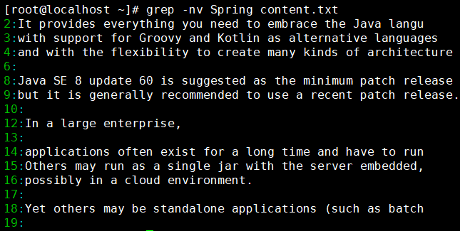
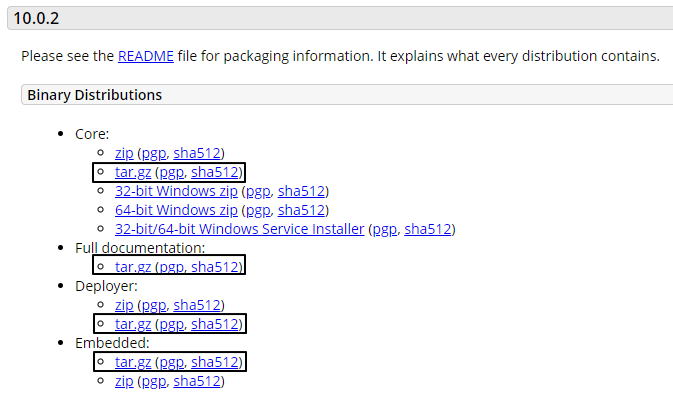
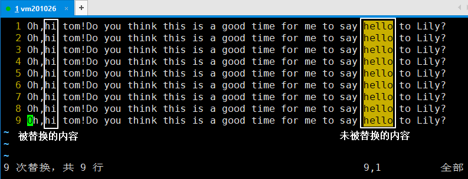
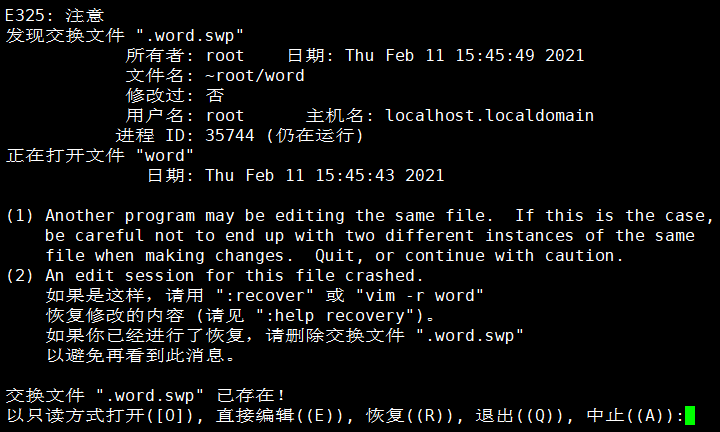

# Linux-day01

## 第一章 Linux的概述

### 第一节 Linux是什么

Linux 英文解释为 Linux is not Unix

Linux是Linus Torvolds于1991年开发的一套免费使用和自由传播的类Unix操作系统，是一个基于POSIX和UNIX的多用户、多任务、支持多线程和多CPU的操作系统。

(注：POSIX表示可移植操作系统接口（Portable Operating System Interface of UNIX，缩写为 POSIX ），POSIX标准定义了操作系统应该为应用程序提供的接口标准)

Linux能运行主要的UNIX工具软件、应用程序和网络协议。它支持32位和64位硬件。

Linux继承了Unix以网络为核心的设计思想，是一个性能稳定的多用户网络操作系统。

目前市面上较知名的发行版有：***\*Ubuntu\****、RedHat、***\*CentOS\****、Debain、Fedora、SuSE、OpenSUSE

### 第二节 Linux的使用场景

1. 作为服务器操作系统是目前Linux应用最广泛的领域
2. 类似Windows作为桌面应用系统，新版本的Linux系统特别在桌面应用方面进行了改进，达到相当的水平，完全可以作为一种集办公应用、 多媒体应用、网络应用等多方面功能于一体的图形界面操作系统。 
3. 作为各种嵌入式设备的操作系统，例如机顶盒、移动电话、智能家居设备等等，在移动电话领域的第一大操作系统的Android就是基于Linux内核的
4. 应用在超级计算机中作为操作系统， 在TOP500超级电脑列表采用Linux为操作系统的，占了371组（即74.2%），其中的前十位者，有7组是使用Linux的。 

### 第三节 怎么下载Linux系统镜像

centos下载地址：

网易镜像：

http://mirrors.163.com/centos/6/isos/

http://mirrors.163.com/centos/7/isos/x86_64/

搜狐镜像：

http://mirrors.sohu.com/centos/6/isos/ 

http://mirrors.sohu.com/centos/7/isos/x86_64/

当然，在我们发的资料中已经有老师给你们下载好的现成的Linux系统的镜像

### 第四节 Linux系统的分类

#### 1.  按照市场需求分

- 桌面版：类似于Windows的，有图形化界面的操作系统。不成熟
- 服务器版：没有图形化界面，使用命令行(CLI, Command Line Interface)进行操作的。企业里通常会使用服务器版的

#### 2. 按照原生程度分

- 内核版：Linus领导的开发小组，维护的内核版本。
- 发行版：一些企业、社区在内核的基础上，增加一些功能、软件，然后重新发行的版本


## 第二章 安装虚拟机和CentOS系统

### 第一节 安装虚拟机

#### 1. 什么是虚拟机

虚拟机（Virtual Machine）指通过软件模拟的具有完整硬件系统功能的、运行在一个完全隔离环境中的完整计算机系统。在实体计算机中能够完成的工作在虚拟机中都能够实现。在计算机中创建虚拟机时，需要将实体机的部分硬盘和内存容量作为虚拟机的硬盘和内存容量。每个虚拟机都有独立的CMOS、硬盘和操作系统，可以像使用实体机一样对虚拟机进行操作。 

#### 2. 常见的虚拟机软件

##### 2.1 VirtualBox 

VirtualBox 是一款开源虚拟机软件。VirtualBox 是由德国 Innotek公司开发，由Sun Microsystems公司出品的软件，使用Qt编写，在 Sun 被 Oracle收购后正式更名成 Oracle VM VirtualBox。使用者可以在VirtualBox上安装并且执行Solaris、Windows、DOS、Linux、OS/2Warp、BSD等系统作为客户端操作系统。已由甲骨文公司进行开发，是甲骨文公司xVM虚拟化平台技术的一部分。 

##### 2.2 VMWare Workstation

**VMware**是全球台式电脑及资料中心虚拟化解决方案的领导厂商。VMWare Workstation是该公司出品的“虚拟 机”软件，通过它可在一台电脑上同时运行更多的Microsoft Windows、Linux、Mac OS X、DOS系统。 

#### 3. 安装VMWare软件

##### 3.1 软件所在位置


##### 3.2 安装步骤

开始安装:


欢迎界面:


许可协议:


安装位置：


是否检查产品更新，不勾选，不帮助其完善，只管用：


是否创建桌面快捷方式和开始菜单启动方式，建议都选上:


开始安装: 


安装完成界面:


##### 3.3 破解VMWare

破解文件所在位置,打开文件查看破解的注册码:


在VMWare中输入注册码:


破解成功页面:


#### 4. 使用VMWare创建虚拟机

##### 4.1 检查电脑是否已经开启虚拟化支持

不一定非得检查电脑是否已经开启虚拟化支持，一般的电脑都是默认开启的，如果你在创建虚拟机的时候报了类似以下的错误，则需要去检查是否开启了虚拟化支持


如果电脑未开启虚拟化支持则需要开启虚拟化支持

各种型号的电脑进入BIOS界面检查是否开启虚拟化支持，以及设置启动虚拟化支持的步骤都不太一样，所以需要自行百度查找方法

##### 4.2 创建虚拟机的步骤

新建虚拟机选择自定义:


选择硬件兼容性:


创建虚拟空白硬盘:


选择操作系统版本:


指定虚拟机的名字以及安装位置：

名字可以随便命，安装位置不能有中文和空格


配置处理器:


配置内存大小:


配置网络类型为NAT:


配置IO控制器类型:


选择磁盘类型:

IDE :并口硬盘，最大80G，传输慢

SATA:串口硬盘，机械硬盘

SCSI：串口硬盘，做过优化，传输速度更快


新建虚拟磁盘


配置磁盘空间:


选择磁盘文件存储位置:
建议和虚拟机存储目录保持一致


新建虚拟机完成页面:


虚拟机设置: 指定操作系统镜像文件路径

点击设置:


指定操作系统镜像文件路径:


#### 5. 开启虚拟机安装CentOS操作系统

##### 5.1 开启虚拟机

点击开启虚拟机:


开启虚拟机之后的欢迎页面:


回车选择第一个开始安装配置，此外，在Ctrl+Alt可以实现Windows主机和VM之间窗口的切换


##### 5.2 开始安装CentOS操作系统

选择安装过程中使用的语言:


配置时间日期:

点击“日期和时间”调整后点完成


配置时区:


设置键盘类型:


增加个英语（美国）:


选择语言:


选择安装源:


设置安装源为: 自动检测


进行软件选择:


选择为GNOME桌面:


安装目标位置:


选择我要配置分区:


点击完成。

添加标准分区:


Boot引导区要大于200Mb:


设置Boot分区文件系统: ext4


再次点击加号，添加Swap分区


Swap分区设置: 文件系统为swap


继续点击加号添加"/"分区，剩余空间都给它:


设置"/"分区:


接收更改，格式化:


进入Kdump设置:


取消勾选，不启用Kdump:


设置网络和主机名: 修改主机名


点击“开始安装”，进入安装页面:


设置“ROOT密码”，不用创建新用户


确认密码:


等待，安装完成之后重启:


重启后进入欢迎页:


许可证页面，同意许可:


点击完成配置


输入选择“汉语（pinyin）”：然后选择前进


隐私，默认，点击前进


时区，上海，点击前进


在线账号，跳过


关于您，设置自己账号


设置自己账号的密码


开始使用CentOS系统:


系统主界面:注销自己的账户


用Root账户登录:


网络连接:设置有线连接为自动连接


设置命令行窗口:


​	选择"文件"---->"新建配置文件"


## 第三章 安装和使用远程访问工具

### 第一节 远程访问工具的概述

#### 1. 为什么要使用远程访问工具

* 通过远程访问工具可以直接从宿主机访问虚拟机，以及在宿主机中向虚拟机传输文件
* 实际应用中服务器一般放在远端（机房）或者云服务上，测试人员不可能直接到现场操作Linux服务器,所以需要远程访问工具远程操作服务器

#### 2. 常见的远程访问工具

##### 2.1 远程文件传输工具

远程文件传输工具是用于不同的计算机之间进行文件传输的工具，我们目前可以使用它从宿主机传输文件给虚拟机

* FileZilla
* FlashFXP
* Xftp

##### 2.2 远程命令行操作工具

远程命令行操作工具是用于在客户机上使用Linux命令远程操作服务机，我们目前可以使用它在宿主机上通过Linux命令行操作虚拟机

* XShell
* FinalShell
* SecureCRT

#### 3. 安装使用远程文件传输工具

##### 3.1 安装Xftp

软件位置:


双击安装:


选择免费版:


选择接受协议:


修改安装路径:


选择程序文件夹: 直接点下一步


选择语言: 


安装完成:


##### 3.2 使用Xftp远程连接虚拟机

新建会话:


设置会话属性:


解决乱码:


#### 4. 安装使用远程命令行操作工具

##### 4.1 安装Xshell

软件所在位置:


开始安装:


选择免费版:


同意许可证协议:


选择安装路径:


选择文件夹:直接点下一步


选择语言: 简体中文


安装完成:


##### 4.2 使用XShell远程连接操作虚拟机

新建会话:


设置会话属性:


连接会话:


接受并保存:


输入、记住用户名:


输入、记住密码:


## 第四章 Linux的文件和目录结构

### 第一节 目录结构预览

#### 1. 查看目录结构


#### 2. 目录结构列表


### 第二节 目录结构中各个目录的介绍

1. “/bin”: bin是Binary的缩写，这个目录存放着最经常使用的命令
2. "/sbin": s表示Super User，这里存放的是系统管理员使用的系统管理程序
3. "/home": 存放普通用户的主目录，在Linux中每个用户都有一个自己的目录，一般该目录名是以用户的账号命名的。
4. "/root": 该目录为系统管理员，也称作超级权限者的用户主目录。
5. "/lib": 系统开机所需要最基本的动态连接共享库，其作用类似于Windows里的DLL文件。几乎所有的应用程序都需要用到这些共享库。
6. "/lost+found": 这个目录一般情况下是空的，当系统非法关机后，这里就存放了一些文件。
7. "/etc": 所有的系统管理所需要的配置文件和子目录。
8. **"/usr"**: 这是一个非常重要的目录，用户的很多应用程序和文件都放在这个目录下，类似与windows下的program files目录。
9. "/proc": 这个目录是一个虚拟的目录，它是系统内存的映射，我们可以通过直接访问这个目录来获取系统信息。
10. "/srv": service缩写，该目录存放一些服务启动之后需要提取的数据。
11. "/sys": 这是linux2.6内核的一个很大的变化。该目录下安装了2.6内核中新出现的一个文件系统 sysfs 。（内核）
12. "/tmp": 这个目录是用来存放一些临时文件的。
13. "/dev": Device(设备)的缩写,类似windows的设备管理器，把所有的硬件用文件的形式存储。
14. "/media": linux系统会自动识别一些设备，例如U盘、光驱等等，当识别后，linux会把识别的设备挂载到这个目录下。CentOS6 就在/media下,CentOS7换目录了/run/media/root/media
15. "/mnt": 系统提供该目录是为了让用户临时挂载别的文件系统的，我们可以将光驱挂载在/mnt/上，然后进入该目录就可以查看光驱里的内容了。
16. **"/opt"**: 这是给主机额外安装软件所摆放的目录。比如你安装JDK、Tomcat则就可以放到这个目录下。默认是空的。
17. **"/usr/local"**: 这是另一个给主机额外安装软件所摆放的目录.一般是通过编译源码方式安装的程序。
18. "/var": 这个目录中存放着在不断扩充着的东西，我们习惯将那些经常被修改的目录放在这个目录下。包括各种日志文件。
19. "/boot": 这里存放的是启动Linux时使用的一些核心文件，包括一些连接文件以及镜像文件，自己的安装别放这里

## 第五章 Linux常用命令

### 第一节 一些常用基本命令

#### 1. 帮助文档

##### 1.1 man (manual 查看帮助手册)

例如`man ls`是查看ls相关的文档手册

##### 1.2 --help (提示使用方法)

例如`ls --help`可以提示ls命令的相关使用方法

#### 2. 日期时间类

##### 2.1 date: 以不同的格式获取日期时间

1. `date +%Y-%m-%d`

2. `date +%Y-%m-%d'  '%H:%M:%S`

3. `date +%F' '%T`

##### 2.2 cal:查看日历

`cal -y`

#### 3. 清除屏幕

##### 3.1 命令: clear

##### 3.2 快捷键: ctrl + L

#### 4. 查看ip配置

`ifconfig`

#### 5. 查看命令历史

`history`命令可以查看所写过的命令历史

#### 6. 关机重启

| 命令     | 作用                   |
| -------- | ---------------------- |
| sync     | 将内存数据保存到硬盘上 |
| poweroff | 关机                   |
| reboot   | 重启                   |

#### 7. 下载文件

` wget `: 


使用 -P 参数可以指定目标目录，例如：(不需要去演示) 

```
wget -P /root https://mirrors.tuna.tsinghua.edu.cn/apache/tomcat/tomcat-10/v10.0.8/bin/apache-tomcat-10.0.8.tar.gz
```

#### 8. 常用快捷键

| 按键         | 作用         |
| ------------ | ------------ |
| Ctrl+l       | 清屏         |
| Ctrl+c       | 强制终止程序 |
| Ctrl+Insert  | 复制         |
| Shift+Insert | 粘贴         |
| Ctrl+s       | 锁屏         |
| Ctrl+q       | 解除锁屏     |
| tab          | 自动补全     |

### 第二节 文件目录命令

#### 1 切换目录命令

1. `cd ..`: 返回上级目录
2. `cd /`: 返回到 / 目录
3. `cd ~`：返回家目录，如果是root用户则返回`/root`，如果是普通用户则返回`/home/普通用户目录`
4. `cd 目录绝对路径`: 通过绝对路径切换到指定目录，可以借助tab键提示目录名
5. `cd 目录相对路径`: 通过相对路径切换到指定目录
6. `cd -`：切换到上一次操作所在的目录

#### 2 打印当前目录的绝对路径

`pwd`命令: 此命令打印当前目录的绝对路径，pwd的全称是:`print wroking directory`打印工作目录，工作目录就是用户当前所在的目录

####  3 列出目录中的文件

1. `ls`: 列出当前目录中的文件名列表

   

2. `ls -l`可以简写成`ll`: 列出当前目录中的文件列表，包含文件的详细信息(其中文件大写用字节表示)

   

3. h参数：`ll -h` 将文件大小使用kb显示

   

4. a参数: `ll -ah`显示目录中的所有文件,包含隐藏文件。注意: a和h都是参数，他俩的顺序可以换

5. `ll 某个目录的绝对路径或者某个目录的相对路径`: 列出指定目录下的文件详情列表

6. R参数: `ll -R`递归查看某个目录以及其子孙后代目录中的所有文件

7. `ll -ltr`: 逆序列出最近修改过的文件


#### 4 创建和删除目录

1. `mkdir 目录路径`：创建新目录，例如`mkdir /usr/local/tomcat`，表示在`/usr/local`中创建tomcat目录，但是前提是`/root/usr/local`目录已存在
2. `mkdir -p 目录路径`: 创建新目录，可以创建多级目录，例如`mkdir -p /root/aa/bb/cc`,表示在`/root`目录中先创建`aa`目录，然后在`aa`目录中创建`bb`目录，在`bb`目录中创建`cc`目录
3. `rmdir 目录路径`: 删除一个目录，当然:该命令只能删除一个空目录

#### 5 创建和删除文件

1. `touch 文件路径`: 新创建一个文件
2. `rm 文件路径`: 删除指定文件，会询问`是否删除`
3. f参数: `rm -f 文件路径`: 删除文件，不会询问`是否删除`
4. r参数:递归删除，`rm -rf 非空目录路径`:递归删除非空目录

#### 6 移动文件或目录

1. `mv 要移动的文件或目录路径 目标路径`: 将要移动的文件移动到目标路径
2. `mv 旧文件或目录名 新文件或目录名`: 对文件进行重命名

#### 7 复制文件或目录

1. `cp 要复制的文件 目标路径`: 将要复制的文件复制到目标路径
2. r参数: `cp -r 要复制的目录 目标路径`: 将目录以及目录中的所有内容都复制到目标路径
3. 强制覆盖的复制: 如果目标目录中已经有了该文件，那么就采用强制覆盖的复制，例如`\cp -rf a /test`表示将a复制到/test目录中，并且进行覆盖

#### 8 查看文件

##### 8.1 cat命令

1. `cat 文件路径`:查看轻量级的文本文件
2. `cat 文件1路径 文件2路径`: 连接查看多个文件
3. `cat 文件1 > 文件2`:将文件1的内容覆盖文件2的内容
4. `cat 文件1 >> 文件2`:将在文件2的内容后面追加文件1的内容

#####  8.2 more命令

`more 文件路径`:查看较长的文件，可以使用空格键向下翻页，使用回车键向下翻行，使用q退出查看，使用`Ctrl + F`向下滚动一屏，使用`Ctrl + B`返回上一屏

##### 8.3 less命令

`less 文件路径`：查看较长的文件，功能比`more`强大，可以使用`PgUp`和`PgDn`向上和向下翻页，可以使用`/字符串`向下搜索`字符串`，使用`?字符串`向上搜索字符串，使用`n`正向重复前一个搜索(与/和?搜索有关)，使用`N`反向重复前一个搜索

##### 8.4 tail命令

1. `tail -数字 文件路径`: 查看指定文件的末尾多少行
2. `tail -数字f 文件路径`: 查看文件末尾多少行，可进行堵塞，文件有新内容增加到文件中，立刻可以显示，适合查看Tomcat的运行日志

#### 9 打印信息

相当于Java中的日志打印，例如`echo $path`打印`path`环境变量信息

#### 10 查找文件或目录

`find`命令是用于在某个范围内查找文件或者目录，它的用法是`find 查找范围 参数 表达式`，例如:


这次查询表示的意思是:


#### 11 基于索引查找文件或者目录

##### 11.1 什么是索引

建立索引可以极大提升查询的速度。为什么会有这么显著的效果呢？我们拿查字典来举个例子。

- 没有索引：从正文第一页开始翻，在每一页中检查有没有自己要找的字。在最差的情况下需要逐页翻到字典的最后一页，这样做速度非常慢。
- 基于索引：字典正文前的检字表就是正文内容的索引。先从检字表里快速找到那个字，这里没有这个字的详细信息，只有这个字所在的页码。我们根据这个页码就可以直接到正文中直接翻到那一页，这样速度就非常快了。

##### 11.2 locate命令的原理


系统启动时把每一个目录、每一个文件的完整路径保存到索引库中。使用locate命令搜索关键词时，就使用关键词查询索引库，把匹配的路径字符串返回。

而新建的文件或目录不会被系统把路径存入索引库，那么使用locate命令就搜索不到。此时使用updatedb命令更新一下索引库就行了。

##### 11.3 locate命令的使用

1. `locate 关键字`:全文搜索与关键字相关的文件或者目录
2. 新建文件之后使用`updatedb`更新索引库，然后再搜索

#### 12 grep

##### 12.1 管道筛选

`grep`配合进行管道筛选，例如`ll /etc | grep .cfg`表示筛选`/etc`目录中包含`.cfg`的文件，对于管道筛选而言`|`前面的表示数据源(需要从数据源中筛选)，`| grep`后面表示筛选条件

##### 12.2 在文本文件中根据关键字匹配行

###### 12.2.1 基本用法

`grep 参数 关键字 被搜索的文件`:


上述语句表示在当前目录的content.txt文件中搜索包含**Spring**的所有行

###### 12.2.2 参数

1. `n`表示在搜索结果中显示行号:

   

2. `v`表示返回不匹配关键字的那些行

   

#### 13 压缩和解压

##### 13.1 gz格式的压缩文件

在Linux系统环境中，很多程序安装包都是以tar包的形式提供下载的： 



###### 13.1.1 压缩

- 语法：`tar -zcvf 压缩包 文件1 文件2 ...`

- 参数：
  - `z`：指定压缩算法为gzip
  - `c`：压缩后要创建压缩文件
  - `v`：在压缩过程中列出文件列表(可以不写)
  - `f`：指定压缩包文件名称。后边跟参数值：压缩包名称

例如`tar  -zcvf  demo.tar.gz  *.txt`表示将当前目录中的所有`txt`文件压缩成`demo.tar.gz`

###### 13.1.2 解压

- 语法：`tar -zxvf 压缩包 -C 解压位置`
- 参数：
  - `z`: 表示使用`gzip`算法解压
  - `x`：extract, 调用解压命令，执行解压操作
  - `v`：在解压缩过程中列出文件列表(可以不写)
  - `f`：指定要解压的文件名称。后边跟参数值：压缩包名称
  - `C`：指定解压的位置（可以不写）
    - 如果写参数`C`：就需要指定解压的位置，必须是已经存在的文件夹
    - 如果不写参数`C`：要解压到当前文件夹里

例如`tar -xvf demo.tar.gz`表示将`demo.tar.gz`文件解压到当前目录；`tar -xvf demo.tar.gz -C /root/app`表示将`demo.tar.gz`解压到`/root/app`目录中


##### 13.2 zip格式的压缩文件(了解)

Linux中一般不会使用zip格式的压缩文件，但是如果需要，我们也有命令对zip格式的压缩文件进行解压、以及将文件压缩成zip格式

###### 13.2.1 压缩

`zip demo.zip *.txt`表示将当前目录中的所有`txt`文件压缩到`demo.zip`中

###### 13.2.2 解压

`unzip demo.zip`表示将`demo.zip`解压到当前目录

### 第三节 文件编辑

#### 1. Linux的文件编辑器

`vim`是Linux中重要的文本编辑器，我们使用`vim`可以在Linux中编辑文件，`vim`可以看做是之前`vi`编辑器的升级版本

#### 2. 文件编辑过程中的三种模式


一般模式(无法编辑)：通过按键控制VIM工作

编辑模式(可以编辑无法保存)：可以自由输入

指令模式(可以执行保存、查找等操作)：通过执行指令完成一些特殊操作

#### 3. 一般模式下的按键操作

`vim 要编辑的文件路径`可以进入到**一般模式**,此时我们无法自由编辑文件，但是可以进行整行的复制、粘贴、删除

* `yy`复制光标所在行
* `p`在下方粘贴一行
* `dd`删除光标所在行
* `u`撤销前一步操作
* `Ctrl + r`重做刚刚撤销的操作
* `r` 替换光标所在位置的一个字符，第一步：按一下r键，第二步：输入新的字符 
* `gg`将光标移动到第一行的开头
* `G`将光标移动到最后一行的开头
* `行数G`将光标移动到指定行的开头

#### 4. 进入编辑模式

因为一般模式下我们无法自由编辑内容，所以需要进入编辑模式来进行文件的编辑，进入编辑模式的方式有如下一些:

| 按键 | 大小写 说明 | 光标动作                                                     |
| ---- | ----------- | ------------------------------------------------------------ |
| i    | 小写        | 不动，就在**当前位置**，开始输入                             |
| I    | 大写        | 移动到**行的开头**，开始输入                                 |
| a    | 小写        | 光标**向后移动一格**，然后开始输入                           |
| A    | 大写        | 光标移动到**行的末尾**，然后开始输入                         |
| o    | 小写        | 先在光标所在行的**下面插入空行** 然后把光标移动到空行的开头，再开始输入 |

在编辑模式下我们可以进行自由编辑，如果想回退到普通模式进行操作，则需要按`Esc`按键，编辑模式下我们无法进行查找、保存等等操作，需要进入指令模式才能完成。而进入指令模式需要从一般模式进入，所以需要先`Esc`退回一般模式

#### 5. 指令模式下的操作

##### 5.1 进入指令模式

###### 5.1.1 进入特殊指令操作的指令模式

在一般模式下输入英文的`:`，其实就是同时按`Shift`和`:`就可以看到文档最下方出现了一个`:`，并且光标也出现在了`:`后面，就表示进入了指令模式，此时我们就可以输入指令进行一些操作

###### 5.1.2 进入用于全文搜索的指令模式

在一般模式下输入`/`，可以进入用于全文搜索的指令模式

##### 5.2 在全文搜索的指令模式下进行搜索

###### 5.2.1 搜索的具体步骤

1. 在`/`的光标处输入搜索关键字，然后按回车按钮进行搜索，搜索出来匹配关键字部分的内容，会高亮显示
2. 遍历匹配内容: 输入`n`向下遍历查找，输入`N`向上遍历查找
3. 取消高亮显示: `:noh`

##### 5.3 指令模式下常用的指令操作

###### 5.3.1 显示行号

`set nu`指令可以显示文本的行号


###### 5.3.2 保存已编辑的内容

`w`指令可以保存已编辑的内容


###### 5.3.3 退出vim编辑器

`q`指令可以退出vim编辑，但是当部分修改还没有保存，那么会看到下面的提示： 


当我们想要放弃对文件的修改，不保存直接退出就使用:`q! `来代替`q`进行退出

###### 5.3.4 保存当前编辑并退出

`wq`指令可以先保存当前编辑的内容，然后再退出vim编辑器

###### 5.3.5 全文替换

1. 准备文本内容

```tex
TIP

Oh,hello tom!Do you think this is a good time for me to say hello to Lily?

Oh,hello tom!Do you think this is a good time for me to say hello to Lily?

Oh,hello tom!Do you think this is a good time for me to say hello to Lily?

Oh,hello tom!Do you think this is a good time for me to say hello to Lily?

Oh,hello tom!Do you think this is a good time for me to say hello to Lily?

Oh,hello tom!Do you think this is a good time for me to say hello to Lily?

Oh,hello tom!Do you think this is a good time for me to say hello to Lily?

Oh,hello tom!Do you think this is a good time for me to say hello to Lily?

Oh,hello tom!Do you think this is a good time for me to say hello to Lily?
```

执行替换:将`hello`替换成`hi`:

`%s/hello/hi`,替换后的效果是:



这时我们看到每一行只有第一个匹配的内容被替换了，后面的没有被替换。这是因为对正则表达式来说，它是以行为单位查找匹配的内容。每一行只要找到第一个匹配那么就可以判断这一行就是匹配的，没有必要继续向后查找了。如果我们需要将一行中的每一个匹配都替换，可以在指令后加/g 

#### 6. 常见的问题

##### 6.1 提示存在交换文件

###### 6.1.1 错误示例



###### 6.1.2 错误原因

vim在打开一个文件的时候会同时创建一个临时文件，命名方式是“.原文件名.swp”，这就是所谓的**交换文件**。而当vim正常退出时，这个交换文件会被删除。所以如果正常操作我们是看不到这个提示界面的。

而之所以会出现上面的提示，是因为当前的vim命令在创建新的交换文件之前就已经检测到了**已存在的交换文件**。

再往前推理一步，为什么会有交换文件残留？

- 可能原因1：其他窗口正在使用vim打开同一个文件
- 可能原因2：非正常关机等原因导致vim没有正常退出

###### 6.1.3 解决方法

先根据最下面的提示输入Q退出，然后检查是否在其他窗口已经用vim打开了这个文件：

- 是：继续在这个vim中编辑文件。
- 否：删除交换文件，重新编辑。

##### 6.2 屏幕被锁

在Windows环境下大家已经习惯了使用Ctrl+s保存文档，但是在Linux环境下Ctrl+s是锁屏。如果是因为Ctrl+s锁屏那么可以使用Ctrl+q解锁，然后继续操作。 