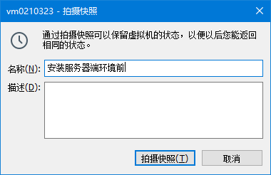

# Linux-day02

## 第一章 Linux常用命令

### 第一节 进程相关命令

#### 1. 查看进程状态

##### 1.1 命令的使用

`ps`命令是用于查看进程状态的命令，它常和`e`参数(对应单词entire，表示全部。具体指显示系统中全部的进程信息。)，以及`f`参数(对应单词full-formate，表示完整格式。) 一起使用


进程信息中各列数据的说明:

| 列名     | 含义                                                     |
| -------- | -------------------------------------------------------- |
| UID      | 进程的用户信息                                           |
| **PID**  | 进程id。由系统分配，不会重复。                           |
| **PPID** | 父进程的id。父进程和子进程的关系是：父进程启动了子进程。 |
| **CMD**  | 当前进程所对应的程序。                                   |
| C        | 用整数表示的CPU使用率                                    |
| STIME    | 进程启动时间                                             |
| TTY      | 进程所在终端。所谓终端就是用户输入命令的操作界面。       |
| TIME     | 进程所占用的CPU时间                                      |

##### 1.2 父进程和子进程之间的关系

简单来说，父进程和子进程的关系是：父进程启动了子进程。我们可以使用pstree命令查看整个进程树。 


##### 1.3 和其它命令配合一起查看进程

###### 1.3.1 分屏查看进程信息

全部进程的信息太多了，一屏无法全部显示，所以我们希望可以分屏显示并由我们来控制翻页。为了达到这个目标，我们可以使用管道符号将ps -ef命令的输出数据传送给less命令。 ` ps -ef | less `

###### 1.3.2 精确查询一个具体进程信息

我们通过Xshell远程连接Linux系统，靠的是sshd这个服务。这个服务如果正在运行中，那么一定会有这个服务对应的进程。所以下面我们来查询一下sshd这个命令的进程。 


我们看到这里返回了3条结果，其中前两天都是和sshd服务相关的结果，但是最后一条不是。

> root 72826 3456 0 20:06 pts/0 00:00:00 grep --color=auto sshd

仔细观察一下就能发现，这其实是grep命令本身。因为grep命令运行过程中本身也是一个进程，“grep sshd”正好也匹配sshd，所以就被选中了。但是这是一个干扰项，并不是我们真正要查询的内容，所以需要把它从查询结果中排除。


再用一层管道，使用grep命令的-v参数把匹配grep的行排除，返回不匹配的结果，这就是我们最终想要的。 

#### 2. 杀死进程

##### 2.1 命令的使用

`kill -9 进程id`表示杀死指定id的进程

##### 2.2 举例

1. 打开Linux内置的火狐浏览器

   

2. 查看火狐浏览器的进程id

   

    另外一个是浏览器插件，不用管。 

3. 使用kill命令结束火狐浏览器进程: `kill -9 3325`

#### 3.  实时查看系统运行情况和健康状态(了解) 

##### 3.1 命令和参数

| 命令名 | 更新时间间隔（秒） | 不显示任何闲置或者僵死进程 | 通过进程id监控单一进程 |
| ------ | ------------------ | -------------------------- | ---------------------- |
| top    | -d 间隔秒数        | -i                         | -p 进程id              |


##### 3.2 按键操作

| 按键 | 功能                             |
| ---- | -------------------------------- |
| P    | 默认值，根据CPU使用率排序        |
| M    | 以内存的使用率排序               |
| N    | 以PID排序                        |
| d    | 设置数据刷新的时间间隔，单位是秒 |
| q    | 退出                             |

##### 3.3 查询结果的字段解释

###### 3.3.1 第一行信息为任务队列信息

| 内容举例                      | 说明                                                         |
| ----------------------------- | ------------------------------------------------------------ |
| 12:26:49                      | 系统当前时间                                                 |
| up 1 day, 13:32               | 系统的运行时间，前面例子表示本机已经运行1天13小时32分钟      |
| 2 users                       | 当前登录了2个用户                                            |
| load average:0.00, 0.00, 0.00 | 系统在之前1分钟，5分钟，15分钟的平均负载。 一般认为小于1时，负载较小。如果大于1，系统已经超出负荷。 |

###### 3.3.2 第二行为进程信息

| 内容举例        | 说明                                      |
| --------------- | ----------------------------------------- |
| Tasks: 95 total | 系统中的进程总数                          |
| 1 running       | 正在运行的进程数                          |
| 94 sleeping     | 睡眠的进程                                |
| 0 stopped       | 正在停止的进程                            |
| 0 zombie        | 僵尸进程。如果不是0，需要手工检查僵尸进程 |

###### 3.3.3 第三行为CPU信息

| 内容举例      | 说明                                                         |
| ------------- | ------------------------------------------------------------ |
| Cpu(s):0.1%us | 用户空间占用的CPU百分比，us对应user                          |
| 0.1%sy        | 内核空间占用的CPU百分比，sy对应system                        |
| 0.0%ni        | 改变过优先级的进程占用的CPU百分比，ni对应niced               |
| 99.7%id       | 空闲CPU的CPU百分比                                           |
| 0.1%wa        | 等待输入/输出的进程的占用CPU百分比，wa对应IO wait            |
| 0.0%hi        | 硬中断请求服务占用的CPU百分比，hi对应hardware IRQ            |
| 0.1%si        | 软中断请求服务占用的CPU百分比，si对应software IRQ            |
| 0.0%st        | st（Steal time）虚拟时间百分比，也叫被hypervisor偷走的时间。 就是当有虚拟机时，虚拟CPU等待实际CPU的时间百分比。 |

###### 3.3.4 第四行为物理内存信息

| 内容举例          | 说明                   |
| ----------------- | ---------------------- |
| 2031912 total     | 物理内存的总量，单位KB |
| 70496 free        | 空闲的物理内存数量     |
| 1780676 used      | 已经使用的物理内存数量 |
| 174864 buff/cache | 作为缓冲的内存数量     |

使用中的内存总量（used）指的是现在系统内核控制的内存数，空闲内存总量（free）是还未纳入内核管控范围的数量。

纳入内核管理的内存不见得都在使用中，还包括过去使用过的现在可以被重复利用的内存，内核并不把这些可被重新使用的内存还给free，因此Linux系统运行过程中free内存会越来越少，但不影响系统运行。因为这表示更多的空闲内存被内核管理了。

###### 3.3.5 第五行为交换分区（swap）信息

| 内容举例        | 说明                                             |
| --------------- | ------------------------------------------------ |
| 2097148 total   | 交换分区（虚拟内存）的总大小                     |
| 1137824 free    | 空闲交换分区的大小                               |
| 959324 used     | 已经使用的交互分区的大小                         |
| 58640 avail Mem | 在不交换的情况下，对启动新应用程序可用内存的估计 |

交换分区是一个非常值得关注的地方，如果swap区的used数值持续发生变化那么说明在内核和交换分区之间正在持续发生数据交换，这表示内存不够用了——必须不断把内存中的数据保存到硬盘上。

#### 4. 查看网络状态命令(了解)

##### 4.1 命令和参数

` netstat `命令是查看网络状态,常用参数列表如下:

| 参数名 | 作用                                             |
| ------ | ------------------------------------------------ |
| -a     | 显示所有正在或不在侦听的套接字。                 |
| -n     | 显示数字形式地址而不是去解析主机、端口或用户名。 |
| -p     | 显示套接字所属进程的PID和名称。                  |

常用: `netstat -anp`

##### 4.2 查询结果的解释

netstat命令显示的网络状态信息包含两部分内容：

- 本机和外部的连接状态信息(重点)

  

* 本机系统内部进程间通信信息(了解)

  

##### 4.3 使用技巧

##### 4.3.1 分屏查看网络状态

` netstat -anp | less `

##### 4.3.2 根据进程名称查看网络状态

` netstat -anp | grep sshd `

##### 4.3.3 根据端口号查看网络状态

` netstat -anp | grep :22 `

这里需要注意一下，端口号本身就是一串数字，进程id也是一串数字。那么根据端口号匹配时，很多无关的进程id也会被匹配到，造成大量不必要的干扰。此时给端口号数字前加上冒号就好多了。 

### 第二节 字符串处理的命令(了解)

#### 1. basename

返回路径字符串中的资源（文件或目录本身）部分 


如果指定了后缀，basename会帮我们把后缀部分也去掉 


#### 2. dirname

返回路径字符串中的目录部分 


注意: 这里dd是文件

#### 3. cut

根据指定符号拆分字符串并提取。默认根据 \t 拆分。

- -f 参数：指定要提取的列
- -d 参数：指定拆分依据的字符

准备测试数据： 


切割提取第一列： 


切割提取第二、第三列： 


选取系统 PATH 变量值，第2个 “:” 开始后的所有路径： 


切割ifconfig 后打印的IP地址： 


另一种做法： 


#### 4. sort

sort命令是在Linux里非常有用，它将文件进行排序，并将排序结果标准输出。

| 参数名 | 作用                     |
| ------ | ------------------------ |
| -n     | 依照数值大小排序         |
| -r     | 相反顺序排序             |
| -t     | 设置排序时使用的分隔字符 |
| -k     | 指定需要排序的列         |


## 第二章 Linux权限管理

### 第一节 权限管理中的专业术语

#### 1. 用户

系统使用者登录系统时使用的账号、密码。系统通过“用户”来识别使用者的身份。使用者以“用户”的名义操作系统资源。 

#### 2. 登录

使用者想要让系统认可自己的身份就必须提供账号、密码等信息。更专业的说法是：“认证（authentication）”。 

#### 3. 资源

权限控制系统要保护的对象。权限控制系统中必须要保存每一个资源所要求的访问权限。哪怕是“不需要任何权限，任何人都可以使用”也是权限信息的一种描述——没有要求也是一种要求。 

#### 4. 授权

authorization，系统给用户分配权限。这些权限代表了用户可以做什么。 

#### 5. 校验

一个用户访问一个资源的时候，权限控制系统必须要检查这个用户持有的权限是否满足目标资源所要求的权限。 

#### 6. 用户组

同一类的用户归到同一个组，也可以叫做角色。 


### 第二节 创建用户和用户组的基本命令

| 命令                   | 作用                           |
| ---------------------- | ------------------------------ |
| groupadd 组名          | 创建用户组                     |
| id 用户名              | 返回用户信息，检查用户是否存在 |
| useradd -g 组名 用户名 | 创建用户，同时指定所属用户组   |
| passwd 用户名          | 给用户账号设置密码             |

### 第三节 文件权限

#### 1. 文件权限信息说明


权限信息共分三组，每组三位： 


下面介绍rwx-分别是什么意思：

- r：读（read）

  - 读文件：查看文件内容

    例如：cat、less、tail等命令

  - 读目录：查看目录内容

    例如：使用ll命令查看目录内容

- w：写（write）

  - 写文件：向文件中写入新内容

  - 写目录：在目录里面增删内容

    例如：在目录内新建文件、删除文件、新建目录、删除目录给目录重命名

- x：执行（execute）

  - 执行文件：把文件当作可执行文件来运行
  - 执行目录：使用cd命令进入目录

- -：无权限

由于每一位要么有权限要么没有权限，所以天然可以使用二进制来表示权限信息：

- 1：有
- 0：无

| 权限的符号表示 | 权限的二进制表示 | 权限的十进制表示 |
| -------------- | ---------------- | ---------------- |
| rwx r-x r-x    | 111 101 101      | 7 5 5            |
| rw- r-- r--    | 110 100 100      | 6 4 4            |

#### 2. 修改文件权限

##### 2.1 命令介绍

| 命令名 | 作用                       |
| ------ | -------------------------- |
| chmod  | 修改权限信息               |
| chown  | 修改文件或目录的所属用户   |
| chgrp  | 修改文件或目录的所属用户组 |

##### 2.2 演示chmod命令

###### 2.2.1 修改权限信息前


###### 2.2.2 添加权限

增加执行权限 

```
chmod +x fruit/content
```

添加权限信息后


###### 2.2.3 删除权限

删除执行权限 

```
chmod -x fruit/content
```

删除权限信息后


###### 2.2.4 修改权限

方法1: `chmod 三位数字`

这三位数字分别表示: 拥有者的权限、同组用户的权限、其它用户的权限

`r`：是4； `w`：是2；`x`：是1

例如`chmod 755 fruit/content `表示将权限设置为:


方法2: `chmod u=rwx,g=rx,o=rx`，其中u表示拥有者，g表示同组用户，o表示其它用户


### 第四节 提升普通用户的权限

在公司参与开发的过程中，通常我们不会拿到服务器系统的 root 权限，而是普通用户权限。但是普通用户很多操作无法执行。比如在 /opt 目录下新建目录: 


提升普通用户的权限其实就是赋予普通用户那些超级管理员才有的权限，我们需要在 /etc/sudoers文件中 进行配置,但是注意sudoers文件默认是只读的，我们要修改它的权限，修改成root可以编辑`chmod 644 /etc/sudoers`

```
## Allow root to run any commands anywhere 
root    ALL=(ALL)       ALL
luozhixiang ALL=(ALL)   ALL
```

不需要重启系统，我们再次测试:


但此时我们发现，每次使用`sudo`都需要输入密码，很麻烦，所以我们可以在`/etc/sudoers`中进行配置

```
luozhixiang ALL=(ALL)   NOPASSWD:ALL
```

这样再使用sudo命令就不需要输入密码了 

这里有两点需要注意：

- 在同一次登录中，即使不加NOPASSWD也只需要输入一次密码，所以NOPASSWD是否生效需要退出登录后再重新登录来测试。
- 使用sudo提权后创建的目录仍然是root root权限，如果有需要那就还要使用chown或chgrp来修改。

## 第三章 Linux系统的服务管理

### 第一节 服务的概念

操作系统中在后台持续运行的程序，本身并没有操作界面，需要通过端口号访问和操作。CentOS 6和CentOS 7的服务管理有很大区别，我们分别来看。

### 第二节 CentOS6的服务(了解)

#### 1. service命令

启动服务：service 服务名 start

停止服务：service 服务名 stop

重启服务：service 服务名 restart

重新加载服务：service 服务名 reload

查看服务状态：service 服务名 status

#### 2. chkconfig命令

查看服务列表：chkconfig [--list]

设置具体服务开机自动启动状态：chkconfig 服务名 on/off

#### 3. 防火墙

防火墙默认会阻止绝大部分端口号的访问，在实际生产环境下，运维工程师需要为服务器设置详细的访问规则。在练习过程中，我们为了方便建议把防火墙直接关闭。由于防火墙服务默认开机自动启动，所以除了**停止服务**，还要设置为**开机不自动启动**。

服务名：iptables

停止防火墙：service iptables stop

设置开机不自动启动：chkconfig iptables off

### 第三节 CentOS7的服务

#### 1. systemctl命令

启动服务：systemctl start 服务名(xxxx.service)

重启服务：systemctl restart 服务名(xxxx.service)

停止服务：systemctl stop 服务名(xxxx.service)

重新加载服务：systemctl reload 服务名(xxxx.service)

查看服务状态：systemctl status 服务名(xxxx.service)

### 2. systemctl命令代替chkconfig命令

查看服务状态：systemctl list-unit-files

设置或取消服务开机自动启动：

* 设置开机自动启动：systemctl enable 服务名

* 取消开机自动启动：systemctl disable 服务名

#### 3. 防火墙的操作

* 开启防火墙 `systemctl start firewalld`
* 重启防火墙 `systemctl restart firewalld`
* 关闭防火墙`systemctl stop firewalld`
* 设置开机启动`systemctl enable firewalld`
* 停止并关闭开机启动`systemctl disable firewalld`
* 查看防火墙状态`systemctl status firewalld` 或者 `firewall-cmd --state`
* 查看防火墙开机时是否启动`systemctl list-unit-files | grep firewalld`

#### 4. 防火墙端口设置

* 开放端口   `firewall-cmd --add-port=端口号/tcp --permanent`

* 更新防火墙规则`firewall-cmd --reload`

* 查看

  `firewall-cmd --zone=public --query-port=端口号/tcp`
  `firewall-cmd --zone=public --list-ports`

* 取消端口开放  `firewall-cmd --remove-port=端口/tcp --permanent`

* 常用端口

  * 8080 tomcat
  * 80 http协议
  * 443 https协议
  * 22 ssh远程连接
  * 3306 mysql
  * 6379 redis

## 第四章 Linux下的Shell脚本开发

### 第一节 Shell编程概述

Shell是一个命令行解释器，它接收应用程序或用户的命令，然后调用操作系统内核。 它是一个功能强大的编程语言，易编写、易调试、灵活性强 


### 第二节 Linux系统提供的Shell解析器


其中最常用的是 /bin/sh 和 /bin/bash

#### 1. bash 和 sh 的关系


sh是bash的软链接 ,Linux默认使用的是bash

### 第三节 Shell编程入门

#### 1. 创建脚本文件

使用`touch`命令创建脚本文件, 通常以.sh作为扩展名 

#### 2. 编写脚本内容

第一行通常指定脚本解析器

```shell
#!/bin/bash
echo "hello world"
```

#### 3. 脚本文件的运行方式

| 命令名             | 在当前进程运行 | 新建子进程运行 |
| ------------------ | -------------- | -------------- |
| source             | √              |                |
| .                  | √              |                |
| sh                 |                | √              |
| bash               |                | √              |
| chmod +x后直接运行 |                | √              |

其中“.”是source的另一种写法。在当前进程中发布的全局变量可以在当前进程的其他脚本中继续沿用，也可以在子进程中使用；但是子进程export发布的变量仅限于子进程内部使用。

### 第四节 Shell的语法

#### 1. 变量

##### 1.1 系统预定义变量

常用系统变量包括：`$USER`、`$HOME`、`$PWD`、`$SHELL`等，可以使用echo命令输出它们的值。使用`set`命令可以查看所有系统预定义变量

##### 1.2 自定义变量

###### 1.2.1 定义变量

```shell
USER_NAME=tom
```

###### 1.2.2 输出变量

```shell
echo $USER_NAME
```

###### 1.2.3 撤销变量

```shell
unset USER_NAME
```

###### 1.2.4 定义静态变量

```shell
readonly COMPANY_NAME=atguigu
```

静态变量不能撤销，也不能修改

###### 1.2.5 语法规则

- 变量名称可以由字母、数字和下划线组成，但是不能以数字开头，环境变量名建议大写。
- 等号两侧不能有空格，衍生规则就是变量声明时必须初始化
- 在bash中，变量默认类型都是字符串类型，无法直接进行数值运算。
- 变量的值如果有空格，需要使用双引号或单引号括起来。
- 变量名区分大小写。

##### 1.3 特殊变量

###### 1.3.1 $n

n是数字，\$0代表当前脚本名称。从$1开始代表对应的脚本参数。从\${10}开始数字需要使用{}括起来。 


###### 1.3.2 $#

返回输入参数的个数 


###### 1.3.3 \$*和$@

都能够返回全部参数，但是只有在循环中且放在引号中能够体现出它们的区别。 


###### 1.3.4 $?

返回上一条命令的执行结果。

- 条件判断语句
  - 返回 0 表示 true
  - 返回 1 表示 false
- 普通语句
  - 返回 0 表示成功
  - 返回非 0 数表示失败

#### 2. 运算符

Shell的运算表达式的语法如下:  `$((表达式))`或`$[表达式] `


#### 3. 条件判断

##### 3.1 基本语法

- 写法1：test condition
- 写法2：[ condition ]
  - 注意 condition 前后有空格
  - 空字符串视为 false，非空字符串视为 true

##### 3.2 常用判断条件

| 数据类型 | 写法 | 单词          | 含义                                     |
| -------- | ---- | ------------- | ---------------------------------------- |
| 数值     | -lt  | less than     | 小于                                     |
| 数值     | -le  | less equal    | 小于等于                                 |
| 数值     | -eq  | equal         | 等于                                     |
| 数值     | -gt  | greater than  | 大于                                     |
| 数值     | -ge  | greater equal | 大于等于                                 |
| 数值     | -ne  | not equal     | 不等于                                   |
| 文件     | -r   | read          | 判断当前用户是否可以读取该文件           |
| 文件     | -w   | write         | 判断当前用户是否可以修改该文件           |
| 文件     | -x   | execute       | 判断当前用户对该文件是否有执行权限       |
| 文件     | -f   | file          | 判断当前文件是否存在并且是一个常规的文件 |
| 文件     | -e   | existence     | 判断文件是否存在                         |
| 文件     | -d   | directory     | 判断是否存在并且是一个目录               |

可以参考下面例子：

```shell
#!/bin/bash

# 条件判断表达式写法一：test
test 10 -gt 7

# 使用$?获取上一条语句的执行结果
echo $?

# 使用$?获取上一条语句的执行结果
test 10 -lt 7
echo $?

# 条件判断表达式写法二：[ condition ]
# 注意：condition两边要有空格
[ 10 -gt 7 ]
echo $?

[ 10 -lt 7 ]
echo $?

# 专门针对文件进行操作的运算符
[ -e aaa.txt ]
echo $?

[ -r aaa.txt ]
echo $?

[ -w aaa.txt ]
echo $?
```

#### 4. 流程控制

##### 4.1 三元运算


##### 4.2 if判断

###### 4.2.1 单if

```shell
if [ 10 -gt 5 ]
then
echo "10大于5"
fi
```

###### 4.2.2 if...else...

```shell
if [ 10 -gt 5 ]
then
echo "10大于5"
else
echo "10小于5"
fi
```

###### 4.2.3 if...elif...

```shell
if [ 10 -gt 5 ]
then
echo "10大于5"
elif [ 10 -lt 5 ]
then
echo "10小于5"
else
echo "10等于5"
fi
```

##### 4.3 case判断

```shell
AGE=10
case $AGE in
"10")
echo 10
;;
"20")
echo 20
;;
*)
echo other
;;
esac
```


##### 4.4 for循环

简单for循环

```shell
for (( i=1;i<=10;i++ ))
do
echo $i
done
```

从外部传入循环长度

```shell
#!/bin/bash
# 如果需要使用外部数据，则需要把外部数据赋值给一个变量，不能在for语句中直接使用
len=$1

for (( i=1;i<=len;i++ ))

# 从do关键字开始是循环体开始
do

echo $i;

# 到done关键字为止是循环体结束
done
```

##### 4.5 for in循环

```shell
for i in $*
do
echo $i
done
```

没有引号的时候$*和$@一样，加了引号就有区别 

```shell
for i in "$*"
do
echo $i
done
```

上面代码输出的结果是： 


"\$*"不换行，"$@"有换行。

##### 4.6 while循环

```shell
sum=0
start=1
while [ $start -le 100 ]
do
# 累加
sum=$[$sum+$start]
# start的值自增1
start=$[$start+1]
done
echo $sum
```

#### 5. 函数

Shell 编程中的函数和我们以前熟悉的函数最大的区别是：Shell 编程中要求函数的返回值只能是整数。并且只能通过 $? 方式获得。可以显示加：return 返回，如果不加，将以最后一条命令运行结果(这个运算结果可以表示true或者false，以及执行成功或者执行失败)，作为返回值。return 后跟数值 n(0-255)。 

```shell
#!/bin/bash
# 声明函数
function sum(){
	# 使用$1、$2引用函数传入的参数
	return $[$1+$2]
}

# 调用函数，传入参数
sum 10 20

# 使用$?获取函数执行结果
echo "sum 10 20执行的结果是$?"
```

#### 6. 获取脚本外部数据

##### 6.1 获取参数

这个前面说过了，通过$1、$2、……方式获取，从${10}开始需要使用大括号。 

##### 6.2 使用read读取用户输入

read命令有两个常用参数

- -t用于指定输入等待时间，单位是秒
- -p用于指定提示文字

```shell
read -t 10 -p "please enter:" NAME
echo $NAME
```

## 第五章 服务器端应用程序的安装

### 第一节 备份配置文件

Linux 系统环境下配置文件通常内容很多。如果不小心修改了不该修改的地方，自己有不记得做了修改，那么将来报错很难找到错误位置。

为了避免这样的问题，我们可以在修改任何配置文件之前都多复制一份：把原始、纯净、正确的配置文件执行了备份。将来万一发生问题，拿原始配置文件覆盖错误配置文件，瞬间恢复到正确状态可以重新开始。

### 第二节 快照备份虚拟机

#### 1. 使用场景

##### 1.1 场景一

针对需要通过安装过程来安装的程序，如果安装失败需要卸载后重新安装，那最好是卸载干净再重新执行安装。Linux 环境下不方便执行『清理残留』。

所以为了避免安装失败以后没有退路可以重新开始，建议在执行相关安装之前拍摄快照。一旦发生问题，可以恢复快照重新开始。

##### 1.2 场景二

对于已经安装好的程序（特别是系统当中安装了很多程序都已成功），强烈建议通过拍摄快照的方式保留这个正确的状态。 

#### 2. 具体操作

##### 2.1 保存快照


给快照文件命名:



##### 2.2 恢复快照


##### 2.3 删除快照


### 第三节 安装JDK

#### 1. rpm命令

rpm 是 Redhat package management 的缩写，实质上来说，通过 rpm 可以管理 Linux 环境下的安装包。 

| 参数名   | 作用                                                         |
| -------- | ------------------------------------------------------------ |
| -qa      | 查询系统中已经安装的程序，通常配合管道，使用 grep 精确匹配想要查询的包 |
| -ivh     | 执行 rpm 包安装操作                                          |
| -e       | 卸载 rpm 包                                                  |
| --nodeps | 在卸载过程中忽略依赖关系                                     |

注：Linux 系统中命令的参数往往有这样的特点：

- 参数如果是一个或多个完整的单词那么前面是两个“-”
- 参数如果是单词的缩写，是一个字母，那么前面是一个“-”

#### 2. 具体安装步骤

##### 2.1 卸载系统预装的JDK

1.  查询系统中已经安装的 JDK 

   ```shel
   rpm -qa | grep openjdk
   ```

2.  执行卸载，卸载过程中使用 --nodeps 忽略依赖关系 

   ```shell
   rpm -e --nodeps 第一步查询出来的数据，如果是多个则用空格分隔
   ```

3.  重启系统生效(一般不需要)

   ```shell
   reboot
   ```

##### 2.2 安装JDK

1. 使用xftp将资料中的jdk的压缩包传输到虚拟机的`/opt`目录中

   

2. 解压jdk压缩包

   ```shell
   cd /opt
   tar -zxvf jdk-8u152-linux-x64.tar.gz
   ```

3. 配置JDK的环境变量

   为了避免配置错误导致运行失败，提前复制一份/etc/profile 

   ```shell
   cp /etc/profile /etc/profile.bak
   ```

   编辑 /etc/profile 文件（下面内容添加到文件末尾）： 

   ```shell
   # 声明 JAVA_HOME 环境变量，等号两边不能有空格
   JAVA_HOME=/opt/jdk1.8.0_152
      
   # 给 PATH 环境变量附加 $JAVA_HOME/bin 部分
   # $PATH 表示引用 PATH 环境变量以前的旧值
   # 使用英文冒号连接
   # $JAVA_HOME 表示对 JAVA_HOME 变量的引用
   # $JAVA_HOME/bin 表示指向可执行文件
   PATH=$JAVA_HOME/bin:$PATH
      
   # 发布
   # 发布是发布变量名，不是引用变量的值，所以前面不写 $ 符号
   export JAVA_HOME PATH
   ```

   保存退出vim后，使用source命令执行/etc/profile脚本，让脚本中发布的环境变量生效。但是仅限于当前进程，如果想让新环境变量全局生效，可以reboot。 

   ```shell
   source /etc/profile
   ```

   验证一下：

   ```shell
   echo $JAVA_HOME
   echo $PATH
   java -version
   ```


### 第四节 安装Tomcat

#### 1. 具体安装步骤

1. 使用xftp将资料中的Tomcat的压缩包传输到虚拟机的`/opt`目录中

   

2. 解压Tomcat的压缩包

   ```shell
   cd /opt
   tar -zxvf /opt/apache-tomcat-8.5.32.tar.gz
   ```

#### 2. 操作Tomcat

1. 启动 Tomcat 

   ```shell
   /opt/apache-tomcat-8.5.32/bin/startup.sh
   ```

2. 停止 Tomcat 

   ```shell
   /opt/apache-tomcat-8.5.32/bin/shutdown.sh
   ```

3. 查看日志 

   ```shell
   tail -F /opt/apache-tomcat-8.5.32/logs/catalina.out
   ```

4. 部署 war 包放在 webapps 目录下 

   ```shell
   /opt/apache-tomcat-8.5.32/webapps
   ```

注意: 

- 在 Linux 系统本地使用火狐浏览器访问可以使用 localhost
- 在 Windows 系统访问 Linux 服务器端的 Tomcat 需要使用 LInux 的 IP 地址,并且要保证防火墙关闭，或者放行了8080端口

开发阶段可以关闭防火墙，关闭防火墙的命令:

```shell
systemctl stop firewalld.service
```

在开发阶段可以禁止防火墙开机自启动:`systemctl disable firewalld.service`

让防火墙放行8080端口的命令:

```shell
firewall-cmd --add-port=8080/tcp --permanent
# 放行端口后一定要重新加载防火墙配置
firewall-cmd --reload
```

### 第三节 安装MySQL(安装之前一定要快照)

#### 1. 卸载系统预装 mariadb

1. 查询系统中预装的mariadb

   ```shell
   rpm -qa | grep mariadb --color
   ```

2. 删除系统中预装的mariadb(如果第一步没查到就不删)

   ```shell
   rpm -e --nodeps 第一步查询到的结果
   ```

注：MySQL 被 Oracle 收购，社区担心将来 MySQL 被 Oracle 关闭开源模式，和 Oracle 数据库一样变成商业化运作。所以社区开发了一个 MySQL 的社区版，内部和 MySQL 一样，只是名字不同，这就是 mariadb。但是我们当前在 Linux 系统中已经预装的 mariadb 只是一个残片，不能直接使用。所以还是要先卸载。 

#### 2. 具体安装步骤

##### 2.1 将mysql的压缩包拷贝到虚拟机中

1. 在虚拟机中的`/usr/local`中创建一个`mysql`目录

2. 使用xftp将mysql压缩包拷贝到`/usr/local/mysql`目录中

   

##### 2.2 解压MySQL的tar包

```shell
cd /usr/local/mysql
tar -zxvf mysql-5.7.25-1.el7.x86_64.rpm-bundle.tar.gz
```

##### 2.3 安装MySQL,下述步骤依次执行

```shell
rpm -ivh mysql-community-common-5.7.25-1.el7.x86_64.rpm
rpm -ivh mysql-community-libs-5.7.25-1.el7.x86_64.rpm
rpm -ivh mysql-community-devel-5.7.25-1.el7.x86_64.rpm
rpm -ivh mysql-community-libs-compat-5.7.25-1.el7.x86_64.rpm
rpm -ivh mysql-community-client-5.7.25-1.el7.x86_64.rpm
rpm -ivh mysql-community-server-5.7.25-1.el7.x86_64.rpm
```

##### 2.4 修改MySQL的字符集配置

MySql默认使用的字符集是latin1，即：iso-8859-1，是不支持中文的。

要想让MySql支持中文，需要通过配置文件设置指定MySql使用utf-8字符集才可以。

修改MySql的字符集：

使用vim打开mysql的配置文件：  vim /etc/my.cnf

进入编辑模式,在[mysqld]后边添加内容：`character-set-server=utf8`

注意：别在 vim 的一般模式下直接粘贴！**一定要进入编辑模式**！ 

##### 2.5 启动MySQL服务

```shell
systemctl start mysqld
```

##### 2.6 设置MySQL服务开机自启动

```shell
systemctl enable mysqld
```

##### 2.7 查看MySQL初始密码

安装MySQL的过程中会自动生成初始密码，我们可以在`/var/log/mysqld.log`文件中进行查看

```shell
cat /var/log/mysqld.log | grep "temporary password" --color
```


##### 2.8 使用初始密码登录MySQL

```shell
mysql -uroot -p"初始密码"
```

注意: p和初始密码之间千万不能空格

##### 2.9 修改root的密码

在使用初始密码登录mysql之后，依次执行下面三行命令

```mysql
set global validate_password_length=4;
set global validate_password_policy=LOW;
set password = password('root');
```

第一次修改密码一定要按照上述三步来做，修改完之后你如果想将密码改成其它的密码，你可以在退出mysql之后执行（需要在未登录mysql的情况下执行）：

```
mysqladmin -uroot -p password 新密码  -- 新密码不需要加上引号
```

#### 3. 在宿主机上用SqlYog远程连接虚拟机上的MySQL

##### 3.1 会遇到的问题

###### 3.1.1 被防火墙拦截


解决方案是关闭防火墙或者是让防火墙放行`3306`端口

关闭防火墙命令:

```shell
systemctl stop firewalld.service
```

放行3306端口的操作:

```shell
firewall-cmd --add-port=3306/tcp --permanent
# 放行端口后一定要重新加载防火墙配置
firewall-cmd --reload
```

###### 3.1.2 MySQL服务器不允许远程访问


解决方案是让`root`用户能够远程访问MySQL服务器:

```mysql
# 允许远程访问:创建一个新的root对象，并且指定这个root对象对所有数据库里面的所有表都有所有权限，并且指定这个root用户的密码是123456
grant all on *.* to 'root'@'%' identified by '123456';
# 刷新设置
flush privileges;
```

解决上述俩问题之后，就可以使用宿主机中的SQLYog远程连接访问虚拟机中的MySQL了

## 第六章 VMWare软件联网原理说明与故障解决

### 第一节 NAT的原理


NAT模式，利用虚拟的NAT设备以及虚拟DHCP服务器来使虚拟机连接外网，而VMware Network Adapter VMnet8虚拟网卡是用来与虚拟机通信的。 

### 第二节 常见的问题

#### 1. Windows端虚拟网卡虚拟网络连接丢失

也就是在你的网络连接中丢失了`VMware Network Adapter VMnet8`虚拟网卡

修复办法：

- 首先将Linux系统关机。
- 打开“虚拟网络编辑器”
- 点击“还原默认设置”（不保证和之前是同一个网段，所以大概率IP地址网段会变）
- 如果修复了虚拟网卡和虚拟网络连接
  - 进入Linux系统修改IP地址，还是要求和虚拟网络编辑器中限定的网段一致
- 如果没有修复成功尝试下面操作
  - 安装CCleaner软件
  - 清理注册表
- 重新进入“虚拟网络编辑器”执行“还原默认设置”
- 如果还没有解决，可以尝试卸载VMWare并清理残留重新安装VMWare
- 如果还不行，重装Windows系统

#### 2. 虚拟网络连接IP地址乱了

虚拟网卡还在，虚拟网络连接也在，但是和 NAT 方式对应的虚拟网络连接的 IP 不是 192.168.xxx.xxx 了，而是169.254.xxx.xxx。此时已经没法和 Linux 的 IP 保持同一个网段了。

此时唯一的办法：在虚拟网络编辑器中“还原默认设置”。让 VMWare 的虚拟网络编辑器重置网络连接。

#### 3. 各方面正常就是连不上

检查一下是不是 Windows 系统中 VMware 的服务没有启动，如果是就把服务启动起来。或虚拟机网卡使用的是仅主机模式，而 Linux 中 IP 地址使用的是 NAT 模式的网段。 

