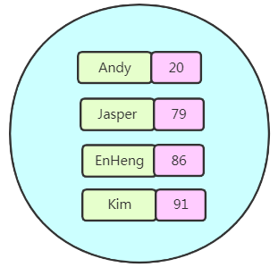

# Redis-day01

## 第一章 非关系型数据库的简介

### 第一节 技术发展线路


### 第二节 互联网发展所面临的问题

#### 1. Web1.0 时代


#### 2. Web2.0时代


#### 3. 互联网三高问题

##### 3.1 高并发、大流量

大型网站系统需要面对高并发(QPS)用户，大流量访问。Google日均PV数35亿，日均IP访问数3亿；腾讯QQ的最大在线用户数1.4亿（2011年数据）；微信用户量已超11亿；2019年天猫双十一交易额突破2500亿。 

##### 3.2 高可用

系统7×24小时不间断服务。大型互联网站的宕机事件通常会成为新闻焦点，微博宕机、B站挂了、腾讯视频挂了，成为重大新闻热点。 

##### 3.3 海量数据

需要存储、管理海量数据，需要使用大量服务器。Facebook每周上传的照片数目接近10亿，百度收录的网页数目有数百亿，Google有近百万台服务器为全球用户提供服务。 

### 第三节 解决上述问题的思路

#### 1. 解决CPU和内存压力问题


#### 2. 解决IO压力问题


### 第四节 非关系型数据库的概念

NoSQL是Not only SQL的缩写，大意为“不只是SQL”，说明这项技术是**传统关系型数据库的补充**而非替代。在整个NoSQL技术栈中**MemCache**、**Redis**、**MongoDB**被称为NoSQL三剑客。那么时代为什么需要NoSQL数据库呢？

我们来做个对比：

####  1. 关系型数据库和非关系型数据库的对比

| 对比项       | 关系型数据库             | 非关系型数据库                         |
| ------------ | ------------------------ | -------------------------------------- |
| 数据存储位置 | 硬盘                     | 内存                                   |
| 数据结构     | 高度组织化结构化数据     | 没有预定义的模式                       |
| 数据操作方式 | SQL                      | 所有数据都是键值对，没有声明性查询语言 |
| 事务控制     | 严格的基于事务ACID原则   | 基于乐观锁的松散事务控制               |
| 访问控制     | 细粒度的用户访问权限控制 | 简单的基于IP绑定或密码的访问控制       |
| 外键         | 支持                     | 不支持                                 |
| 索引         | 支持                     | 不支持                                 |

所以NoSQL数据库的最大优势体现为：高性能、高可用性和可伸缩性。

#### 2. 非关系型数据库的适用场景

* 对数据高并发的读写

* 海量数据的读写

* 对数据高可扩展性的

#### 3. 非关系型数据库不适用的常见

* 需要事务支持

* 基于sql的结构化查询存储，处理复杂的关系,需要即席查询。

## 第二章 Redis的简介

### 第一节 Redis的官方介绍

中文官网介绍: Redis是一个开源（BSD许可）的，内存中的数据结构存储系统，它可以用作数据库、缓存和消息中间件。 它支持多种类型的数据结构，如字符串（strings），散列（hashes），列表（lists），集合（sets），有序集合（sorted sets） 与范围查询，bitmaps，hyperloglogs和地理空间（geospatial） 索引半径查询。 Redis 内置了复制（replication），LUA脚本（Lua scripting）， LRU驱动事件（LRU eviction），事务（transactions）和不同级别的磁盘持久化（persistence）， 并通过Redis哨兵（Sentinel）和自动分区（Cluster）提供高可用性（high availability）。

下面是几点补充：

- Redis的名字是Remote Dictionary Server的缩写。
- 开发语言是ANSI C。
- 支持多种不同语言的客户端。
- 官方给出的性能参考（在并发量50的情况下）：
  - GET: 110000/s:读的速度每秒11万次
  - SET: 81000/s: 写的速度每秒8万次

中文官网http://www.redis.cn
英文官网http://redis.io

Redis命令参考文档网址：http://redisdoc.com

### 第二节 Redis的应用场景

#### 1. 配合关系型数据库做高速缓存

使用Redis可以建立性能非常出色的缓存服务器，查询请求先在Redis中查找所需要的数据，如果能够查询到（命中）则直接返回，大大减轻关系型数据库的压力。 例如: 高频次，热门访问，并且不会经常变化的数据，降低数据库IO

#### 2. 数据临时存储位置

使用token（令牌）作为用户登录系统时的身份标识，这个token就可以在Redis中临时存储。

#### 3. 作为分布式环境下解决Session不一致问题时的Session库

Spring提供了一种技术解决分布式环境下Session不一致问题，叫SpringSession。而Redis就可以为SpringSession提供一个数据存储空间。 

#### 4. 多样的数据结构存储持久化数据


## 第三章 安装Redis

### 第一节 安装Linux版本的Redis

#### 1. 具体安装步骤

##### 1.1 上传redis压缩包
使用xftp将redis压缩包上传到虚拟机的`/usr/local`目录中


上传完之后建议拍个快照，以防安装出错

##### 1.2 安装c语言编译环境

因为是Redis是c语言开发的，所以要运行redis必须有c语言编译环境

```shell
yum install gcc-c++ -y
# 安装GCC环境，中间有确认的话，一律选y (yes)
# 注意：使用yum命令安装软件，需要联网
```

##### 1.3 解压redis

1. 进入`/usr/local`目录: `cd /usr/local`
2. 解压: `tar -xvf redis-5.0.13.tar.gz`

##### 1.4 重命名文件夹

将 `redis-5.0.13`重命名成`redis`

```shell
mv redis-5.0.13 redis
```

##### 1.5 编译安装

1. 进入redis目录:`cd redis/`
2. 编译redis:`make`
3. 指定安装路径并且安装: `make PREFIX=/usr/local/redis install`，安装好之后`/usr/local/redis`目录中会多出来一个`bin`目录

#### 2. redis的配置和启动

##### 2.1 修改配置文件

1. 将`/usr/local/redis/redis.conf`配置文件拷贝到`/usr/local/redis/bin`目录中

2. 使用`vim`编辑器修改`bin`目录中的`redis.conf`文件,修改如下三项

   **注意：/var/logs目录需要我们提前创建好**
   
   | 配置项名称 | 作用                                  | 取值                  |
   | ---------- | ------------------------------------- | --------------------- |
   | daemonize  | 控制是否以守护进程形式运行Redis服务器 | yes                   |
| logfile    | 指定日志文件位置                      | "/var/logs/redis.log" |
   | dir        | Redis工作目录                         | /usr/local/redis      |
   

##### 2.2 后台启动redis服务器

1. 进入redis的bin目录: `cd /usr/local/redis/bin`
2. 让redis根据配置文件启动: `./redis-server ./redis.conf`

##### 2.3 启动redis客户端连接服务器

`./redis-cli`,然后执行`ping`命令，如果能连接上，代表redis安装成功，并且redis服务器启动成功

### 第二节 Windows版本Redis的安装(不建议使用)

Redis官方没有开发支持Windows的版本， 但是，Microsoft开发技术小组开发和维护了Redis的Windows版本(只能使用在64位的电脑上)

#### 1. 具体安装步骤

##### 1.1 软件所在位置


任选一个版本均可，建议选最高的

##### 1.2 开始安装

1. 双击msi文件

   

2. 直接点击下一步

   

3. 同意协议

   

4. 设置安装路径

   

5. 端口号为`6379`不变


6. 设置最大内存空间限制


7. 开始安装


8. 安装之后的目录结构

   

#### 2. 启动Redis服务

redis安装之后是Windows中的服务,采用启动和关闭服务的方式对其进行启动和关闭即可


#### 3. 客户端连接Redis

双击redis安装路径中的`redis-cli.exe`即可打开redis的客户端，然后连接到redis服务

#### 4. 安装Redis可视化客户端


但是Windows中的Redis可视化客户端默认无法与Linux中的Redis服务器连接，需要修改Linux中的Redis服务器的配置: 在redis.conf配置文件中在bind的值的后面加上虚拟机的IP地址(在后面将Jedis的时候会讲到)，并且要确保Linux的防火墙放行了"6379"端口，或者防火墙关闭了

```
例如:原本的是
bind 127.0.0.1
现在改成
bind 127.0.0.1 192.168.141.135
```

改完之后要重启redis:

```
先找到redis服务的进程id
ps -ef | grep redis
然后根据进程id杀死进程
kill -9 进程id
```


## 第三章 Redis常用数据结构

### 第一节 Redis总体结构

Redis中的数据，总体上是键值对，不同数据类型指的是键值对中值的类型。其中value支持8种数据类型

| 数据类型     | 应用场景                                                |
| ------------ | ------------------------------------------------------- |
| string       | 分布式Session存储 分布式数据库ID 计数器：统计网站访问量 |
| hash         | 存储对象信息（购物车中的商品信息） 存储表的信息         |
| list         | 实现队列、栈操作 汇总日志 粉丝列表 关注的人列表         |
| set          | 签到 打卡 点赞                                          |
| zset         | 排行榜 百度热点搜索                                     |
| geospatial   | 获取地理位置信息 两地之间的距离                         |
| hyperloglogs | 基数统计                                                |
| bitmaps      | 统计用户访问次数                                        |

### 第二节 八种数据类型的简介

#### 1. string 类型

Redis中最基本的类型，它是key对应的一个单一值。二进制安全，不必担心由于编码等问题导致二进制数据变化。所以redis的string可以包含任何数据，比如jpg图片或者序列化的对象。Redis中一个字符串值的最大容量是512M。

####  2. list类型

Redis 列表是简单的字符串列表，按照插入顺序排序。你可以添加一个元素到列表的头部（左边）或者尾部（右边）。它的底层是双向链表，所以它操作时头尾效率高，中间效率低（额外花费查找插入位置的时间）。

在Redis中list类型是按照插入顺序排序的字符串链表。和数据结构中的普通链表一样，我们可以在其头部(left)和尾部(right)添加新的元素。在插入时，如果该键并不存在，Redis将为该键创建一个新的链表。与此相反，如果链表中所有的元素均被移除，那么该键也将会被从数据库中删除。List中可以包含的最大元素数量是2^32-1个。

list是一个有序可以重复的数据类型。

#### 3. set类型

Redis的set是string类型的无序集合。它是基于哈希表实现的。set类型插入数据时会自动去重。最大可以包含2^32-1个元素。


#### 4. hash类型

本身就是一个键值对集合。可以当做Java中的Map<String,String>对待。每一个hash可以存储2^32-1个键值对。 


#### 5. zset类型

Redis zset 和 set 一样也是string类型元素的集合,且不允许重复的成员。不同的是每个元素都会关联一个double类型的分数。redis正是通过分数来为集合中的成员进行从小到大的排序。zset的成员是唯一的,但分数(score)却可以重复。 



#### 6. Geospatial

Redis 在 3.2 推出 Geo 类型，该功能可以推算出地理位置信息，两地之间的距离。 


#### 7. HyperLogLogs

用于大数据量基数统计，速度非常快，占用内存非常小。每个HyperLogLog键只需要花费12KB内存，就可以计算接近 2^64个不同元素的基数。比如计算网站UV（User view，用户访问数量，一个用户一天访问同一个URL地址多次合并为一次）。 

#### 8. bitmap

直接对string的二进制位进行操作的一组命令 

## 第三章 Redis命令行操作

### 第一节 基本操作命令

#### 1. 切换数据库

Redis默认有16个数据库,默认情况下使用的是第一个数据库，我们使用select进行切换，数据库索引从0开始

#### 2. 查看数据库长度

数据库长度就是这个数据库中存储了多少条数据，使用`dbsize`可以查看数据库长度

#### 3. 清空数据库

##### 3.1 清空当前数据库

`flushdb`

##### 3.2 清空所有数据库

`flushall`

### 第二节 KEY操作

#### 1. KEY的命名规范

在实际操作中对于Key的定义大家注意下面几点：

- Key不要太长，超过1024字节将消耗过多内存，降低查询效率。尽管Redis支持的Key最大长度为512MB。
- Key仍然要做到见名知意。
- 在同一个项目中遵循同一个命名规范，习惯上多个单词用“:”分开。例如：“user:token:session:id”
- Redis命令不区分大小写，Key区分大小写

#### 2. KEY操作相关命令(等后续再来演示)

| 命令                    | 描述                                                         |
| ----------------------- | ------------------------------------------------------------ |
| KEYS PATTERN            | 把匹配PATTERN的key返回。PATTERN中可以使用“*”匹配多个字符，使用“?”匹配单个字符 |
| TYPE KEY                | 返回KEY对应的值的类型                                        |
| MOVE KEY DB             | 把一组键值对数据移动到另一个数据库中                         |
| DEL KEY [KEY ...] 重点  | 根据KEY进行删除，至少要指定一个KEY                           |
| EXISTS KEY [KEY ...]    | 检查指定的KEY是否存在。指定一个KEY时，存在返回1，不存在返回0。可以指定多个，返回存在的KEY的数量。 |
| RENAME KEY NEWKEY       | 重命名一个KEY，NEWKEY不管是否是已经存在的都会执行，如果NEWKEY已经存在则会被覆盖。 |
| RENAMENX KEY NEWKEY     | 只有在NEWKEY不存在时能够执行成功，否则失败                   |
| TTL KEY                 | 以秒为单位查看KEY还能存在多长时间<br/>	正数：剩余的存活时间（单位：秒）<br/>	-1：永不过期<br/>	-2：不存在的Key |
| EXPIRE KEY SECONDS 重点 | 给一个KEY设置在SECONDS秒后过期，过期会被Redis移除。          |
| PERSIST KEY             | 移除过期时间，变成永久key                                    |

### 第三节 string操作

| 命令                            | 描述                                                         |
| ------------------------------- | :----------------------------------------------------------- |
| SET key value(重点)             | 设置指定 key 的值                                            |
| GET key(重点)                   | 获取指定 key 的值                                            |
| APPEND KEY VALUE                | 把指定的value追加到KEY对应的原来的值后面，返回值是追加后字符串长度 |
| GETSET key value                | 将给定 key 的值设为 value ，并返回 key 的旧值(old value)。   |
| GETRANGE KEY START END          | 从字符串中取指定的一段，索引从0开始 	START是开始取值的索引 	END是结束取值的索引 |
| SETRANGE KEY OFFSET VALUE       | 跳过offset个字符，然后使用Value替换等长度的内容              |
| STRLEN KEY                      | 直接返回字符串长度                                           |
| SETEX key seconds value(重点)   | 将值 value 关联到 key ，并将 key 的过期时间设为 seconds (以秒为单位)。 |
| SETNX key value                 | 只有在 key 不存在时设置 key 的值。                           |
| INCR key(重点)                  | 将 key 中储存的数字值增一。                                  |
| INCRBY key increment            | 将 key 所储存的值加上给定的增量值（increment） 。            |
| DECR key                        | 将 key 中储存的数字值减一。                                  |
| DECRBY key decrement            | key 所储存的值减去给定的减量值（decrement） 。               |
| MSET KEY VALUE [KEY VALUE ...]  | 一次性设置一组多个键值对                                     |
| MGET KEY [KEY ...]              | 一次性指定多个KEY，返回它们对应的值，没有值的KEY返回值是(nil |
| MSETNX KEY VALUE [KEY VALUE ... | 一次性新建多个值                                             |

### 第四节 list操作

| 命令                                   | 命令描述                                                     |
| -------------------------------------- | ------------------------------------------------------------ |
| LPUSH key value [value ...] 重点       | 将一个或多个值插入到列表头部(左边)                           |
| LPUSHX key value                       | 只能针对存在的list执行LPUSH                                  |
| RPUSH key value [value ...] 重点       | 在列表中添加一个或多个值(右边)                               |
| LRANGE key start stop                  | 根据list集合的索引打印元素数据 	正着数：0,1,2,3,... 	倒着数：-1,-2,-3,... |
| LPOP key 重点                          | 左边弹出一个 相当于移除第一个                                |
| RPOP key 重点                          | 右边弹出一个  相当于移除最后一个                             |
| LLEN key                               | 返回指定key所对应的list中元素个数                            |
| LINDEX key index                       | 通过索引获取列表中的元素                                     |
| LINSERT key BEFORE\| AFTER pivot value | 在pivot指定的值前面或后面插入value 	如果pivot值有重复的，那么就从左往右数，以第一个遇到的pivot为基准 	BEFORE表示放在pivot前面 	AFTER表示放在pivot后面 |
| RPOPLPUSH source destination           | 从source中RPOP一个元素，LPUSH到destination中                 |
| LREM key count value                   | 根据count指定的数量从key对应的list中删除value 	具体执行时从左往右删除，遇到一个删一个，删完为止 |
| LSET key index value                   | 把指定索引位置的元素替换为另一个值                           |
| LTRIM key start stop                   | 仅保留指定区间的数据，两边的数据被删除                       |

### 第五节 Set操作

| 命令                                  | 命令描述                                                     |
| ------------------------------------- | ------------------------------------------------------------ |
| SADD key member [member ...]          | 给key指定的set集合中存入数据，set会自动去重                  |
| SREM key member [member ...]          | 从集合中删除元素                                             |
| SMEMBERS key                          | 返回可以指定的set集合中所有的元素                            |
| SCARD key                             | 返回集合中元素的数量                                         |
| SISMEMBER key member                  | 检查当前指定member是否是集合中的元素 	返回1：表示是集合中的元素 	返回0：表示不是集合中的元素 |
| SPOP key                              | 移除并返回集合中的一个随机元素                               |
| SDIFF key [key ...]                   | 将指定的集合执行“差集”操作 	集合A：a,b,c 	集合B：b,c,d 	A对B执行diff：a 	相当于：A-交集部分 |
| SDIFFSTORE destination key [key ...]  | 取差集后存入destination这个集合                              |
| SUNION key [key ...]                  | 将指定的集合执行“并集”操作 	集合A：a,b,c 	集合B：b,c,d 	并集：a,b,c,d |
| SUNIONSTORE destination key [key ...] | 取并集后存入destination这个集合                              |
| SINTER key [key ...]                  | 将指定的集合进行“交集”操作 	集合A：a,b,c 	集合B：b,c,d 	交集：b,c |
| SINTERSTORE destination key [key ...] | 取交集后存入destination这个集合                              |
| SMOVE source destination member       | 把member从source移动到destination                            |

### 第六节 Hash操作

| 命令                                    | 命令描述                                              |
| :-------------------------------------- | ----------------------------------------------------- |
| HSET key field value                    | 将哈希表 key 中的字段 field 的值设为 value            |
| HMSET key field value [field value ...] | 同时将多个 field-value (字段-值)对设置到哈希表 key 中 |
| HGET key field                          | 获取存储在哈希表中指定字段的值                        |
| HMGET key field [field ...]             | 获取多个给定字段的值                                  |
| HDEL key field [field ...]              | 删除一个或多个哈希表字段                              |
| HLEN key                                | 获取哈希表中字段的数量                                |
| HGETALL key                             | 获取在哈希表中指定 key 的所有字段和值                 |
| HKEYS key                               | 获取所有哈希表中的字段                                |
| HVALS key                               | 获取哈希表中所有值                                    |
| HEXISTS key field                       | 判断是否存在某个字段                                  |

### 第七节 zset操作

| 命令                                                        | 命令描述                                                     |
| ----------------------------------------------------------- | ------------------------------------------------------------ |
| ZADD key score member \[score member ...\]                  | 增加元素                                                     |
| ZSCORE key member                                           | 获取元素的分数                                               |
| ZREM key member [member ...]                                | 删除元素                                                     |
| ZCARD key                                                   | 获得集合中元素的数量                                         |
| ZRANGE key start stop[WITHSCORES]                           | 获得排名在某个范围的元素列表                                 |
| ZREVRANGE key start stop                                    | 按照分数从高到低排序                                         |
| ZRANGEBYSCORE key min max [WITHSCORES] [LIMIT offset count] | 在分数的指定区间内返回数据 	min参数可以通过 -inf 表示负无穷 	max参数可以通过 +inf 表示正无穷 |
| ZRANK key member                                            | 先对分数进行升序排序，返回member的排名。排名从0开始          |

### 第八节 Geospatial(了解)

查询经纬度数据的网址：http://www.jsons.cn/lngcode 

#### 1. 添加地理位置

```
GEOADD key longitude latitude member [longitude latitude member ...]
```

规则：

1.取值范围

 有效的经度从 -180 度到 180 度。

 有效的纬度从 -85.05112878 度到 85.05112878 度。

 当坐标位置超出指定范围时，该命令将会返回一个错误。

2.已经添加的数据，是无法再次往里面添加的。

例子:

```
GEOADD china:city 114.085947 22.547 shenzhen 
GEOADD china:city 113.280637 23.125178 guangzhou
```

#### 2. 查询已添加的地理位置

Geo类型在Redis内部其实是使用zset类型存储的，所以可以使用zset的命令进行常规操作 

```
ZRANGE china:city 0 -1 
ZRANGE china:city 0 -1 WITHSCORES
```

#### 3. 删除已添加的地理位置

```
ZREM china:city guangzhou
```

#### 4. 获取指定地区的坐标值

```
GEOPOS china:city shenzhen
```

##### 5. 计算两地之间的直线距离

```
GEODIST china:city guangzhou shenzhen km
```

单位：

m 表示单位为米[默认值]。

km 表示单位为千米。

mi 表示单位为英里。

ft 表示单位为英尺。

如果用户没有显式地指定单位参数， 那么 GEODIST 默认使用米作为单位。

#### 6. 以给定坐标为中心，在指定半径内查找元素

```
GEORADIUS china:city 110 20 1000 km WITHCOORD WITHDIST
```

WITHCOORD表示显示经纬度

WITHDIST表示显示到中心的距离

#### 7. 在指定元素周围查找其他元素

```
GEORADIUSBYMEMBER china:city shenzhen 300 km WITHCOORD WITHDIST
```

### 第九节 HyperLogLogs(了解)

#### 1. 基数概念

一个集合中不重复元素的个数。例如：集合{1,2,5,1,7,2,5}中元素个数是7，但是基数是4。而hyperloglogs的主要功能就是进行基数统计。 

#### 2. 常用命令

##### 2.1 添加

```
PFADD user:access:1 tom jerry andy jim andy jerry tom
PFADD user:access:2 andy jerry tom bob kate
PFADD user:access:3 mary harry tom jerry
```

##### 2.2 统计

```
PFCOUNT user:access:1 user:access:2 user:access:3
```

##### 2.3 合并

```
PFMERGE user:access:merge user:access:1 user:access:2 user:access:3
```

### 第十节 bitmap位图(了解)

直接对数据的二进制位进行操作 ：

setbit设置指定比特位
getbit获取指定比特位
bitcount统计所有比特位中1的数量

```text
set a hello
GETBIT a 0
GETBIT a 1
GETBIT a 2
GETBIT a 3
GETBIT a 4
GETBIT a 5
SETBIT a 5 1
get a
BITCOUNT a
```

## 第四章 总结

1. 为什么需要NoSQL
   1. 主要目的：解决互联网项目的性能问题
   2. 具体解决哪些性能问题: 高并发、海量数据、高可用
2. Redis有几种数据类型
   1. string
   2. list
   3. set
   4. hash
   5. zset
   6. 地理位置
   7. 基数
   8. bitmap
3. redis存储数据的整体结构: 键值对
4. 安装redis:
   1. 安装完之后:修改配置文件
   2. 远程访问: 修改配置文件的bind
   3. 启动redis的时候: 一定要附加配置文件参数   `./redis-server 配置文件路径`