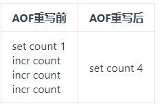
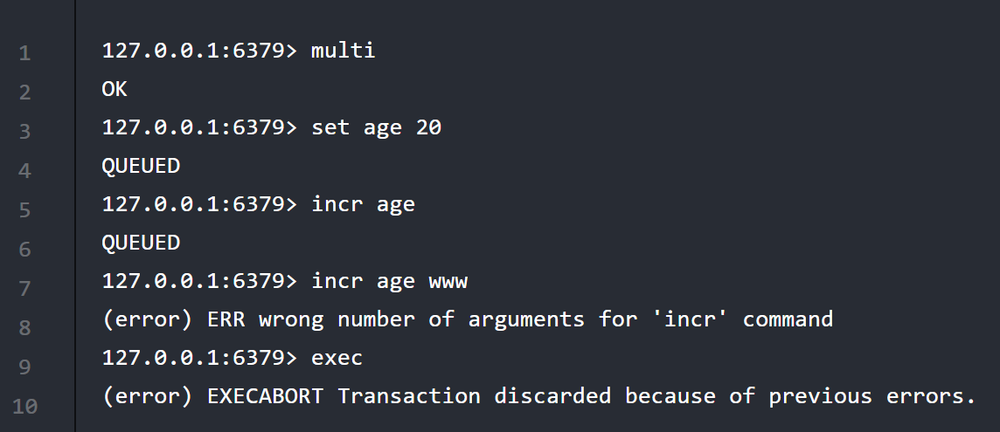
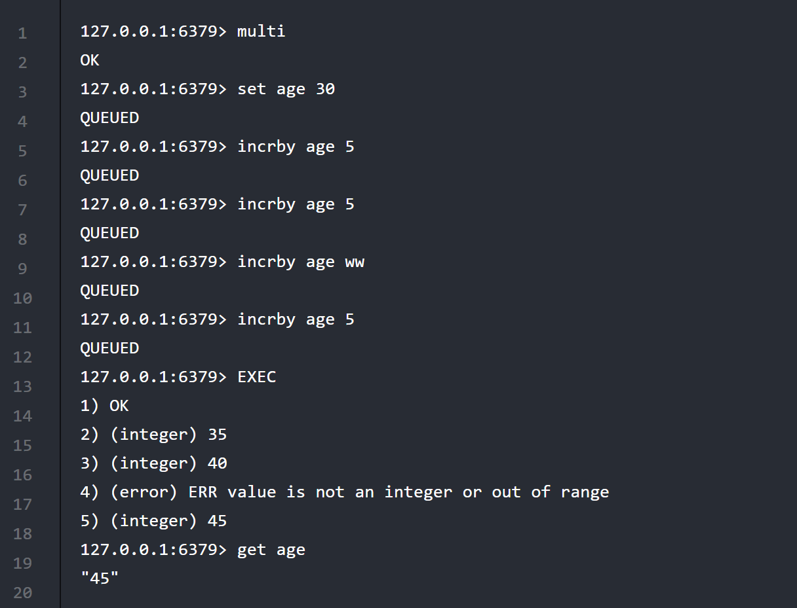
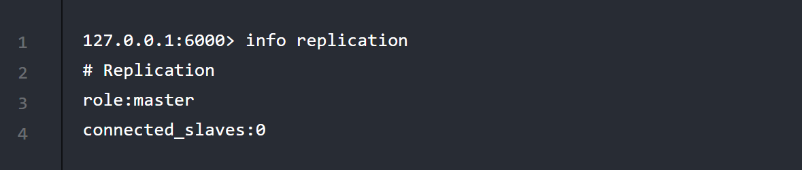

# Redis-day02

## 第一章 Redis持久化机制

Redis的高性能是由于其将所有数据都存储在了内存中，为了使Redis在重启之后仍能保证数据不丢失，需要将数据**从内存中同步到硬盘(文件)中，这一过程就是持久化**。Redis 提供了一系列不同的持久化选项，包含: RDB、AOF、不持久以及RDB+AOF这四种选项

官网地址: https://redis.io/topics/persistence 

### 第一节 RDB持久化机制

#### 1. RDB的概念

RDB 持久化以指定的时间间隔执行数据集的快照。RDB持久化方式是Redis默认开启的，我们不配置也可以默认使用RDB持久化机制

#### 2. 快照的触发时机

##### 2.1 基于默认配置

| 配置          | 含义                                |
| ------------- | ----------------------------------- |
| save 900 1    | 900秒内至少有一次修改则触发保存操作 |
| save 300 10   | 300秒内至少有10次修改则触发保存操作 |
| save 60 10000 | 60秒内至少有1万次修改则触发保存操作 |

##### 2.2 使用保存命令

 save或bgsave 

##### 2.3 使用flushall命令

这个命令也会产生dump.rdb文件，但里面是空的，没有意义 

##### 2.4 正常关闭服务器

如果执行SHUTDOWN命令让Redis正常退出，那么此前Redis就会执行一次持久化保存。

####  3. RDB的相关配置

| 配置项     | 取值                   | 作用                                                         |
| ---------- | ---------------------- | ------------------------------------------------------------ |
| save       | 900 1                  | 设置RDB的快照时间点，如果为空则禁用RDB                       |
| dbfilename | 文件名，例如：dump.rdb | 设置RDB机制下，数据存储文件的文件名                          |
| dir        | Redis工作目录路径      | 指定存放持久化文件的目录的路径。注意：这里指定的必须是目录不能是文件名 |

#### 4. RDB持久化的优势

1. RDB是一个简洁的按时间点生成的文件，RDB 文件非常适合备份。例如，你可能希望在最近 24 小时内每小时存档一次 RDB 文件，并在 30 天内每天保存一个 RDB 快照。这使您可以在发生灾难时轻松恢复不同版本的数据集。 
2. RDB 非常适合灾难恢复，它是一个可以传输到远程数据中心或者云服务器的简洁文件(文件体积不大)，并且进行数据恢复时速度很快(便于数据恢复)
3. RDB 最大限度地提高了 Redis 的性能，因为 Redis 父进程为了持久化需要做的唯一工作是创建一个能完成所有持久化工作子进程。父进程永远不会执行磁盘 I/O 或类似操作。
4. 在副本上，RDB 支持重启和故障转移后的部分重新同步。

####  5. RDB的缺点

1. 容易造成数据丢失，因为RDB是在一定的时间点才会去进行持久化，例如( 300秒内至少有10次修改则触发保存操作)，那么此时如果发生不可预期的关机或断电，则会导致这几分钟之内的数据丢失
2.  RDB 经常需要 fork() 以便使用子进程在磁盘上持久化。如果数据集很大，Fork() 可能会很耗时，如果数据集很大且 CPU 性能不是很好，则可能导致 Redis 停止为客户端服务几毫秒甚至一秒钟。 AOF 也需要 fork() 但你可以调整你想要重写日志的频率，而不会对持久性进行任何权衡。 

### 第二节 AOF持久化机制

#### 1. AOF的概念

AOF 持久化记录服务器收到的每个写操作，这些操作将在服务器启动时再次播放，重建原始数据集。命令使用与 Redis 协议本身相同的格式以仅附加的方式记录。当日志变得太大时，Redis 能够在后台重写日志。 

#### 2. AOF的基本配置

| 配置项         | 取值              | 作用                                                         |
| -------------- | ----------------- | ------------------------------------------------------------ |
| appendonly     | yes               | 启用AOF持久化机制                                            |
|                | no                | 禁用AOF持久化机制[默认值]                                    |
| appendfilename | "文件名"          | AOF持久化文件名                                              |
| dir            | Redis工作目录路径 | 指定存放持久化文件的目录的路径。注意：这里指定的必须是目录不能是文件名 |
| appendfsync    | always            | 每一次数据修改后都将执行文件写入操作，是最安全的方式但是速度缓慢。 |
|                | everysec          | 每秒执行一次写入操作。折中。                                 |
|                | no                | 由操作系统在适当的时候执行写入操作，Redis性能最好，数据保存次数最少。 |

注意: 当 AOF 和 RDB 机制并存时，Redis 会优先采纳 AOF 机制。使用 AOF 持久化文件恢复内存中的数据。而 AOF 刚刚开启时 appendonly.aof 持久化文件中没有任何数据。拿空的 appendonly.aof 持久化文件恢复内存，就会导致以前所有数据都丢失。 

#### 3. AOF的优势

1. 使用AOF可以让Redis更持久：你可以有不同的 fsync 策略：不进行fsync，每秒进行fsync，每次执行Redis命令都进行fsync。使用 fsync每秒写入性能的默认策略仍然很棒（fsync是使用后台线程执行的，当没有 fsync 正在进行时，主线程将努力执行写入。）但您只能丢失一秒钟的写入。 
2. AOF 日志是仅附加日志，因此在断电时不会出现寻道或损坏问题。即使日志由于某种原因（磁盘已满或其他原因）以半写命令结束，redis-check-aof 工具也能够轻松修复它。 
3. 当 AOF文件变大时，Redis 能够在后台自动重写 AOF。重写是完全安全的，因为当 Redis 继续追加到旧文件时，会使用创建当前数据集所需的最少操作集生成一个全新的文件，一旦第二个文件准备就绪，Redis 就会切换这两个文件并开始追加到新的。 
4. AOF以易于理解和解析的格式包含所有操作的日志。您甚至可以轻松导出 AOF 文件。例如，即使您不小心使用 FLUSHALL删除了所有内容，只要在此期间没有重写日志，您仍然可以通过停止服务器、删除最新命令并重新启动Redis 来保存您的数据集再次。 

#### 4. AOF的缺点

1. AOF文件通常比相同数据集的等效 RDB 文件大。 
2. AOF持久化数据的恢复速度比RDB要慢很多
3. AOF可能在特定命令中遇到罕见的错误（例如，有一个涉及像 BRPOPLPUSH 这样的阻塞命令）导致生成的 AOF在重新加载时无法重现完全相同的数据集。但这种错误是极其罕见的

#### 5. AOF文件重写

##### 5.1 AOF文件为什么会重写

随着写入操作的执行，AOF 变得越来越大。例如，如果您将计数器递增 100 次，您最终将在数据集中只有一个键包含最终值，但在 AOF 中有 100 个条目。重建当前状态不需要这些条目中的 99 个。 所以Redis支持了一个有趣的特性它能够在不中断对客户端的服务的情况下在后台重建AOF。每当您发出BGREWRITEAOF时，Redis 都会写入在内存中重建当前数据集所需的最短命令序列。在Redis 2.2及以上的版本中使用 AOF，则需要不时运行 BGREWRITEAOF，它会自动触发日志重写

##### 5.2 AOF文件重写的效果

对比下面两组命令：



两组命令执行后对于count来说最终的值是一致的，但是进行AOF重写后省略了中间过程，可以让AOF文件体积更小，缩短数据恢复时间。而Redis会根据AOF文件的体积来决定是否进行AOF重写。参考的配置项如下：

| 配置项                          | 含义                            |
| ------------------------------- | ------------------------------- |
| auto-aof-rewrite-percentage 100 | 文件体积增大100%时执行AOF重写   |
| auto-aof-rewrite-min-size 64mb  | 文件体积增长到64mb时执行AOF重写 |

实际工作中不要进行频繁的AOF重写，因为CPU、内存资源和硬盘资源三者之间肯定是CPU、内存资源更加宝贵，所以不应该过多耗费CPU性能去节省硬盘空间。另外数据恢复也不是高频操作，所以节约数据恢复时间价值也不是非常大。

### 第三节 如何修复损坏的AOF文件

Redis服务器启动时如果读取了损坏的AOF持久化文件会导致启动失败，此时为了让Redis服务器能够正常启动，需要对损坏的持久化文件进行修复。 

- 第一步：备份要修复的appendonly.aof文件

- 第二步：执行修复程序

  /usr/local/redis/bin/redis-check-aof --fix /usr/local/redis/appendonly.aof

- 第三步：重启Redis

注意：所谓修复持久化文件仅仅是把损坏的部分去掉，而没法把受损的数据找回。


### 第四节 如何选择Redis的持久化选项

官方建议:

一般的迹象是，如果您想要与 PostgreSQL 可以提供的数据安全程度相当的数据安全性，则应该同时使用这两种持久性方法。 如果您非常关心您的数据，但在发生灾难时仍然可以忍受几分钟的数据丢失，您可以简单地单独使用 RDB。 有许多用户单独使用 AOF，但我们不鼓励它，因为不时拥有 RDB 快照对于进行数据库备份、更快地重新启动以及在 AOF 引擎中出现错误时是一个好主意。 注意：由于所有这些原因，我们很可能在未来将 AOF 和 RDB 统一为一个持久化模型（长期计划）。 

我的理解是:

如果Redis仅仅作为缓存可以不使用任何持久化方式。

其他应用方式综合考虑性能和完整性、一致性要求。

RDB文件只用作后备用途，建议只在Slave上持久化RDB文件，而且只要15分钟备份一次就够了，只保留save 900 1这条规则。如果Enalbe AOF，好处是在最恶劣情况下也只会丢失不超过两秒数据，启动脚本较简单只load自己的AOF文件就可以了。代价一是带来了持续的IO，二是AOF rewrite的最后将rewrite过程中产生的新数据写到新文件造成的阻塞几乎是不可避免的。只要硬盘允许，应该尽量减少AOF rewrite的频率，AOF重写的基础大小默认值64M太小了，可以设到5G以上。默认超过原大小100%大小时重写可以改到适当的数值。如果不开启AOF，仅靠Master-Slave Replication 实现高可用性能也不错。能省掉一大笔IO也减少了rewrite时带来的系统波动。代价是如果Master/Slave同时挂掉，会丢失十几分钟的数据，启动脚本也要比较两个Master/Slave中的RDB文件，载入较新的那个。新浪微博就选用了这种架构。

## 第二章 Jedis

### 第一节 Jedis的入门

#### 1. Jedis的简介

Redis不仅是使用命令来操作，现在基本上主流的语言都有客户端支持，比如java、C、C#、C++、php、Node.js、Go等。 在官方网站里列一些Java的客户端，有Jedis、Redisson、Jredis、JDBC-Redis、等其中官方推荐使用Jedis和Redisson。 在企业中用的最多的就是Jedis，Jedis同样也是托管在github上

#### 2. 修改Redis配置文件中的bind配置项

##### 2.1 bind配置项的作用

bind后面跟的ip地址是客户端访问Redis时使用的IP地址。规则是：Redis要求客户端访问的地址，必须是 bind 配置项绑定的地址。看下面例子：

| bind值          | 访问方式                       |
| --------------- | ------------------------------ |
| 127.0.0.1       | ./redis-cli -h 127.0.0.1       |
| 192.168.200.100 | ./redis-cli -h 192.168.200.100 |

所以，结论是：bind 配置项要绑定可以对外暴露的本机地址。那么 Redis 为什么会有这样的要求？就是因为在实际项目中，Redis 不是给用户直接访问的，而是给 Java 程序访问的。所以 Redis 只要绑定一个内部访问地址，就能够屏蔽外部的访问，所以这个地址绑定机制，能够对 Redis 进行保护。 

##### 2.2 修改bind配置项

因为我们是在宿主机Windows系统中编写Java代码，而Redis服务器是在虚拟机Linux系统中运行，所以为了让Redis能够被远程客户端访问，我们需要修改bind的配置，在redis.conf配置文件中将bind的值配置成虚拟机的IP地址

```
例如:原本的是
bind 127.0.0.1
现在改成
bind 127.0.0.1 192.168.141.135
改完需要重启redis服务器
```

千万不要把`127.0.0.1删掉`，如果删掉了的话，则Linux本机无法访问Redis。

将bind的值修改成`0.0.0.0`也可以实现本机和远程都能连接redis服务器。

当然还有另一种方式可以让Redis被远程客户端访问，那就是关闭Redis的安全模式: 在redis.conf配置文件中将`protected-mode`的值设置为`no`

#### 3. 使用Jedis

##### 3.1 引入Jedis的依赖

```xml
<dependency>
    <groupId>redis.clients</groupId>
    <artifactId>jedis</artifactId>
    <version>2.9.0</version>
</dependency>
```

##### 3.2 Jedis的使用代码

```java
//指定Redis服务器的IP地址和端口号
Jedis jedis = new Jedis("Jedis服务器的IP地址", 6379);

//jedis的方法是与jedis的命令一一对应的
//存储一个键值对
jedis.set("tom:code","123456");

//根据key获取值
System.out.println(jedis.get("tom:code"));    

//关闭连接
jedis.close();
```

#### 4. JedisPool的使用

JedisPool是Jedis的连接池

```java
@Test
public void testJedisPool(){
    //测试使用Jedis连接池
    //1. 创建连接池
    JedisPool jedisPool = new JedisPool("192.168.141.136",6379);

    //2. 我们可以对连接池进行配置
    GenericObjectPoolConfig poolConfig = new GenericObjectPoolConfig();
    //最大连接数
    poolConfig.setMaxTotal(20);
    //最大闲置连接数
    poolConfig.setMaxIdle(20);
    //最小闲置连接数
    poolConfig.setMinIdle(0);
    poolConfig.setMaxWaitMillis(3000);

    //3. 使用连接池获取连接
    Jedis jedis = jedisPool.getResource();

    System.out.println(jedis.get("username"));

    //归还连接
    jedis.close();
}
```

## 第三章 Redis事务控制

### 第一节 Redis事务的概述

#### 1. 事务的作用

Redis事务是一个单独的隔离操作：事务中的所有命令都会序列化、按顺序地执行。事务在执行的过程中，不会被其他客户端发送来的命令请求所打断。

Redis事务的主要作用就是串联多个命令防止别的命令插队。

#### 2. 事务控制的相关命令

| 命令名  | 作用                                                         |
| ------- | ------------------------------------------------------------ |
| MULTI   | 表示开始收集命令，后面所有命令都不是马上执行，而是加入到一个队列中。 |
| EXEC    | 执行MULTI后面命令队列中的所有命令。                          |
| DISCARD | 放弃执行队列中的命令。                                       |
| WATCH   | “观察“、”监控“一个KEY，在当前队列外的其他命令操作这个KEY时，放弃执行自己队列的命令 |
| UNWATCH | 放弃监控一个KEY                                              |

### 第二节 命令队列执行失败的两种情况

#### 1. 加入队列时失败



入队过程中某个命令出现了报告错误，执行时整个的所有队列都会被取消。


#### 2. 执行队列时失败



错误在入队时检测不出来，整个队列执行时有错的命令执行失败，但是其他命令并没有回滚。 

#### 3. Redis为什么不支持回滚

官方解释如下：

> 如果你有使用关系式数据库的经验， 那么 “Redis 在事务失败时不进行回滚，而是继续执行余下的命令”这种做法可能会让你觉得有点奇怪。以下是这种做法的优点： 1.Redis 命令只会因为错误的语法而失败（并且这些问题不能在入队时发现），或是命令用在了错误类型的键上面：这也就是说，从实用性的角度来说，失败的命令是由编程错误造成的，而这些错误应该在开发的过程中被发现，而不应该出现在生产环境中。 2.因为不需要对回滚进行支持，所以 Redis 的内部可以保持简单且快速。 有种观点认为 Redis 处理事务的做法会产生 bug ， 然而需要注意的是， 在通常情况下， 回滚并不能解决编程错误带来的问题。 举个例子， 如果你本来想通过 INCR 命令将键的值加上 1 ， 却不小心加上了 2 ， 又或者对错误类型的键执行了 INCR ， 回滚是没有办法处理这些情况的。

### 第三节 悲观锁和乐观锁

#### 1. 悲观锁

顾名思义，就是很悲观，每次去拿数据的时候都认为别人会修改，所以每次在拿数据的时候都会上锁，这样别人想拿这个数据就会block直到它拿到锁。传统的关系型数据库里边就用到了很多这种锁机制，比如行锁，表锁等，读锁，写锁等，都是在做操作之前先上锁。

#### 2. 乐观锁

顾名思义，就是很乐观，每次去拿数据的时候都认为别人不会修改，所以不会上锁，但是在更新的时候会判断一下在此期间别人有没有去更新这个数据，可以使用版本号等机制。

- 如果是基于最新的版本所做的修改：服务器接受，修改成功
- 如果是基于旧的版本号所做的修改：服务器不接受，修改失败，整个MULTI队列中的操作都被丢弃

乐观锁适用于多读的应用类型，这样可以提高吞吐量。在执行multi之前，先执行watch key1 [key2],可以监视一个(或多个) key ，如果在事务执行之前这个(或这些) key 被其他命令所改动，那么事务将被打断。这就是乐观锁的具体体现


## 第四章 Redis的主从复制机制

### 第一节 主从复制的概述

#### 1. 什么是主从复制

主从复制是主机数据更新后根据配置和策略， 自动同步到备机的master/slave机制，Master以写为主，Slave以读为主


#### 2. 主从复制的目的

- 性能优化：主服务器专注于写操作，可以用更适合写入数据的模式工作；同样，从服务器专注于读操作，可以用更适合读取数据的模式工作。
- 强化数据安全，避免单点故障：由于数据同步机制的存在，各个服务器之间数据保持一致，所以其中某个服务器宕机不会导致数据丢失或无法访问。从这个角度说参与主从复制的Redis服务器构成了一个**集群**。

### 第二节 搭建主从复制集群

#### 1. 搭建思路

Redis集群在运行时使用的是同一个可执行文件(redis-server)，只是对应的配置文件(redis.conf)不同。 


每个配置文件相同的参数是:

```
daemonize yes
dir /usr/local/cluster-redis
```

不同的参数是:

| 配置项名称 | 作用                          | 取值                                                         |
| ---------- | :---------------------------- | ------------------------------------------------------------ |
| port       | Redis服务器启动后监听的端口号 | 6000 7000 8000                                               |
| dbfilename | RDB文件存储文件名             | dump6000.rdb                                                                                   dump7000.rdb                                                                        dump8000.rdb |
| logfile    | 日志文件位置                  | /var/logs/redis6000.log                                                /var/logs/redis7000.log                                               /var/logs/redis8000.log |
| pidfile    | pid文件位置                   | /var/run/redis6000.pid                                                          /var/run/redis7000.pid                                                         /var/run/redis8000.pid |

#### 2. 搭建步骤

- 第一步：创建/usr/local/cluster-redis目录`mkdir /usr/local/cluster-redis`
- 第二步：把原始未经修改的redis.conf复制到/usr/local/cluster-redis目录,并且改名为redis6000.conf

```
cp /usr/local/redis/redis.conf /usr/local/cluster-redis/redis6000.conf
```

- 第三步：按照既定计划修改redis6000.conf中的相关配置项
  - daemonize yes
  - dir
  - port
  - dbfilename
  - logfile
  - pidfile
- 第五步：复制redis6000.conf为redis7000.conf
- 第六步：修改redis7000.conf中的相关配置项
  - port
  - dbfilename
  - logfile
  - pidfile
- 第七步：复制redis6000.conf为redis8000.conf
- 第八步：修改redis8000.conf中的相关配置项
  - port
  - dbfilename
  - logfile
  - pidfile

#### 3. 启动Redis主从复制集群

进入`/usr/local/redis/bin`目录下:

```
./redis-server /usr/local/cluster-redis/redis6000.conf
./redis-server /usr/local/cluster-redis/redis7000.conf
./redis-server /usr/local/cluster-redis/redis8000.conf
```

使用redis-cli连接指定服务器的命令格式如下:

```
/usr/local/redis/bin/redis-cli -h IP地址 -p 端口号
```

使用redis-cli停止指定服务器的命令格式如下：
`/usr/local/redis/bin/redis-cli -h IP地址 -p 端口号 shutdown `

### 第三节 主从关系

#### 1. 查看主从关系

刚刚启动的集群服务器中每一个节点服务器都认为自己是主服务器。需要建立主从关系。 



#### 2. 配置主从关系

只需要在从机上指定主机的地址和端口号即可

```
SLAVEOF 127.0.0.1 6000
```

此时表示本机的`6000`端口是主机

#### 3. 取消主从关系

只需要在从机上执行命令`SLAVEOF NO ONE`即可，那么此时从机就自己变成了主机


#### 4. 执行测试

- 测试1：在主机写入数据，在从机查看
- 测试2：在从机写入数据会报错。配置文件中的依据是：slave-read-only yes
- 测试3：主机执行SHUTDOWN看从机状态
- 测试4：主机恢复启动，看从机状态
- 测试5：从机SHUTDOWN，此时主机写入数据，从机恢复启动查看状态。重新设定主从关系后看新写入的数据是否同步。

### 第四节 哨兵模式

#### 1. 哨兵模式的概念

能够后台监控主机是否故障，如果故障了根据投票数自动将从机转换为主机，通过哨兵服务器监控master/slave可以实现主从复制集群的自动管理

#### 2. 相关概念

##### 2.1 主观下线

一台哨兵服务器检测到某个节点服务器下线了

##### 2.2 客观下线

检测到某个节点服务器下线的哨兵服务器达到了一定数量，这个数量后续会在哨兵的启动配置文件中指定。注意：只有master机需要做客观下线判断，slave机只需要做主观下线判断

##### 2.3 心跳检查

心跳(heart beat)检查是指客户端为了确认服务器端是否正常运行，会不断地给服务器端发送数据包，通过服务器端返回的数据包判断服务器端是否正在运行的一种工作机制

#### 3. 配置哨兵

简单起见我们只配置一台哨兵。我们所需要做的就是创建一个哨兵服务器运行所需要的配置文件。

`touch /usr/local/cluster-redis/sentinel.conf`

编辑sentinel.conf文件:

| 格式                                                         | 例子                                       |
| ------------------------------------------------------------ | ------------------------------------------ |
| sentinel monitor 为主机命名 主机IP 主机端口号 将主机判定为下线时需要Sentinel同意的数量 | sentinel monitor mymaster 127.0.0.1 6000 1 |

#### 4. 启动哨兵

进入`/usr/local/redis/bin`目录中:

然后执行`./redis-server /usr/local/cluster-redis/sentinel.conf --sentinel  `

假设两个 slave 服务器参与选举：

- 情况1：
  - slave A：投票给 slave B
  - slave B：投票给 slave A
  - 两个服务器各得一票，平手，不能确定，需要继续投票
- 情况2：
  - slave A：投票给自己
  - slave B：投票给自己
  - 两个服务器各得一票，平手，不能确定，需要继续投票
- 情况3：
  - slave A：投票给自己
  - slave B：投票给 slave A
  - slave A 得 2 票，slave B 没有得票，所以 slave A 当选