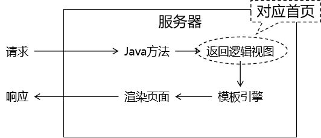
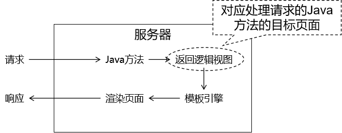
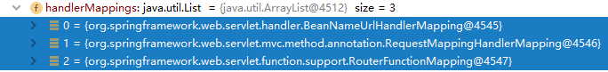
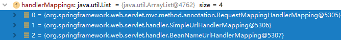
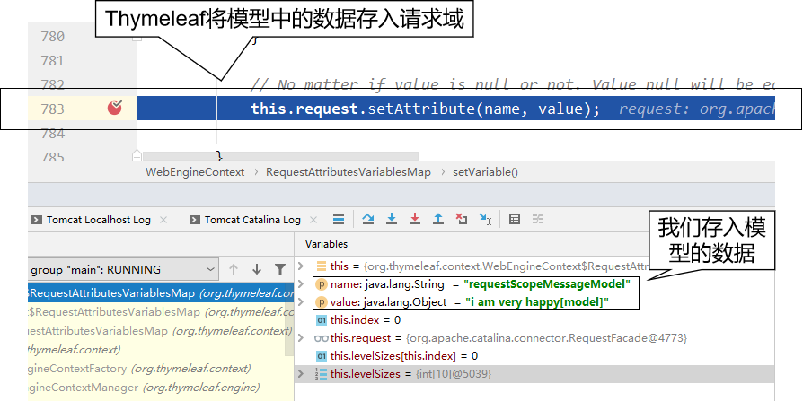

# springmvc-day01

## 第一章 SpringMVC入门

### 第一节 SpringMVC概述

#### 1. SpringMVC 优势

SpringMVC 是 Spring 为表述层开发提供的一整套完备的解决方案。在表述层框架历经 Strust、WebWork、Strust2 等诸多产品的历代更迭之后，目前业界普遍选择了 SpringMVC 作为 Java EE 项目表述层开发的**首选方案**。之所以能做到这一点，是因为 SpringMVC 具备如下显著优势：

- **Spring 家族原生产品**，与 IOC 容器等基础设施无缝对接
- 表述层各细分领域需要解决的问题**全方位覆盖**，提供**全面解决方案**
- **代码清新简洁**，大幅度提升开发效率
- 内部组件化程度高，可插拔式组件**即插即用**，想要什么功能配置相应组件即可
- **性能卓著**，尤其适合现代大型、超大型互联网项目要求

#### 2. 表述层框架要解决的基本问题

- 请求映射:让一个方法处理一个请求
- 数据输入:获取请求参数
- 类型转换:内置或者自定义类型转换器，对请求参数的类型进行转换
- 数据校验:参数的非空校验
- 视图界面:Thymeleaf
- 请求分发:请求转发
- 与域对象交互
- 会话控制:Session
- 过滤拦截:Filter
- 异步交互
- 文件上传
- 文件下载

### 第二节 SpringMVC入门案例(重点)

#### 1. 功能需求

##### 1.1 访问首页



##### 1.2 在首页点超链接



#### 2. 搭建环境

##### 2.1 导入依赖

```xml
<dependencies>
    <!-- SpringMVC -->
    <dependency>
        <groupId>org.springframework</groupId>
        <artifactId>spring-webmvc</artifactId>
        <version>5.3.1</version>
    </dependency>
    
    <!-- 日志 -->
    <dependency>
        <groupId>ch.qos.logback</groupId>
        <artifactId>logback-classic</artifactId>
        <version>1.2.3</version>
    </dependency>
    
    <!-- ServletAPI -->
    <dependency>
        <groupId>javax.servlet</groupId>
        <artifactId>javax.servlet-api</artifactId>
        <version>3.1.0</version>
        <scope>provided</scope>
    </dependency>
    
    <!-- Spring5和Thymeleaf整合包 -->
    <dependency>
        <groupId>org.thymeleaf</groupId>
        <artifactId>thymeleaf-spring5</artifactId>
        <version>3.0.12.RELEASE</version>
    </dependency>
</dependencies>
```

由于 Maven 的传递性，我们不必将所有需要的包全部配置依赖，而是配置最顶端的依赖，其他靠传递性导入。 


##### 2.2 日志配置文件

文件名：logback.xml 

```xml
<?xml version="1.0" encoding="UTF-8"?>
<configuration debug="true">
    <!-- 指定日志输出的位置 -->
    <appender name="STDOUT"
              class="ch.qos.logback.core.ConsoleAppender">
        <encoder>
            <!-- 日志输出的格式 -->
            <!-- 按照顺序分别是：时间、日志级别、线程名称、打印日志的类、日志主体内容、换行 -->
            <pattern>[%d{HH:mm:ss.SSS}] [%-5level] [%thread] [%logger] [%msg]%n</pattern>
        </encoder>
    </appender>

    <!-- 设置全局日志级别。日志级别按顺序分别是：DEBUG、INFO、WARN、ERROR -->
    <!-- 指定任何一个日志级别都只打印当前级别和后面级别的日志。 -->
    <root level="DEBUG">
        <!-- 指定打印日志的appender，这里通过“STDOUT”引用了前面配置的appender -->
        <appender-ref ref="STDOUT" />
    </root>

    <!-- 根据特殊需求指定局部日志级别 -->
    <logger name="org.springframework.web.servlet.DispatcherServlet" level="DEBUG" />

</configuration>
```

##### 2.3 web.xml配置

```xml
<!-- 配置SpringMVC中负责处理请求的核心Servlet，也被称为SpringMVC的前端控制器 -->
<servlet>
    <servlet-name>DispatcherServlet</servlet-name>
    
    <!-- DispatcherServlet的全类名 -->
    <servlet-class>org.springframework.web.servlet.DispatcherServlet</servlet-class>
    
    <!-- 通过初始化参数指定SpringMVC配置文件位置 -->
    <init-param>
    
        <!-- 如果不记得contextConfigLocation配置项的名称，可以到DispatcherServlet的父类FrameworkServlet中查找 -->
        <param-name>contextConfigLocation</param-name>
    
        <!-- 使用classpath:说明这个路径从类路径的根目录开始才查找 -->
        <param-value>classpath:spring-mvc.xml</param-value>
    </init-param>
    
    <!-- 作为框架的核心组件，在启动过程中有大量的初始化操作要做，这些操作放在第一次请求时才执行非常不恰当 -->
    <!-- 我们应该将DispatcherServlet设置为随Web应用一起启动 -->
    <load-on-startup>1</load-on-startup>
    
</servlet>
    
<servlet-mapping>
    <servlet-name>DispatcherServlet</servlet-name>
    
    <!-- 对DispatcherServlet来说，url-pattern有两种方式配置 -->
    <!-- 方式一：配置“/”，表示匹配整个Web应用范围内所有请求。 -->
    <!-- 方式二：配置“*.扩展名”，表示匹配整个Web应用范围内部分请求 -->
    <url-pattern>/</url-pattern>
</servlet-mapping>
```

##### 2.4 Spring配置文件

```xml
<!-- 自动扫描包 -->
<context:component-scan base-package="com.atguigu.mvc.handler"/>
    
<!-- Thymeleaf视图解析器 -->
<bean id="viewResolver" class="org.thymeleaf.spring5.view.ThymeleafViewResolver">
    <property name="order" value="1"/>
    <property name="characterEncoding" value="UTF-8"/>
    <property name="templateEngine">
        <bean class="org.thymeleaf.spring5.SpringTemplateEngine">
            <property name="templateResolver">
                <bean class="org.thymeleaf.spring5.templateresolver.SpringResourceTemplateResolver">
    
                    <!-- 视图前缀 -->
                    <property name="prefix" value="/WEB-INF/templates/"/>
    
                    <!-- 视图后缀 -->
                    <property name="suffix" value=".html"/>
                    <property name="templateMode" value="HTML5"/>
                    <property name="characterEncoding" value="UTF-8" />
                </bean>
            </property>
        </bean>
    </property>
</bean>
```

#### 3. 代码实现

##### 3.1 创建请求处理器类

###### 3.1.1 命名规范

SpringMVC 对处理请求的类并没有特殊要求，只要是 JavaBean 即可。我们自己习惯上有两种命名方式：

- XxxHandler：意思是 Xxx 处理器的意思
- XxxController：意思是 Xxx 控制器的意思

这只是一个命名的习惯，不是语法要求。所以往往把处理请求的类叫做『Handler类』，处理请求的方法叫做『Handler方法』。

###### 3.1.2 创建处理器类

```java
@Controller
public class Demo01HelloHandler {
    
}
```

##### 3.2 实现访问首页

###### 3.2.1 创建 handler 方法

```java
@Controller
public class Demo01Handler {
    @RequestMapping("/")
    public String showPortal(){
        System.out.println("showPortal()方法被调用了...");
        //handler方法的返回值就是对应的Thymeleaf模板的逻辑视图
        return "index";
    }
}
```

###### 3.2.2 在首页编写超链接


```html
<!DOCTYPE html>
<html lang="en" xmlns:th="http://www.thymeleaf.org">
    <head>
        <meta charset="UTF-8">
        <title>首页</title>
    </head>
    <body>
        <h1>欢迎来到SpringMVC首页</h1>
        <!--"@{/}"表示"/项目名/"-->
        <a th:href="@{/toTarget}">访问目标页面</a>
    </body>
</html>
```

##### 3.3 实现点击超链接

###### 3.3.1 加入日志记录仪

在 handler 类中声明一个成员变量：

```java
private Logger logger = LoggerFactory.getLogger(this.getClass());
```

- Logger：org.slf4j.Logger
- LoggerFactory：org.slf4j.LoggerFactory

###### 3.3.2 声明 handler 方法

```java
@RequestMapping("/toTarget")
public String toTarget(){
    logger.debug("toTarget方法被调用了...");
    return "target";
}
```

###### 3.3.3 创建目标页面

```html
<!DOCTYPE html>
<html lang="en" xmlns:th="http://www.thymeleaf.org">
<head>
    <meta charset="UTF-8">
    <title>目标页面</title>
</head>
<body>
    <h1>欢迎来到目标页面</h1>
</body>
</html>
```

##### 3.4 整体流程解析


### 第三节 常见注解

#### 1. RequestMapping注解(重点)

##### 1.1 作用

从注解名称上我们可以看到，@RequestMapping注解的作用就是将请求的 URL 地址和处理请求的方式关联起来，建立映射关系。

SpringMVC 接收到指定的请求，就会来找到在映射关系中对应的方法来处理这个请求。

##### 1.2 使用位置

###### 1.2.1 准备客户端访问路径

```html
<h3>测试@RequestMapping注解标记在类上</h3>
<a th:href="@{/user/login}">用户登录</a><br/>
<a th:href="@{/user/register}">用户注册</a><br/>
<a th:href="@{/user/logout}">用户退出</a><br/>
```

###### 1.2.2 仅标记在方法上的RequestMapping注解

```java
@RequestMapping("/user/login")
@RequestMapping("/user/register")
@RequestMapping("/user/logout")
```

###### 1.2.3 分别标记在类和方法上的@RequestMapping注解

在类级别：抽取各个方法上@RequestMapping注解地址中前面重复的部分 

```java
@RequestMapping("/user")
```

在方法级别：省略被类级别抽取的部分 

```java
@RequestMapping("/login")
@RequestMapping("/register")
@RequestMapping("/logout")
```

##### 1.3 指定请求方式

###### 1.3.1 通过RequestMapping的method属性指定

HTTP 协议定义了八种请求方式，在 SpringMVC 中封装到了下面这个枚举类： 

```java
public enum RequestMethod {
    GET, HEAD, POST, PUT, PATCH, DELETE, OPTIONS, TRACE
}
```

设置RequestMapping注解的method属性

```java
//value属性表示匹配请求路径，method属性表示匹配请求方式
@RequestMapping(value = "/emp", method = RequestMethod.GET)
```

###### 1.3.2 通过RequestMapping的进阶注解指定

| 原版                                                         | 进阶版                 |
| ------------------------------------------------------------ | ---------------------- |
| @RequestMapping(value = "/emp",  method = RequestMethod.GET) | @GetMapping("/emp")    |
| @RequestMapping(value = "/emp",  method = RequestMethod.POST) | @PostMapping("/emp")   |
| @RequestMapping(value = "/emp",  method = RequestMethod.PUT) | @PutMapping("/emp")    |
| @RequestMapping(value = "/emp",  method = RequestMethod.DELETE) | @DeleteMapping("/emp") |

 针对Http的八种请求方式都有专门的注解

 另外需要注意：进阶版的这几个注解是从 4.3 版本才开始有，低于 4.3 版本无法使用。 

##### 1.4 Ambiguous mapping异常

出现原因：多个 handler 方法映射了同一个地址，导致 SpringMVC 在接收到这个地址的请求时该找哪个 handler 方法处理。

> Caused by: java.lang.IllegalStateException: Ambiguous mapping. Cannot map 'demo03MappingMethodHandler' method  com.atguigu.mvc.handler.Demo03MappingMethodHandler#empPost() to { [/emp]}: **There is already** 'demo03MappingMethodHandler' bean method com.atguigu.mvc.handler.Demo03MappingMethodHandler#empGet() **mapped**.

#### 2. RequestHeader注解(了解)

##### 2.1 作用

通过这个注解获取请求消息头中的具体数据。 

##### 2.2 用法

```java
@RequestMapping("/getHeader")
public String getHeaderValue(@RequestHeader("user-agent") String headerValue){
    //目标:获取user-agent请求头的信息，并且赋值给headerValue
    logger.debug(headerValue);
    return "target";
}
```

#### 3. CookieValue注解(了解)

##### 3.1 作用

获取当前请求中的 Cookie 数据。 

##### 3.2 用法

```java
@RequestMapping("/getCookie")
public String getCookieValue(@CookieValue(value = "JSESSIONID",defaultValue = "abc") String cookieValue){
    //目标:获取浏览器中的名为"JSESSIONID"的cookie的值，赋值给CookieValue参数
    logger.debug(cookieValue);
    return "target";
}
```

### 第四节 获取请求参数(重点)

#### 1. 根据一个参数名获取一个参数值

##### 1.1 前端页面携带请求参数

```html
<a th:href="@{/param/one(userName='tom')}">一个名字一个值的情况</a><br/>
```

##### 1.2 处理器中获取请求参数

###### 1.2.1 最简写法

```java
@RequestMapping("/oneParameter")
public String oneParameter(String username){
    //最简单的方式获取单个请求参数:就是在handler方法中添加一个和请求参数名同名的参数，来接收请求参数
    //其实这个地方String username此处省略了一个注解 @RequestParam
    //@RequestParam("username")就是通过参数名获取请求参数
    logger.debug(username);
    return "target";
}
```

###### 1.2.2 使用RequestParam注解

```java
@RequestMapping("/oneParameter")
public String oneParameter(@RequestParam("username") String username){
    //最简单的方式获取单个请求参数:就是在handler方法中添加一个和请求参数名同名的参数，来接收请求参数
    //其实这个地方String username此处省略了一个注解 @RequestParam
    //@RequestParam("username")就是通过参数名获取请求参数
    logger.debug(username);
    return "target";
}
```

###### 1.2.3 如果此时请求中没有携带username参数


页面信息说明：

- 响应状态码：400（在 SpringMVC 环境下，400通常和数据注入相关）
- 说明信息：必需的 String 请求参数 'username' 不存在

原因可以参考 @RequestParam 注解的 required 属性：默认值为true，表示请求参数默认必须提供

```java
/**
     * Whether the parameter is required.
     * <p>Defaults to {@code true}, leading to an exception being thrown
     * if the parameter is missing in the request. Switch this to
     * {@code false} if you prefer a {@code null} value if the parameter is
     * not present in the request.
     * <p>Alternatively, provide a {@link #defaultValue}, which implicitly
     * sets this flag to {@code false}.
     */
boolean required() default true;
```

我们可以通过将required 属性设置为 false 表示这个请求参数可有可无： 

```java
@RequestParam(value = "userName", required = false)
```
当然，我们也可以通过设置请求参数的默认值来解决上述`400`错误

```java
@RequestParam(value = "userName", defaultValue = "missing")
```

#### 2. 根据一个参数名获取多个参数值

##### 2.1 前端页面携带请求参数

```html
<form th:action="@{/param/multi}" method="post">
    请选择你最喜欢的球队：
    <input type="checkbox" name="team" value="Brazil"/>巴西
    <input type="checkbox" name="team" value="German"/>德国
    <input type="checkbox" name="team" value="French"/>法国
    <input type="checkbox" name="team" value="Holland"/>荷兰
    <input type="checkbox" name="team" value="Italian"/>意大利
    <input type="checkbox" name="team" value="China"/>中国
    <br/>
    <input type="submit" value="保存"/>
</form>
```

##### 2.2 处理器中获取请求参数

```java
@RequestMapping("/multi")
public String oneNameMultiValue(@RequestParam("team")List<String> teamList){
    logger.debug(teamList.toString());
    //要使用什么类型来接收参数
    return "target";
}
```

#### 3. 使用实体类封装请求参数

##### 3.1 前端页面携带请求参数

```html
<form th:action="emp/save" method="post">
    姓名：<input type="text" name="empName"/><br/>
    年龄：<input type="text" name="empAge"/><br/>
    工资：<input type="text" name="empSalary"/><br/>
    <input type="submit" value="保存"/>
</form>
```

##### 3.2 封装实体类

注意: 实体类的属性名要和请求参数名一致

```java
@Data
@AllArgsConstructor
@NoArgsConstructor
public class Employee {
    private String empName;
    private Integer empAge;
    private Double empSalary;
}
```

##### 3.3 处理器中获取请求参数

```java
@RequestMapping("/pojo")
public String parameterToPojo(Employee employee){
    //获取请求参数封装到Employee对象中:只需要保证Employee类中的属性和请求参数名一致
    logger.debug(employee.toString());
    return "target";
}
```

##### 3.4 解决POST请求的中文字符乱码问题

到 web.xml 中配置 CharacterEncodingFilter 即可：

```xml
<!-- 配置过滤器解决 POST 请求的字符乱码问题 -->
<filter>
    <filter-name>CharacterEncodingFilter</filter-name>
    <filter-class>org.springframework.web.filter.CharacterEncodingFilter</filter-class>
    
    <!-- encoding参数指定要使用的字符集名称 -->
    <init-param>
        <param-name>encoding</param-name>
        <param-value>UTF-8</param-value>
    </init-param>
    
    <!-- 请求强制编码 -->
    <init-param>
        <param-name>forceRequestEncoding</param-name>
        <param-value>true</param-value>
    </init-param>
    <!-- 响应强制编码 -->
    <init-param>
        <param-name>forceResponseEncoding</param-name>
        <param-value>true</param-value>
    </init-param>
</filter>
<filter-mapping>
    <filter-name>CharacterEncodingFilter</filter-name>
    <url-pattern>/*</url-pattern>
</filter-mapping>
```

注1：在较低版本的 SpringMVC 中，forceRequestEncoding 属性、forceResponseEncoding 属性没有分开，它们是一个 forceEncoding 属性。这里需要注意一下。

注2：由于 CharacterEncodingFilter 是通过 request.setCharacterEncoding(encoding); 来设置请求字符集，所以在此操作前不能有任何的 request.getParameter() 操作。在设置字符集之前获取过请求参数，那么设置字符集的操作将无效。

#### 4. 使用Map封装请求参数

##### 4.1 前端页面表单

```html
<form th:action="@{/parameter/map}" method="post">
    姓名：<input type="text" name="empName"/><br/>
    年龄：<input type="text" name="empAge"/><br/>
    工资：<input type="text" name="empSalary"/><br/>
    <input type="submit" value="保存"/>
</form>
```

##### 4.2 handler方法接收参数

```java
@RequestMapping("/map")
public String parameterToMap(@RequestParam Map map){
    //获取请求参数，封装到Map中:请求参数名就是map的key，请求参数值就是map的value
    logger.debug(map.toString());
    return "target";
}
```


#### 5. 实体类封装的数据包含级联属性(了解

##### 5.1 实体类

###### Student

```java
public class Student {
    private String stuName;
    private School school;
    private List<Subject> subjectList;
    private Subject[] subjectArray;
    private List<Teacher> teacherList;
    private Map<String, Double> scores;
    ……
```

###### School

```java
public class School {
    
    private String schoolName;
    ……
```

###### Subject

```java
public class Subject {
    
    private String subjectName;
    ……
```

###### Teacher

```java
public class Teacher {
    
    private String teacherName;
    ……
```

##### 5.2 前端页面携带请求参数

表单项中的 name 属性值必须严格按照级联对象的属性来设定： 

```html
<!-- 提交数据的表单 -->
<form th:action="@{param/toNestEntity}" method="post">
    stuName：<input type="text" name="stuName" value="tom"/><br/>
    school.schoolName:<input type="text" name="school.schoolName" value="atguigu"/><br/>
    subjectList[0].subjectName:<input type="text" name="subjectList[0].subjectName" value="java"/><br/>
    subjectList[1].subjectName:<input type="text" name="subjectList[1].subjectName" value="php"/><br/>
    subjectList[2].subjectName:<input type="text" name="subjectList[2].subjectName" value="javascript"/><br/>
    subjectList[3].subjectName:<input type="text" name="subjectList[3].subjectName" value="css"/><br/>
    subjectList[4].subjectName:<input type="text" name="subjectList[4].subjectName" value="vue"/><br/>
    subjectArray[0].subjectName:<input type="text" name="subjectArray[0].subjectName" value="spring"/><br/>
    subjectArray[1].subjectName:<input type="text" name="subjectArray[1].subjectName" value="SpringMVC"/><br/>
    subjectArray[2].subjectName:<input type="text" name="subjectArray[2].subjectName" value="mybatis"/><br/>
    subjectArray[3].subjectName:<input type="text" name="subjectArray[3].subjectName" value="maven"/><br/>
    subjectArray[4].subjectName:<input type="text" name="subjectArray[4].subjectName" value="mysql"/><br/>
    teacherList[0].teacherName:<input type="text" name="teacherList[0].teacherName" value="t_one"/><br/>
    teacherList[1].teacherName:<input type="text" name="teacherList[1].teacherName" value="t_two"/><br/>
    teacherList[2].teacherName:<input type="text" name="teacherList[2].teacherName" value="t_three"/><br/>
    teacherList[3].teacherName:<input type="text" name="teacherList[3].teacherName" value="t_four"/><br/>
    teacherList[4].teacherName:<input type="text" name="teacherList[4].teacherName" value="t_five"/><br/>
    scores['Chinese']：input type="text" name="scores['Chinese']" value="100"/><br/>
    scores['English']：<input type="text" name="scores['English']" value="95" /><br/>
    scores['Mathematics']：<input type="text" name="scores['Mathematics']" value="88"/><br/>
    scores['Chemistry']：<input type="text" name="scores['Chemistry']" value="63"/><br/>
    scores['Biology']：<input type="text" name="scores['Biology']" value="44"/><br/>
    <input type="submit" value="保存"/>
</form>
```

##### 5.3 处理器中获取请求参数

```java
@RequestMapping("/param/toNestEntity")
public String formToNestedEntity(
        // SpringMVC 自己懂得注入级联属性，只要属性名和对应的getXxx()、setXxx()匹配即可
        Student student) {
    logger.debug(student.toString());
    
    return "target";
}
```

### 第五节 访问静态资源(重点)

#### 1. SpringMVC环境下的静态资源访问问题

##### 1.1 问题描述

在 Web 应用中加入图片资源：

 

访问静态资源


##### 1.2 分析原因

- DispatcherServlet 的 url-pattern 配置的是“/”
- url-pattern 配置“/”表示整个 Web 应用范围内所有请求都由 SpringMVC 来处理
- 对 SpringMVC 来说，必须有对应的 @RequestMapping 才能找到处理请求的方法
- 现在static/images/mm.jpg 请求没有对应的 @RequestMapping 所以返回 404

##### 1.3 解决办法

在 SpringMVC 配置文件中增加配置：

```xml
<!-- 加入这个配置，SpringMVC 就会在遇到没有 @RequestMapping 的请求时放它过去 -->
<!-- 所谓放它过去就是让这个请求去找它原本要访问的资源 -->
<mvc:default-servlet-handler/>
```

再次测试访问图片：


新的问题：其他原本正常的请求访问不了了,进一步解决问题：再增加一个配置

```xml
<!-- 开启 SpringMVC 的注解驱动功能。这个配置也被称为 SpringMVC 的标配。 -->
<!-- 标配：因为 SpringMVC 环境下非常多的功能都要求必须打开注解驱动才能正常工作。 -->
<mvc:annotation-driven/>
```

##### 1.4 default-servlet-handler底层[了解]

所在类：org.springframework.web.servlet.resource.DefaultServletHttpRequestHandler

关键方法：handleRequest()方法

大体机制：SpringMVC 首先查找是否存在和当前请求对应的 @RequestMapping；如果没有，则调用handleRequest()方法转发到目标资源。

```java
@Override
public void handleRequest(HttpServletRequest request, HttpServletResponse response)
            throws ServletException, IOException {
    
    Assert.state(this.servletContext != null, "No ServletContext set");
    RequestDispatcher rd = this.servletContext.getNamedDispatcher(this.defaultServletName);
    if (rd == null) {
        throw new IllegalStateException("A RequestDispatcher could not be located for the default servlet '" +
        this.defaultServletName + "'");
    }
    
    // 这里执行请求转发操作
    rd.forward(request, response);
}
```

### 第六节 页面跳转控制

#### 1. 访问Thymeleaf前后缀控制范围内的页面

访问Thymeleaf前后缀控制范围之内的页面，直接`return`逻辑视图即可，但是访问前后缀控制范围之外的页面，则需要使用重定向或者请求转发

#### 2. 访问Thymeleaf前后缀控制范围外的页面(了解)

##### 2.1 创建范围之外的页面


```html
<body>
    
    <h1>范围之外页面</h1>
    
</body>
```

##### 2.2 在 SpringMVC 配置文件加入配置

下面配置是访问静态资源所需配置(如果没有它的话，访问静态资源会被DispatcherServlet所拦截)： 

```xml
<mvc:annotation-driven/>
<mvc:default-servlet-handler/>
```

##### 2.3 使用指令进行跳转(了解)

###### 2.3.1 请求转发的指令

```java
@RequestMapping("/forwardCommand")
public String forwardCommand(){
    //使用转发指令:在handler方法中，访问Thymeleaf前后缀控制范围外的页面
    //"forward:要转发到的资源路径",相当于使用的是请求转发跳转
    //请求转发的绝对路径是:在uri的基础上省略"/项目名"
    return "forward:/outter.html";
}
```

###### 2.3.2 重定向的指令

```java
@RequestMapping("/redirectCommand")
public String redirectCommand(){
    //使用重定向指令:在handler方法中，访问Thymeleaf前后缀控制范围外的页面
    //"redirect:要转发到的资源路径",相当于使用的是请求转发跳转
    //重定向的绝对路径:就是uri   "/项目名/资源路径"
    //因为SpringMVC框架在接收到redirect指令之后，会自动给访问路径加上"/项目名"
    return "redirect:/outter.html";
}
```

#### 3. mvc:view-controller访问页面(重点)

##### 3.1 场景描述

在一个 handler 方法中，仅仅只是完成 @RequestMapping 映射，将请求转发到目标视图，除此之外没有任何其他代码。此时可以使用 SpringMVC 配置文件中的配置代替这样的 handler 方法。 

##### 3.2 具体操作

###### 3.2.1 访问Thymeleaf前后缀控制范围内的页面

在 SpringMVC 配置文件中使用 mvc:view-controller 配置： 

```xml
<mvc:view-controller path="/index.html" view-name="portal"/>
```

此时浏览器路径"index.html"可以访问到Thymeleaf前后缀控制范围内的portal.html页面

###### 3.2.2 访问Thymeleaf前后缀控制范围外的页面

在 SpringMVC 配置文件中使用 mvc:view-controller 配置：

```xml
<mvc:view-controller path="/test/redirect/command" view-name="redirect:/outter.html"/>
```

此时就相当于代替了之前的重定向访问的那个handler方法

##### 3.3 遇到的问题

加入 mvc:view-controller 配置后，其他正常 @RequestMapping 将失效。此时还是需要加入 mvc:annotation-driven 来解决。 

#### 4. 三个配置影响访问效果探索(了解)

通过前面的学习，我们发现无论是添加了`default-servlet-handler`还是`view-controller`,我们都必须添加`annotation-driven`标签。所以`annotation-driven`标签是SpringMVC必须添加的

接下来我们从源码角度分析这三个配置:

##### 4.1 相关组件：HandlerMapping

见名知意，HandlerMapping 封装的数据包含了请求地址和 handler 方法之间的映射关系。所以请求访问是否能生效关键要看 HandlerMapping 在 IOC 容器中加载的情况。为了看到这一点，我们可以在 DispatcherServlet 中找到 doDispatch() 方法设置断点。之所以选择这个方法，是因为每一个由 SpringMVC 处理的请求都会经过这里，便于操作。 


##### 4.2 按三种标签的配置情况进行分析

###### 4.2.1 三个标签都没有配置的情况



我们看到 SpringMVC 加载了三个 HandlerMapping：

> org.springframework.web.servlet.handler.**BeanNameUrlHandlerMapping**
>
> org.springframework.web.servlet.mvc.method.annotation.**RequestMappingHandlerMapping**
>
> org.springframework.web.servlet.function.support.**RouterFunctionMapping**

其中 RequestMappingHandlerMapping 封装了 @RequestMapping 相关请求，有它在 @RequestMapping 相关请求就能访问到。

这里顺带一提，在较低版本的 SpringMVC 此处要加载的是：

> org.springframework.web.servlet.handler.BeanNameUrlHandlerMapping org.springframework.web.servlet.mvc.annotation.DefaultAnnotationHandlerMapping

其中 DefaultAnnotationHandlerMapping 封装了 @RequestMapping 相关请求，有它在 @RequestMapping 相关请求就能访问到。

###### 4.2.2  配置了 mvc:view-controller 或 mvc:default-servlet-handler 的情况


我们看到 SpringMVC 加载了两个 HandlerMapping：

> org.springframework.web.servlet.handler.**SimpleUrlHandlerMapping**
>
> org.springframework.web.servlet.handler.**BeanNameUrlHandlerMapping**

此时没有了RequestMappingHandlerMapping，所以无法根据@RequestMapping的映射来调用handler方法了

较低版本的 SpringMVC 在这里的情况一样。


###### 4.2.3 三个标签全部配置了的情况

配置全部 mvc:view-controller、mvc:default-servlet-handler、mvc:annotation-driven 三个标签。 



我们看到 SpringMVC 加载了略有不同的三个 HandlerMapping：

> org.springframework.web.servlet.mvc.method.annotation.**RequestMappingHandlerMapping**
>
> org.springframework.web.servlet.handler.**SimpleUrlHandlerMapping**
>
> org.springframework.web.servlet.handler.**BeanNameUrlHandlerMapping**

此时RequestMappingHandlerMapping 封装了 @RequestMapping 相关请求，有它在 @RequestMapping 相关请求就能访问到。

较低版本的 SpringMVC 在这里的情况还是一样。

## 第二章 SpringMVC使用域对象

### 第一节 请求域对象

#### 1. 将数据存入请求域对象

##### 1.1 使用原生的Servlet的API操作

```java
@RequestMapping("/testAttrOriginalRequest")
public String testAttrOriginalRequest(HttpServletRequest request){
    //目标:将数据存储到请求域对象，然后跳转到target页面
    //方式一:使用原始的request来完成
    request.setAttribute("username","aobama");
    return "target";
}
```

##### 1.2 使用 Model 类型的形参操作

```java
@RequestMapping("/testAttrRequestModel")
public String testAttrRequestModel(Model model){
    //目标:目标:将数据存储到请求域对象，然后跳转到target页面
    //方式二:使用Model对象往请求域中存储值
    model.addAttribute("username","aolafu");
    return "target";
}
```

##### 1.3 使用 ModelMap 类型的形参

```java
@RequestMapping("/attr/request/model/map")
public String testAttrRequestModelMap(
    
        // 在形参位置声明ModelMap类型变量，用于存储模型数据
        ModelMap modelMap) {
    
    // 我们将数据存入模型，SpringMVC 会帮我们把模型数据存入请求域
    // 存入请求域这个动作也被称为暴露到请求域
    modelMap.addAttribute("requestScopeMessageModelMap","i am very happy[model map]");
    
    return "target";
}
```

##### 1.4 使用 Map 类型的形参

```java
@RequestMapping("/attr/request/map")
public String testAttrRequestMap(
    
        // 在形参位置声明Map类型变量，用于存储模型数据
        Map<String, Object> map) {
    
    // 我们将数据存入模型，SpringMVC 会帮我们把模型数据存入请求域
    // 存入请求域这个动作也被称为暴露到请求域
    map.put("requestScopeMessageMap", "i am very happy[map]");
    
    return "target";
}
```

##### 1.5 使用 ModelAndView 对象

```java
@RequestMapping("/attr/request/mav")
public ModelAndView testAttrByModelAndView() {
    
    // 1.创建ModelAndView对象
    ModelAndView modelAndView = new ModelAndView();
    
    // 2.存入模型数据
    modelAndView.addObject("requestScopeMessageMAV", "i am very happy[mav]");
    
    // 3.设置视图名称
    modelAndView.setViewName("target");
    
    return modelAndView;
}
```

#### 2. 模型的本质

##### 2.1 BindingAwareModelMap

SpringMVC 传入的 Model、ModelMap、Map类型的参数其实本质上都是 BindingAwareModelMap 类型的。 

##### 2.2 体系结构


#### 3. 框架底层将模型存入请求域的原理

##### 3.1 源码位置

所在类：org.thymeleaf.context.WebEngineContext

所在方法：setVariable()



### 第二节 会话域对象

使用会话域最简单直接的办法就是使用原生的 HttpSession 对象 

```java
@RequestMapping("/attrSession")
public String attrSession(HttpSession httpSession){
    //目标:往会话域中存储数据
    httpSession.setAttribute("address","召唤师峡谷");
    return "target";
}
```

### 第三节 应用域

应用域同样是使用IOC注入的方式来操作： 

```java
@Autowired
private ServletContext servletContext;
@RequestMapping("/attr/application")
public String attrApplication() {
    
    servletContext.setAttribute("appScopeMsg", "i am hungry...");
    
    return "target";
}
```

## 第三章 综合案例

### 第一节 案例准备工作

#### 1. 引入依赖

```xml
<dependencies>
    <!-- SpringMVC -->
    <dependency>
        <groupId>org.springframework</groupId>
        <artifactId>spring-webmvc</artifactId>
        <version>5.3.1</version>
    </dependency>

    <!-- 日志 -->
    <dependency>
        <groupId>ch.qos.logback</groupId>
        <artifactId>logback-classic</artifactId>
        <version>1.2.3</version>
    </dependency>

    <!-- ServletAPI -->
    <dependency>
        <groupId>javax.servlet</groupId>
        <artifactId>javax.servlet-api</artifactId>
        <version>3.1.0</version>
        <scope>provided</scope>
    </dependency>

    <!-- Spring5和Thymeleaf整合包 -->
    <dependency>
        <groupId>org.thymeleaf</groupId>
        <artifactId>thymeleaf-spring5</artifactId>
        <version>3.0.12.RELEASE</version>
    </dependency>

    <dependency>
        <groupId>org.junit.jupiter</groupId>
        <artifactId>junit-jupiter-api</artifactId>
        <version>5.7.0</version>
        <scope>test</scope>
    </dependency>

    <dependency>
        <groupId>org.springframework</groupId>
        <artifactId>spring-test</artifactId>
        <version>5.3.1</version>
    </dependency>
    <!--引入LomBok的依赖-->
    <dependency>
        <groupId>org.projectlombok</groupId>
        <artifactId>lombok</artifactId>
        <version>1.18.8</version>
        <scope>provided</scope>
    </dependency>
    <!-- 导入 orm 包就可以通过 Maven 的依赖传递性把其他两个也导入 -->
    <dependency>
        <groupId>org.springframework</groupId>
        <artifactId>spring-orm</artifactId>
        <version>5.3.1</version>
    </dependency>

    <!-- MySQL驱动 -->
    <dependency>
        <groupId>mysql</groupId>
        <artifactId>mysql-connector-java</artifactId>
        <version>5.1.3</version>
    </dependency>
    <!-- 数据源 -->
    <dependency>
        <groupId>com.alibaba</groupId>
        <artifactId>druid</artifactId>
        <version>1.0.31</version>
    </dependency>
</dependencies>
```

#### 2 数据建模

##### 2.1 物理建模

```mysql
CREATE TABLE t_movie(
	movie_id INT PRIMARY KEY AUTO_INCREMENT,
	movie_name VARCHAR(50),
	movie_price DOUBLE
);
INSERT INTO t_movie(movie_name,movie_price) 
VALUES ("肖申克救赎",10.0),
("泰坦尼克号",20.0),
("审死官",30.0),
("大话西游之大圣娶亲",40.0),
("大话西游之仙履奇缘",50.0),
("功夫",60.0)
```

##### 2.2 逻辑建模

```java
@Data
@AllArgsConstructor
@NoArgsConstructor
public class Movie {
    private Integer movieId;
    private String movieName;
    private Double moviePrice;
}
```

#### 3. 创建Dao

##### 3.1 接口

```java
package com.atguigu.dao;

import com.atguigu.pojo.Movie;

import java.util.List;

/**
 * 包名:com.atguigu.dao
 *
 * @author Leevi
 * 日期2021-09-06  10:01
 */
public interface MovieDao {
    /**
     * 查询所有
     * @return
     */
    List<Movie> getAll();

    /**
     * 根据id查询
     * @param movieId
     * @return
     */
    Movie getMovieById(String movieId);

    /**
     * 添加Movie
     * @param movie
     */
    void saveMovie(Movie movie);

    /**
     * 修改Movie
     * @param movie
     */
    void updateMovie(Movie movie);

    /**
     * 根据id删除
     * @param movieId
     */
    void removeMovieById(String movieId);
}
```

##### 3.2 实现类

```java
package com.atguigu.dao.impl;

import com.atguigu.dao.MovieDao;
import com.atguigu.pojo.Movie;

import java.util.List;

/**
 * 包名:com.atguigu.dao.impl
 *
 * @author Leevi
 * 日期2021-09-06  10:03
 */
public class MovieDaoImpl implements MovieDao {

    @Override
    public List<Movie> getAll() {
        return null;
    }

    @Override
    public Movie getMovieById(String movieId) {
        return null;
    }

    @Override
    public void saveMovie(Movie movie) {

    }

    @Override
    public void updateMovie(Movie movie) {

    }

    @Override
    public void removeMovieById(String movieId) {

    }
}

```

#### 4 创建Service

##### 4.1 接口

```java
package com.atguigu.service;

import com.atguigu.pojo.Movie;

import java.util.List;

/**
 * 包名:com.atguigu.service
 *
 * @author Leevi
 * 日期2021-09-06  10:03
 */
public interface MovieService {
    /**
     * 查询所有
     * @return
     */
    List<Movie> getAll();

    /**
     * 根据id查询
     * @param movieId
     * @return
     */
    Movie getMovieById(String movieId);

    /**
     * 添加Movie
     * @param movie
     */
    void saveMovie(Movie movie);

    /**
     * 修改Movie
     * @param movie
     */
    void updateMovie(Movie movie);

    /**
     * 根据id删除
     * @param movieId
     */
    void removeMovieById(String movieId);
}
```

##### 4.2 实现类

```java
package com.atguigu.dao.impl;

import com.atguigu.dao.MovieDao;
import com.atguigu.pojo.Movie;

import java.util.List;


public class MovieDaoImpl implements MovieDao {

    @Override
    public List<Movie> getAll() {
        return null;
    }

    @Override
    public Movie getMovieById(String movieId) {
        return null;
    }

    @Override
    public void saveMovie(Movie movie) {

    }

    @Override
    public void updateMovie(Movie movie) {

    }

    @Override
    public void removeMovieById(String movieId) {

    }
}
```

### 第二节 环境搭建

#### 1 配置文件

##### 1.1 web.xml

```xml
<?xml version="1.0" encoding="UTF-8"?>
<web-app xmlns:xsi="http://www.w3.org/2001/XMLSchema-instance"
         xmlns="http://java.sun.com/xml/ns/javaee"
         xsi:schemaLocation="http://java.sun.com/xml/ns/javaee http://java.sun.com/xml/ns/javaee/web-app_2_5.xsd"
         version="2.5">
    <!--DispatcherServlet-->
    <servlet>
        <servlet-name>dispatcherServlet</servlet-name>
        <servlet-class>org.springframework.web.servlet.DispatcherServlet</servlet-class>
        <init-param>
            <param-name>contextConfigLocation</param-name>
            <param-value>classpath:springmvc.xml</param-value>
        </init-param>
        <load-on-startup>1</load-on-startup>
    </servlet>
    <servlet-mapping>
        <servlet-name>dispatcherServlet</servlet-name>
        <url-pattern>/</url-pattern>
    </servlet-mapping>
    <!--CharacterEncodingFilter-->
    <!-- 配置过滤器解决 POST 请求的字符乱码问题 -->
    <filter>
        <filter-name>CharacterEncodingFilter</filter-name>
        <filter-class>org.springframework.web.filter.CharacterEncodingFilter</filter-class>
        <!-- encoding参数指定要使用的字符集名称 -->
        <init-param>
            <param-name>encoding</param-name>
            <param-value>UTF-8</param-value>
        </init-param>
        <!-- 请求强制编码 -->
        <init-param>
            <param-name>forceRequestEncoding</param-name>
            <param-value>true</param-value>
        </init-param>
        <!-- 响应强制编码 -->
        <init-param>
            <param-name>forceResponseEncoding</param-name>
            <param-value>true</param-value>
        </init-param>
    </filter>
    <filter-mapping>
        <filter-name>CharacterEncodingFilter</filter-name>
        <url-pattern>/*</url-pattern>
    </filter-mapping>
</web-app>
```

##### 1.2 logback.xml 

```xml
<?xml version="1.0" encoding="UTF-8"?>
<configuration debug="true">
    <!-- 指定日志输出的位置 -->
    <appender name="STDOUT"
              class="ch.qos.logback.core.ConsoleAppender">
        <encoder>
            <!-- 日志输出的格式 -->
            <!-- 按照顺序分别是：时间、日志级别、线程名称、打印日志的类、日志主体内容、换行 -->
            <pattern>[%d{HH:mm:ss.SSS}] [%-5level] [%thread] [%logger] [%msg]%n</pattern>
        </encoder>
    </appender>
    
    <!-- 设置全局日志级别。日志级别按顺序分别是：DEBUG、INFO、WARN、ERROR -->
    <!-- 指定任何一个日志级别都只打印当前级别和后面级别的日志。 -->
    <root level="INFO">
        <!-- 指定打印日志的appender，这里通过“STDOUT”引用了前面配置的appender -->
        <appender-ref ref="STDOUT" />
    </root>
    
    <!-- 根据特殊需求指定局部日志级别 -->
    <logger name="org.springframework.web.servlet.DispatcherServlet" level="DEBUG" />
    
</configuration>
```

##### 1.3 SpringMVC 配置文件springmvc.xml

```xml
<?xml version="1.0" encoding="UTF-8"?>
<beans xmlns="http://www.springframework.org/schema/beans"
       xmlns:xsi="http://www.w3.org/2001/XMLSchema-instance"
       xmlns:context="http://www.springframework.org/schema/context"
       xmlns:mvc="http://www.springframework.org/schema/mvc"
       xsi:schemaLocation="http://www.springframework.org/schema/beans
                           http://www.springframework.org/schema/beans/spring-beans.xsd
                           http://www.springframework.org/schema/context
                           https://www.springframework.org/schema/context/spring-context.xsd http://www.springframework.org/schema/mvc https://www.springframework.org/schema/mvc/spring-mvc.xsd">
    <!--1.包扫描-->
    <context:component-scan base-package="com.atguigu"/>
    <!--2. Thymeleaf解析器的配置-->
    <!-- Thymeleaf视图解析器 -->
    <bean id="viewResolver" class="org.thymeleaf.spring5.view.ThymeleafViewResolver">
        <property name="order" value="1"/>
        <property name="characterEncoding" value="UTF-8"/>
        <property name="templateEngine">
            <bean class="org.thymeleaf.spring5.SpringTemplateEngine">
                <property name="templateResolver">
                    <bean class="org.thymeleaf.spring5.templateresolver.SpringResourceTemplateResolver">

                        <!-- 视图前缀 -->
                        <property name="prefix" value="/WEB-INF/templates/"/>

                        <!-- 视图后缀 -->
                        <property name="suffix" value=".html"/>

                        <!--模板类型-->
                        <property name="templateMode" value="HTML5"/>
                        <!--模板的字符编码-->
                        <property name="characterEncoding" value="UTF-8" />
                    </bean>
                </property>
            </bean>
        </property>
    </bean>
    <!--3. 加载MVC注解驱动-->
    <mvc:annotation-driven />
    <!--4. 静态资源处理-->
    <mvc:default-servlet-handler/>
</beans>
```

### 第三节 持久层代码

#### 1. 数据源配置文件:jdbc.properties

```properties
jdbc.username=root
jdbc.password=123456
jdbc.driver=com.mysql.jdbc.Driver
jdbc.url=jdbc:mysql://localhost:3306/springmvc-test
```

#### 2. 配置数据源:在springmvc.xml中

```xml
<context:property-placeholder location="classpath:jdbc.properties"/>
<!--5. 对数据源进行IOC-->
<bean id="dataSource" class="com.alibaba.druid.pool.DruidDataSource">
    <property name="username" value="${jdbc.username}"/>
    <property name="password" value="${jdbc.password}"/>
    <property name="url" value="${jdbc.url}"/>
    <property name="driverClassName" value="${jdbc.driver}"/>
</bean>
```

#### 3. 配置JdbcTemplate:在springmvc.xml中

```xml
<!--6. 对JdbcTemplate进行IOC-->
<bean id="jdbcTemplate" class="org.springframework.jdbc.core.JdbcTemplate">
    <property name="dataSource" ref="dataSource"/>
</bean>
```

#### 4. 配置持久层的实现类

对持久层的实现类进行IOC配置，以及注入JdbcTemplate对象

```java
package com.atguigu.dao.impl;

import com.atguigu.dao.MovieDao;
import com.atguigu.pojo.Movie;
import org.springframework.beans.factory.annotation.Autowired;
import org.springframework.jdbc.core.JdbcTemplate;
import org.springframework.stereotype.Repository;

import java.util.List;

/**
 * 包名:com.atguigu.dao.impl
 *
 * @author Leevi
 * 日期2021-09-06  10:03
 */
@Repository
public class MovieDaoImpl implements MovieDao {
    @Autowired
    private JdbcTemplate jdbcTemplate;
    @Override
    public List<Movie> getAll() {
        return null;
    }

    @Override
    public Movie getMovieById(String movieId) {
        return null;
    }

    @Override
    public void saveMovie(Movie movie) {

    }

    @Override
    public void updateMovie(Movie movie) {

    }

    @Override
    public void removeMovieById(String movieId) {

    }
}
```

#### 5. 编写测试持久层的各个方法

##### 5.1 持久层的各个方法实现

```java
package com.atguigu.dao.impl;

import com.atguigu.dao.MovieDao;
import com.atguigu.pojo.Movie;
import org.springframework.beans.factory.annotation.Autowired;
import org.springframework.jdbc.core.BeanPropertyRowMapper;
import org.springframework.jdbc.core.JdbcTemplate;
import org.springframework.stereotype.Repository;

import java.util.List;

/**
 * 包名:com.atguigu.dao.impl
 *
 * @author Leevi
 * 日期2021-09-06  10:03
 */
@Repository
public class MovieDaoImpl implements MovieDao {
    @Autowired
    private JdbcTemplate jdbcTemplate;
    @Override
    public List<Movie> getAll() {
        String sql = "select movie_id movieId, movie_name movieName,movie_price moviePrice from t_movie";
        return jdbcTemplate.query(sql,new BeanPropertyRowMapper<>(Movie.class));
    }

    @Override
    public Movie getMovieById(String movieId) {
        String sql = "select movie_id movieId, movie_name movieName,movie_price moviePrice from t_movie where movie_id=?";
        return jdbcTemplate.queryForObject(sql,new BeanPropertyRowMapper<>(Movie.class),movieId);
    }

    @Override
    public void saveMovie(Movie movie) {
        String sql = "insert into t_movie(movie_name,movie_price) values (?,?)";
        jdbcTemplate.update(sql,movie.getMovieName(),movie.getMoviePrice());
    }

    @Override
    public void updateMovie(Movie movie) {
        String sql = "update t_movie set movie_name=?,movie_price=? where movie_id=?";
        jdbcTemplate.update(sql,movie.getMovieName(),movie.getMoviePrice(),movie.getMovieId());
    }

    @Override
    public void removeMovieById(String movieId) {
        String sql = "delete from t_movie where movie_id=?";
        jdbcTemplate.update(sql,movieId);
    }
}

```

##### 5.2 持久层方法测试

```java
package com.atguigu;

import com.atguigu.dao.MovieDao;
import org.junit.Test;
import org.junit.runner.RunWith;
import org.springframework.beans.factory.annotation.Autowired;
import org.springframework.test.context.ContextConfiguration;
import org.springframework.test.context.junit4.SpringJUnit4ClassRunner;

/**
 * 包名:com.atguigu
 *
 * @author Leevi
 * 日期2021-09-06  10:22
 */
@RunWith(SpringJUnit4ClassRunner.class)
@ContextConfiguration(locations = "classpath:springmvc.xml")
public class TestDao {
    @Autowired
    private MovieDao movieDao;
    @Test
    public void testGetAll(){
        System.out.println(movieDao.getAll());
    }
}
```
### 第四节 业务层的代码

```java
package com.atguigu.service.impl;

import com.atguigu.dao.MovieDao;
import com.atguigu.pojo.Movie;
import com.atguigu.service.MovieService;
import org.springframework.beans.factory.annotation.Autowired;
import org.springframework.stereotype.Service;

import java.util.List;

/**
 * 包名:com.atguigu.service.impl
 *
 * @author Leevi
 * 日期2021-09-06  10:04
 */
@Service
public class MovieServiceImpl implements MovieService {
    @Autowired
    private MovieDao movieDao;
    @Override
    public List<Movie> getAll() {
        return movieDao.getAll();
    }

    @Override
    public Movie getMovieById(String movieId) {
        return movieDao.getMovieById(movieId);
    }

    @Override
    public void saveMovie(Movie movie) {
        movieDao.saveMovie(movie);
    }

    @Override
    public void updateMovie(Movie movie) {
        movieDao.updateMovie(movie);
    }

    @Override
    public void removeMovieById(String movieId) {
        movieDao.removeMovieById(movieId);
    }
}
```

### 第五节 实现功能

#### 1. 显示首页

##### 1.1 案例流程


##### 1.2 具体实现

###### 1.2.1 配置 view-controller

```xml
<!--7. 使用view-controller访问首页-->
<mvc:view-controller path="/" view-name="portal"/>
<mvc:view-controller path="/index.html" view-name="portal"/>
```

###### 1.2.2 前端页面


```html
<!DOCTYPE html>
<html lang="en" xmlns:th="http://www.thymeleaf.org">
<head>
    <meta charset="UTF-8">
    <title>Title</title>
</head>
<body style="text-align: center">
    <a th:href="@{/movie/showList}">显示电影列表</a>
</body>
</html>
```

#### 2. 在首页点击超链接显示全部数据

##### 2.1 案例流程


##### 2.2 具体实现

###### 2.2.1 处理器类和处理器方法

```java
package com.atguigu.handler;

import com.atguigu.pojo.Movie;
import com.atguigu.service.MovieService;
import org.springframework.beans.factory.annotation.Autowired;
import org.springframework.stereotype.Controller;
import org.springframework.ui.Model;
import org.springframework.web.bind.annotation.RequestMapping;

import java.util.List;

/**
 * 包名:com.atguigu.handler
 *
 * @author Leevi
 * 日期2021-09-06  10:31
 */
@Controller
@RequestMapping("/movie")
public class MovieHandler {
    @Autowired
    private MovieService movieService;

    @RequestMapping("/showList")
    public String showList(Model model){
        //1. 调用业务层的方法查询所有的movie
        List<Movie> movieList = movieService.getAll();
        //2. 将查询到的所有movie存储到请求域
        model.addAttribute("movieList",movieList);
        //3. 解析Thymeleaf模板显示所有movie
        return "list";
    }
}

```

###### 2.2.2 前端页面

1. 样式部分

```html
<style type="text/css">
    table {
        border-collapse: collapse;
        margin: 0px auto 0px auto;
    }
    table th,td {
        border: 1px solid black;
        text-align: center;
    }
</style>
```

2. 数据展示部分

```html
<table>
    <thead>
        <tr>
            <th>电影ID</th>
            <th>电影名称</th>
            <th>电影票价格</th>
            <th>删除</th>
            <th>更新</th>
        </tr>
    </thead>
    <tbody th:if="${#lists.isEmpty(movieList)}">
        <tr>
            <td colspan="5">抱歉！没有查询到数据！</td>
        </tr>
    </tbody>
    <tbody th:unless="${#lists.isEmpty(movieList)}">
        <tr th:each="movie : ${movieList}">
            <td th:text="${movie.movieId}">电影ID</td>
            <td th:text="${movie.movieName}">电影名称</td>
            <td th:text="${movie.moviePrice}">电影票价格</td>
            <td>删除</td>
            <td>更新</td>
        </tr>
    </tbody>
    <tfoot>
        <tr>
            <td colspan="5">添加</td>
        </tr>
    </tfoot>
</table>
```

#### 3. 删除一条数据

##### 3.1 案例流程


##### 3.2 具体实现

###### 3.2.1 修改数据展示时候的删除数据的超链接

```html
<a th:href="@{/movie/removeMovie(movieId=${movie.movieId})}">删除</a>
```

###### 3.2.2 handler 方法

```java
@RequestMapping("/removeMovie")
public String removeMovie(@RequestParam("movieId") String movieId){
    //调用业务层的方法根据id删除movie
    movieService.removeMovieById(movieId);
    //重新查询所有
    return "redirect:/movie/showList";
}
```

#### 4. 跳转到添加页面

##### 4.1  案例流程


##### 4.2 具体实现

###### 4.2.1 修改页面上添加数据的超链接

在`tfoot`标签的td中加入超链接标签 

```html
<td colspan="5"><a th:href="@{/add.html}">添加</a></td>
```

###### 4.2.2 配置view-controller

```xml
<!--8. 使用view-controller访问添加页面-->
<mvc:view-controller path="/add.html" view-name="add"/>
```

###### 4.2.3 movie-add.html页面的表单

```html
<form th:action="@{/movie/saveMovie}" method="post">

    电影名称：<input type="text" name="movieName" /><br/>
    电影票价格：<input type="text" name="moviePrice" /><br/>

    <button type="submit">保存</button>

</form>
```

#### 5. 执行添加数据

##### 5.1 案例流程


##### 5.2 具体实现

###### 5.2.1 handler方法

```java
@RequestMapping("/saveMovie")
public String addMovie(Movie movie){
    //调用业务层的方法添加Movie
    movieService.saveMovie(movie);
    //重新查询所有
    return "redirect:/movie/showList";
}
```

#### 6. 跳转到更新表单回显数据

##### 6.1 案例流程


##### 6.2 具体实现

###### 6.2.1 修改页面更新数据的超链接

```html
<a th:href="@{/edit/movie/page(movieId=${movie.movieId})}">更新</a>
```

###### 6.2.2 handler方法

```java
@RequestMapping("/edit/movie/page")
public String editMoviePage(
    
        // 获取请求参数
        @RequestParam("movieId") String movieId,
        
        Model model
) {
    
    // 1.根据id查询movie对象
    Movie movie = movieService.getMovieById(movieId);
        
    // 2.将movie对象存入模型
    model.addAttribute("movie", movie);
    
    // 3.返回逻辑视图
    return "movie-edit";
}
```

###### 6.2.3 准备表单页面并回显

```html
<form th:action="@{/update/movie}" method="post">
    
    <input type="hidden" name="movieId" th:value="${movie.movieId}" />
    
    电影名称：<input type="text" name="movieName" th:value="${movie.movieName}" /><br/>
    电影票价格：<input type="text" name="moviePrice" th:value="${movie.moviePrice}" /><br/>
    
    <button type="submit">更新</button>
    
</form>
```

#### 7. 执行更新

##### 7.1 案例流程


##### 7.2 具体实现

###### 7.2.1 handler方法

```java
@RequestMapping("/update/movie")
public String updateMovie(Movie movie) {
    
    movieService.updateMovie(movie);
    
    return "redirect:/show/list";
}
```

### 第六节 案例环境总结

#### 1. Spring和SpringMVC的环境

1. 依赖
2. web.xml中的配置:servlet、filter
3. springmvc配置文件:
   1. 包扫描:为了解析组件注解(IOC和依赖注入的主键)
   2. 配置Thymeleaf的模板解析器:为了解析Thymeleaf模板
   3. 加载MVC注解驱动:为了能够找到Handler方法处理请求
   4. 处理静态资源
   5. `view-controller`:访问页面
4. 注解: 
   1. IOC和依赖注入的注解: Controller、Service、Repository、AutoWired
   2. SpringMVC的注解: RequestMapping(请求映射)、RequestParam(获取请求参数)
5. 日志

#### 2. 持久层环境

1. 依赖
2. springmvc配置文件中配置持久层:
   1. 数据源
   2. JdbcTemplate
3. 持久层实现类的方法中执行各个SQL语句

#### 3. 测试环境

1. 依赖
2. Spring整合Junit
3. 测试:需要测试业务层和持久层的代码

### 第七节 功能总结

#### 1. 单纯跳转页面的功能

例如:访问首页、访问add.html添加页面，使用`view-controller`标签实现

#### 2. 查询功能

例如:查询电影列表、更新前的数据回显。它们的具体步骤:

1. 需不需要带参数:就要看有没有查询条件
2. 获取参数:
3. 调用业务层的方法进行查询，获取到查询的数据
4. 将查询到的数据存储到请求域
5. 返回逻辑视图
6. 在Thymeleaf页面获取请求域的数据，并展示

#### 3. 增删改功能

例如:添加电影、删除电影、更新电影。它们的具体步骤:

1. 肯定需要带参数:Thymeleaf的路径携带参数、以及表单携带参数
2. 参数乱码:配置过滤器解决
3. 获取参数:单个参数、POJO封装参数
4. 调用业务层的方法进行增删改
5. 重新查询所有: 使用`redirect`指令重定向访问`查询所有电影`的功能