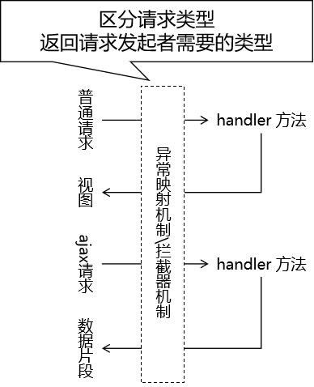
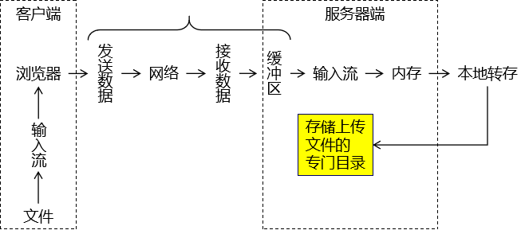
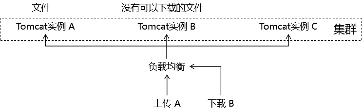

# springmvc-day03

## 第一章 拦截器(重点)

### 1. 概念

#### 1.1 使用场景

##### 1.1.1 生活中坐地铁的场景

为了提高乘车效率，在乘客进入站台前统一检票： 


##### 1.1.2 程序中的校验登录场景

在程序中，使用拦截器在请求到达具体 handler 方法前，统一执行检测。 


#### 1.2 拦截器与过滤器的对比

##### 1.2.1 相同点

三要素相同

- 拦截(配置拦截路径)：必须先把请求拦住，才能执行后续操作
- 过滤(根据某种规则/业务逻辑进行筛选)：拦截器或过滤器存在的意义就是对请求进行统一处理
- 放行(满足规则/筛选条件，就让你访问你想访问的资源)：对请求执行了必要操作后，放请求过去，让它访问原本想要访问的资源

##### 1.2.2 不同点

- 工作平台不同
  - 过滤器工作在 Servlet 容器中
  - 拦截器工作在 SpringMVC 的基础上
- 拦截的范围
  - 过滤器：能够拦截到的最大范围是整个 Web 应用
  - 拦截器：能够拦截到的最大范围是整个 SpringMVC 负责的请求(handler方法、view-controller跳转页面)
- IOC 容器支持
  - 过滤器：想得到 IOC 容器需要调用专门的工具方法，是间接的
  - 拦截器：它自己就在 IOC 容器中，所以可以直接从 IOC 容器中装配组件，也就是可以直接得到 IOC 容器的支持

### 2. 具体使用

#### 2.1 创建拦截器类

```java

public class Process01Interceptor implements HandlerInterceptor {
 
    Logger logger = LoggerFactory.getLogger(this.getClass());
 
    // 在处理请求的目标 handler 方法前执行
    @Override
    public boolean preHandle(HttpServletRequest request, HttpServletResponse response, Object handler) throws Exception {
        
        logger.debug("Process01Interceptor preHandle方法");
         
        // 返回true：放行
        // 返回false：不放行
        return true;
    }
 
    // 在目标 handler 方法之后，渲染视图之前
    @Override
    public void postHandle(HttpServletRequest request, HttpServletResponse response, Object handler, ModelAndView modelAndView) throws Exception {
 
        logger.debug("Process01Interceptor postHandle方法");
        
    }
 
    // 渲染视图之后执行
    @Override
    public void afterCompletion(HttpServletRequest request, HttpServletResponse response, Object handler, Exception ex) throws Exception {
        
        logger.debug("Process01Interceptor afterCompletion方法");
        
    }
}
```

**单个拦截器执行顺序**：

- preHandle() 方法
- 目标 handler 方法
- postHandle() 方法
- 渲染视图
- afterCompletion() 方法

#### 2.2 注册拦截器

##### 2.2.1 默认拦截全部请求

```xml
<!-- 注册拦截器 -->
<mvc:interceptors> 
    <!-- 直接通过内部 bean 配置的拦截器默认拦截全部请求（SpringMVC 范围内） -->
    <bean class="com.atguigu.interceptor.Demo01Interceptor"/>
</mvc:interceptors>
```

##### 2.2.2 配置拦截路径

###### 2.2.2.1 精确匹配

```xml
<!-- 具体配置拦截器可以指定拦截的请求地址 -->
<mvc:interceptor>
    <!-- 精确匹配 -->
    <mvc:mapping path="/hello/sayHello"/>
    <bean class="com.atguigu.interceptor.Demo01Interceptor"/>
</mvc:interceptor>
```

###### 2.2.2.2 模糊匹配：匹配单层路径

```xml
<mvc:interceptor>
    <!-- /*匹配路径中的一层 -->
    <mvc:mapping path="/hello/*"/>
    <bean class="com.atguigu.interceptor.Demo01Interceptor"/>
</mvc:interceptor>
```

###### 2.2.2.3 模糊匹配：匹配多层路径

```xml
<mvc:interceptor>
    <!--模糊匹配多级目录-->
    <mvc:mapping path="/hello/**"/>

    <!--排除-->
    <mvc:exclude-mapping path="/hello/sayHello"/>

    <bean class="com.atguigu.interceptor.Demo01Interceptor"/>
</mvc:interceptor>
```

#### 2.3 多个拦截器执行顺序

- preHandle()方法：和配置的顺序一样
- 目标handler方法
- postHandle()方法：和配置的顺序相反
- 渲染视图
- afterCompletion()方法：和配置的顺序相反


## 第二章 类型转换

SpringMVC 将『把请求参数注入到 POJO 对象』这个操作称为**『数据绑定』**，英文单词是 binding。数据类型的转换和格式化就发生在数据绑定的过程中。 类型转换和格式化是密不可分的两个过程，很多带格式的数据必须明确指定格式之后才可以进行类型转换。最典型的就是日期类型。 

### 1. 自动类型转换

HTTP 协议是一个无类型的协议，我们在服务器端接收到请求参数等形式的数据时，本质上都是字符串类型。请看 javax.servlet.ServletRequest 接口中获取全部请求参数的方法：

```java
public Map<String, String[]> getParameterMap();
```

而我们在实体类当中需要的类型是非常丰富的。对此，SpringMVC 对基本数据类型提供了自动的类型转换。例如：请求参数传入“100”字符串，我们实体类中需要的是 Integer 类型，那么 SpringMVC 会自动将字符串转换为 Integer 类型注入实体类。

### 2. 日期和数值类型转换

#### 2.1 通过注解设定数据格式

```java
package com.atguigu.pojo;

import lombok.AllArgsConstructor;
import lombok.Data;
import lombok.NoArgsConstructor;
import org.springframework.format.annotation.DateTimeFormat;
import org.springframework.format.annotation.NumberFormat;

import java.util.Date;

/**
 * 包名:com.atguigu.pojo
 *
 * @author Leevi
 * 日期2021-09-07  11:26
 * SpringMVC提供了一些注解，可以让我们进行一些手动类型转换
 * 1. DateTimeFormat注解:可以对日期时间类型进行转换
 * 2. NumberFormat注解:可以对数值类型进行转换
 */
@Data
@AllArgsConstructor
@NoArgsConstructor
public class Product {
    @DateTimeFormat(pattern = "yyyy-MM-dd HH:mm:ss")
    private Date productDate;

    @NumberFormat(pattern = "###,###,###.###")
    private Double productPrice;
}

```

#### 2.2 前端表单

```html
<!DOCTYPE html>
<html lang="en">
    <head>
        <meta charset="UTF-8">
        <title>首页</title>
    </head>
    <body>
        <form action="/springmvcday0303/hello/saveProduct" method="post">
            生产日期：<input type="text" name="productDate" value="1992-10-15 17:15:06" /><br/>
            产品价格：<input type="text" name="productPrice" value="111,222,333.444" /><br/>
            <button type="submit">保存</button>
        </form>
    </body>
</html>
```

#### 2.3 handler 方法

```java
@RequestMapping("/saveProduct")
public String saveProduct(Product product){
    logger.debug(product.toString());
    return "target";
}
```

#### 2.4 转换失败后处理方式

##### 2.4.1 默认结果


##### 2.4.2 BindingResult 接口

BindingResult 接口和它的父接口 Errors 中定义了很多和数据绑定相关的方法，如果在数据绑定过程中发生了错误，那么通过这个接口类型的对象就可以获取到相关错误信息。 


##### 2.4.3 重构 handler 方法

```java
@RequestMapping("/saveProduct")
public String saveProduct(Product product, BindingResult bindingResult){
    if (bindingResult.hasErrors()) {
        //跳转到错误页面:显示错误数据
        return "error";
    }
    logger.debug(product.toString());
    return "target";
}
```

##### 2.4.4 在页面上显示错误消息

页面是error.html，放在Thymeleaf前后缀控制范围之内

```html
<!DOCTYPE html>
<html lang="en" xmlns:th="http://www.thymeleaf.org">
    <head>
        <meta charset="UTF-8">
        <title></title>
    </head>
    <body>
        <!-- 从请求域获取实体类信息时，属性名是按照类名首字母小写的规则 -->
        <!-- ${注入请求参数的实体类.出问题的字段} -->
        <p th:errors="${product.productDate}">这里显示具体错误信息</p>
        <p th:errors="${product.productPrice}">这里显示具体错误信息</p>
    </body>
</html>
```

### 3. 自定义类型转换器

#### 3.1 创建实体类

##### 3.1.1 Address

```java
@Data
@AllArgsConstructor
@NoArgsConstructor
public class Address {
    private String province;
    private String city;
    private String street;
}
```

##### 3.1.2 Student

```java
@Data
@AllArgsConstructor
@NoArgsConstructor
public class Product {
    @DateTimeFormat(pattern = "yyyy-MM-dd HH:mm:ss")
    private Date productDate;

    @NumberFormat(pattern = "###,###,###.###")
    private Double productPrice;

    private Address productAddress;
}
```

#### 3.2 表单

现在我们希望通过一个文本框输入约定格式的字符串，然后转换为我们需要的类型，所以必须通过自定义类型转换器来实现，否则 SpringMVC 无法识别。 

```html
<form action="/springmvcday0303/hello/saveProduct" method="post">
    生产日期：<input type="text" name="productDate" value="1992-10-15 17:15:06" /><br/>
    产品价格：<input type="text" name="productPrice" value="111,222,333.444" /><br/>
    生产地: <input type="text" name="productAddress" value="广东省,深圳市,宝安区航城街道"/>
    <button type="submit">保存</button>
</form>
```

#### 3.3 handler 方法

```java
@RequestMapping("/saveProduct")
public String saveProduct(Product product, BindingResult bindingResult){
    if (bindingResult.hasErrors()) {
        //跳转到错误页面:显示错误数据
        return "error";
    }
    logger.debug(product.toString());
    return "target";
}
```

在目前代码的基础上，我们没有提供自定义类型转换器，所以处理请求时看到如下错误日志：

> Field error in object 'student' on field 'address': rejected value [aaa,bbb,ccc]; codes [typeMismatch.student.address,typeMismatch.address,typeMismatch.com.atguigu.mvc.entity.Address,typeMismatch]; arguments [org.springframework.context.support.DefaultMessageSourceResolvable: codes [student.address,address]; arguments []; default message [address]]; default message [Failed to convert property value of type 'java.lang.String' to required type 'com.atguigu.mvc.entity.Address' for property 'address'; nested exception is java.lang.IllegalStateException: Cannot convert value of type 'java.lang.String' to required type 'com.atguigu.mvc.entity.Address' for property 'address': no matching editors or conversion strategy found]]]

页面返回 400。

#### 3.4 创建自定义类型转换器类

实现接口：org.springframework.core.convert.converter.Converter<S,T>

泛型 S：源类型（本例中是 String 类型）

泛型 T：目标类型（本例中是 Address 类型）

```java
package com.atguigu.converter;

import com.atguigu.pojo.Address;
import org.springframework.core.convert.converter.Converter;

/**
 * 包名:com.atguigu.converter
 *
 * @author Leevi
 * 日期2021-09-07  14:00
 * 编写自定义类型转换器:
 * 1. 写一个类实现Converter接口
 * 2. 重写convert方法进行转换
 * 3. 在springmvc的配置文件中配置类型转换器
 */
public class AddressConverter implements Converter<String , Address> {
    @Override
    public Address convert(String source) {
        //source就是要进行转换的那个字符串
        //1. 解析字符串:获取省、市、街道
        String[] strs = source.split(",");
        //2. 创建一个Address对象
        Address address = new Address();
        //3. 将省、市、街道设置到Address对象中
        address.setProvince(strs[0]);
        address.setCity(strs[1]);
        address.setStreet(strs[2]);
        return address;
    }

    @Override
    public <U> Converter<String, U> andThen(Converter<? super Address, ? extends U> after) {
        return null;
    }
}

```

#### 3.5 在springmvc配置文件中注册类型转换器

```xml
<!-- 在 mvc:annotation-driven 中注册 FormattingConversionServiceFactoryBean -->
<mvc:annotation-driven conversion-service="formattingConversionService"/>
 
<!-- 在 FormattingConversionServiceFactoryBean 中注册自定义类型转换器 -->
<bean id="formattingConversionService"
      class="org.springframework.format.support.FormattingConversionServiceFactoryBean">
    <!-- 在 converters 属性中指定自定义类型转换器 -->
    <property name="converters">
        <set>
            <bean class="com.atguigu.mvc.converter.AddressConverter"/>
        </set>
    </property>
 
</bean>
```

## 第三章 数据校验(重要)

在 Web 应用三层架构体系中，表述层负责接收浏览器提交的数据，业务逻辑层负责数据的处理。为了能够让业务逻辑层基于正确的数据进行处理，我们需要在表述层对数据进行检查，将错误的数据隔绝在业务逻辑层之外。 

### 1. 数据校验概述

JSR 303 是 Java 为 Bean 数据合法性校验提供的标准框架，它已经包含在 JavaEE 6.0 标准中。JSR 303 通过在 Bean 属性上标注类似于 @NotNull、@Max 等标准的注解指定校验规则，并通过标准的验证接口对Bean进行验证。 

| 注解                       | 规则                                           |
| -------------------------- | ---------------------------------------------- |
| @Null                      | 标注值必须为 null                              |
| @NotNull                   | 标注值不可为 null                              |
| @AssertTrue                | 标注值必须为 true                              |
| @AssertFalse               | 标注值必须为 false                             |
| @Min(value)                | 标注值必须大于或等于 value                     |
| @Max(value)                | 标注值必须小于或等于 value                     |
| @DecimalMin(value)         | 标注值必须大于或等于 value                     |
| @DecimalMax(value)         | 标注值必须小于或等于 value                     |
| @Size(max,min)             | 标注值大小必须在 max 和 min 限定的范围内       |
| @Digits(integer,fratction) | 标注值值必须是一个数字，且必须在可接受的范围内 |
| @Past                      | 标注值只能用于日期型，且必须是过去的日期       |
| @Future                    | 标注值只能用于日期型，且必须是将来的日期       |
| @Pattern(value)            | 标注值必须符合指定的正则表达式                 |

JSR 303 只是一套标准，需要提供其实现才可以使用。Hibernate Validator 是 JSR 303 的一个参考实现，除支持所有标准的校验注解外，它还支持以下的扩展注解： 

| 注解      | 规则                               |
| --------- | ---------------------------------- |
| @Email    | 标注值必须是格式正确的 Email 地址  |
| @Length   | 标注值字符串大小必须在指定的范围内 |
| @NotEmpty | 标注值字符串不能是空字符串         |
| @Range    | 标注值必须在指定的范围内           |

Spring 4.0 版本已经拥有自己独立的数据校验框架，同时支持 JSR 303 标准的校验框架。Spring 在进行数据绑定时，可同时调用校验框架完成数据校验工作。在SpringMVC 中，可直接通过注解驱动 mvc:annotation-driven 的方式进行数据校验。Spring 的 LocalValidatorFactoryBean 既实现了 Spring 的 Validator 接口，也实现了 JSR 303 的 Validator 接口。只要在Spring容器中定义了一个LocalValidatorFactoryBean，即可将其注入到需要数据校验的 Bean中。Spring本身并没有提供JSR 303的实现，所以必须将JSR 303的实现者的jar包放到类路径下。

配置 mvc:annotation-driven 后，SpringMVC 会默认装配好一个 LocalValidatorFactoryBean，通过**在处理方法的入参上标注 @Validated 注解**即可让 SpringMVC 在完成数据绑定后执行数据校验的工作。

### 2. 具体操作

前提:1.  springmvc环境   2. Tomcat8及以上版本

#### 2.1 引入依赖

```xml
<!-- https://mvnrepository.com/artifact/org.hibernate.validator/hibernate-validator -->
<dependency>
    <groupId>org.hibernate.validator</groupId>
    <artifactId>hibernate-validator</artifactId>
    <version>6.2.0.Final</version>
</dependency>
<!-- https://mvnrepository.com/artifact/org.hibernate.validator/hibernate-validator-annotation-processor -->
<dependency>
    <groupId>org.hibernate.validator</groupId>
    <artifactId>hibernate-validator-annotation-processor</artifactId>
    <version>6.2.0.Final</version>
</dependency>
```

#### 2.2 应用校验规则

##### 2.2.1 给要进行校验的字段添加上校验规则注解

```java
@Data
@AllArgsConstructor
@NoArgsConstructor
public class President {
    // 字符串长度：[3,6]
    @Size(min = 3, max = 6)
    private String username;
    // 字符串必须满足Email格式
    @Email
    private String email;

}
```

##### 2.2.2 给handler方法的形参加上Validated

```java
@RequestMapping("/savePresident")
public String savePresident(@Validated President president){
    logger.debug(president.toString());
    return "target";
}
```

#### 2.3 校验失败效果

日志：

> Field error in object 'president' on field 'email': rejected value [aa]; codes [Email.president.email,Email.email,Email.java.lang.String,Email]; arguments [org.springframework.context.support.DefaultMessageSourceResolvable: codes [president.email,email]; arguments []; default message [email],[Ljavax.validation.constraints.Pattern$Flag;@4a6addb7,.*]; default message [不是一个合法的电子邮件地址] Field error in object 'president' on field 'email': rejected value [aa]; codes [Size.president.email,Size.email,Size.java.lang.String,Size]; arguments [org.springframework.context.support.DefaultMessageSourceResolvable: codes [president.email,email]; arguments []; default message [email],6,3]; default message [个数必须在3和6之间]]]

同时页面返回 400。

#### 2.4 显示友好的错误提示

##### 2.4.1 重构 handler 方法

```java
@RequestMapping("/save/president")
public String savePresident(
        // 在实体类参数和 BindingResult 之间不能有任何其他参数
        @Validated President president, BindingResult bindingResult) {
 
    if (bindingResult.hasErrors()) {
        return "error";
    }
     
    logger.debug(president.getEmail());
 
    return "target";
}
```

##### 2.4.2 准备错误信息页面

```html
<h1>系统信息</h1>
<!-- 从请求域获取实体类信息时，属性名是按照类名首字母小写的规则 -->
<!-- ${注入请求参数的实体类.出问题的字段} -->
<p th:errors="${president.email}">这里显示系统提示消息</p>
```

## 第四章 异常映射

### 1. 为什么需要异常映射

一个项目中会包含很多个模块，各个模块需要分工完成。如果张三负责的模块按照 A 方案处理异常，李四负责的模块按照 B 方法处理异常……各个模块处理异常的思路、代码、命名细节都不一样，那么就会让整个项目非常混乱。 

异常映射可以将异常类型和某个具体的视图关联起来，建立映射关系。好处是可以通过 SpringMVC 框架来帮助我们管理异常。

- 声明式管理异常：在配置文件中指定异常类型和视图之间的对应关系。在配置文件或注解类中统一管理。
- 编程式管理异常：需要我们自己手动 try ... catch ... 捕获异常，然后再手动跳转到某个页面。

### 2. 异常映射的优势

- 使用声明式代替编程式来实现异常管理
  - 让异常控制和核心业务解耦，二者各自维护，结构性更好
- 整个项目层面使用同一套规则来管理异常
  - 整个项目代码风格更加统一、简洁
  - 便于团队成员之间的彼此协作

### 3. 基于 XML 的异常映射

#### 3.1 XML配置

SpringMVC 会根据异常映射信息，在捕获到指定异常对象后，将异常对象存入请求域，然后转发到和异常类型关联的视图。

 

```xml
<!--配置异常处理-->
<bean id="exceptionResolver"
      class="org.springframework.web.servlet.handler.SimpleMappingExceptionResolver">

    <!-- 配置异常映射关系 -->
    <property name="exceptionMappings">
        <props>
            <!-- key属性：指定异常类型 -->
            <!-- 文本标签体：和异常类型对应的逻辑视图 -->
            <prop key="java.lang.ArithmeticException">error-arith</prop>

            <prop key="java.lang.ClassNotFoundException">error-class</prop>

            <prop key="java.lang.RuntimeException">error-runtime</prop>
        </props>
    </property>
    <!--
            SimpleMappingExceptionResolver在处理异常的时候，会将异常对象存储到请求域中
            我们下面的配置，就是用于指定将异常对象存储进请求域的时候，使用的是key叫什么
        -->
    <property name="exceptionAttribute" value="atguiguException"/>
</bean>
```

#### 3.2 异常范围

如果在配置文件中，发现有多个匹配的异常类型，那么 SpringMVC 会采纳范围上最接近的异常映射关系。 

```xml
<prop key="java.lang.ArithmeticException">error-arith</prop>
<prop key="java.lang.RuntimeException">error-runtime</prop>
```

### 4. 基于注解的异常映射

#### 4.1 创建异常处理器类


#### 4.2 异常处理器对象加入 IOC 容器

##### 4.2.1 包扫描

```xml
<!--1.包扫描-->
<context:component-scan base-package="com.atguigu"/>
```

##### 4.2.2 给异常处理器类标记注解

```java
// 异常处理器类需要使用 @ControllerAdvice 注解标记
@ControllerAdvice
public class MyExceptionHandler {
    
}
```

#### 4.3 声明处理异常的方法

```java
// @ExceptionHandler注解：标记异常处理方法
// value属性：指定匹配的异常类型
// 异常类型的形参：SpringMVC 捕获到的异常对象
@ExceptionHandler(value = NullPointerException.class)
public String resolveNullPointerException(Exception e, Model model) {
 
    // 我们可以自己手动将异常对象存入模型
    model.addAttribute("atguiguException", e);
 
    // 返回逻辑视图名称
    return "error-nullpointer";
}
```

当同一个异常类型在基于 XML 和注解的配置中都能够找到对应的映射，那么以注解为准。 

### 5. 区分请求类型

#### 5.1 为什么要区分请求类型

异常处理机制和拦截器机制都面临这样的问题： 



#### 5.2 判断依据

查看请求消息头中是否包含 Ajax 请求独有的特征：

- Accept 请求消息头：包含 application/json
- X-Requested-With 请求消息头：包含 XMLHttpRequest

两个条件满足一个即可。

```java
/**
     * 判断请求类型，如果返回true就是同步请求，返回false就是异步请求
     * @param request
     * @return
     */
private boolean judgeRequestType(HttpServletRequest request) {
    //加入代码判断当前请求是同步请求还是异步请求:通过accept或者X-Requested-With
    String acceptHeader = request.getHeader("Accept");
    String xRequestHeader = request.getHeader("X-Requested-With");

    return !((acceptHeader != null && acceptHeader.contains("application/json")) ||
             (xRequestHeader != null && xRequestHeader.equals("XMLHttpRequest")));
}
```

#### 5.3 重构异常处理器兼容两种请求的处理方法

```java
@ExceptionHandler(value = Exception.class)
public String resolveNullPointerException(HttpServletResponse response,
                                          HttpServletRequest request,
                                          Exception e, Model model) throws IOException {
    //这个方法处理空指针异常
    if(!judgeRequestType(request)){
        //说明当前是异步请求:使用response向客户端响应异常信息
        response.getWriter().write(e.getMessage());
        return null;
    }
    //要获取异常信息，并且将异常信息存储到请求域
    model.addAttribute("atguiguException",e);
    //这个方法返回:异常处理页面的逻辑视图
    return "error";
}
```

## 第五章 文件上传(重要)

### 1. 前端表单

需要满足的要求:

- 第一点：请求方式必须是 POST
- 第二点：请求体的编码方式必须是 multipart/form-data（通过 form 标签的 enctype 属性设置）
- 第三点：使用 input 标签、type 属性设置为 file 来生成文件上传框

```html
<form th:action="@{/atguigu/upload}" method="post" enctype="multipart/form-data">
    
    <input type="file" name="picture" />
    <button type="submit">上传头像</button>
     
</form>
```

### 2. SpringMVC 环境

#### 2.1 引入依赖

```xml
<!-- https://mvnrepository.com/artifact/commons-fileupload/commons-fileupload -->
<dependency>
    <groupId>commons-fileupload</groupId>
    <artifactId>commons-fileupload</artifactId>
    <version>1.3.1</version>
</dependency>
```

#### 2.2 配置

在 SpringMVC 的配置文件中加入 multipart 类型数据的解析器： 

```xml
<bean id="multipartResolver" 
      class="org.springframework.web.multipart.commons.CommonsMultipartResolver">
    
    <!-- 由于上传文件的表单请求体编码方式是 multipart/form-data 格式，所以要在解析器中指定字符集 -->
    <property name="defaultEncoding" value="UTF-8"/>
    
</bean>
```

### 3. handler 方法接收数据

```java
@RequestMapping("/simple/upload")
public String doUpload(
 
        // 表单提交的数据仍然是请求参数，所以使用 @RequestParam 注解接收
        @RequestParam("nickName") String nickName,
 
        // 对于上传的文件使用 MultipartFile 类型接收其相关数据
        @RequestParam("picture") MultipartFile picture
        ) throws IOException {
 
    String inputName = picture.getName();
    logger.debug("文件上传表单项的 name 属性值：" + inputName);
 
    // 获取这个数据通常都是为了获取文件本身的扩展名
    String originalFilename = picture.getOriginalFilename();
    logger.debug("文件在用户本地原始的文件名：" + originalFilename);
 
    String contentType = picture.getContentType();
    logger.debug("文件的内容类型：" + contentType);
 
    boolean empty = picture.isEmpty();
    logger.debug("文件是否为空：" + empty);
 
    long size = picture.getSize();
    logger.debug("文件大小：" + size);
 
    byte[] bytes = picture.getBytes();
    logger.debug("文件二进制数据的字节数组：" + Arrays.asList(bytes));
 
    InputStream inputStream = picture.getInputStream();
    logger.debug("读取文件数据的输入流对象：" + inputStream);
 
    Resource resource = picture.getResource();
    logger.debug("代表当前 MultiPartFile 对象的资源对象" + resource);
 
    return "target";
}
```

### 4. MultipartFile接口介绍


### 5. 文件转存

#### 5.1 底层原理


#### 5.2 三种去向

##### 5.2.1 本地转存



###### 5.2.1.1  **创建保存文件的目录** 


这个目录如果是空目录，那么服务器部署运行时很容易会忽略这个目录。为了避免这个问题，在这个目录下随便创建一个文件，随便写点内容即可。 

###### 5.2.1.2  **编写转存代码** 

下面是负责处理文件上传请求的 handler 方法的转存部分： 

```java
@Autowired
private ServletContext servletContext;
Logger logger = LoggerFactory.getLogger(this.getClass());
@RequestMapping("/upload")
public String upload(@RequestParam("nickname") String nickname,@RequestParam("picture") MultipartFile multipartFile) throws IOException {
    //获取请求参数(除了文件之外)，还是和以前一样的方式获取
    logger.debug(nickname);
    //multipartFile对象就表示客户端上传的文件
    //1. 指定转存的目录路径:动态获取部署的目录路径
    String dirPath = servletContext.getRealPath("head-picture");

    //2. 获取文件名:在获取到原文件的文件名之后，将其文件名改成一个唯一的名字，这样就能保证不会出现上传文件同名的情况
    String UUIDName = UUID.randomUUID().toString().replace("-","");
    //获取文件名的后缀
    String originalFilename = multipartFile.getOriginalFilename();
    String suffix = originalFilename.substring(originalFilename.lastIndexOf("."));

    //唯一的文件名就是UUIDName拼接后缀
    String fileName = UUIDName + suffix;
    //要将该文件转存到目录中
    multipartFile.transferTo(new File(dirPath+"/"+fileName));
    return "target";
}
```

###### 5.2.1.3 缺陷

- Web 应用重新部署时通常都会清理旧的构建结果，此时用户以前上传的文件会被删除，导致数据丢失。
- 项目运行很长时间后，会导致上传的文件积累非常多，体积非常大，从而拖慢 Tomcat 运行速度。
- 当服务器以集群模式运行时，文件上传到集群中的某一个实例，其他实例中没有这个文件，就会造成数据不一致。
- 不支持动态扩容，一旦系统增加了新的硬盘或新的服务器实例，那么上传、下载时使用的路径都需要跟着变化，导致 Java 代码需要重新编写、重新编译，进而导致整个项目重新部署。



##### 5.2.2 文件服务器


###### 5.2.2.1 优势

- 不受 Web 应用重新部署影响
- 在应用服务器集群环境下不会导致数据不一致
- 针对文件读写进行专门的优化，性能有保障
- 能够实现动态扩容


###### 5.2.2.2 常见的文件服务器类型

- 第三方平台：
  - 阿里的 OSS 对象存储服务
  - 七牛云
- 自己搭建服务器：FastDFS等

##### 5.2.3 上传到其他模块(了解)

这种情况肯定出现在分布式架构中，常规业务功能不会这么做，采用这个方案的一定的特殊情况。 


## 第六章 文件下载(了解)

### 1. 原始形态

使用链接地址指向要下载的文件。此时浏览器会尽可能解析对应的文件，只要是能够在浏览器窗口展示的，就都会直接显示，而不是提示下载。 

```html
<a href="download/hello.atguigu">下载</a><br/>
<a href="download/tank.jpg">下载</a><br/>
<a href="download/chapter04.zip">下载</a><br/>
```

上面例子中，只有 chapter04.zip 文件是直接提示下载的，其他两个都是直接显示。 

### 2. 明确要求浏览器提示下载

```java
@Autowired
private ServletContext servletContext;
@RequestMapping("/download")
public ResponseEntity download(@RequestParam("fileName") String fileName) throws IOException {
    //用来下载文件:
    //1. 使用输入流读取要下载的文件
    //1.1 获取要下载的文件路径
    String downloadPath = servletContext.getRealPath("download/"+fileName);
    //1.2 读取要下载的文件
    FileInputStream fileInputStream = new FileInputStream(downloadPath);
    int len = fileInputStream.available();
    byte[] buffer = new byte[len];
    fileInputStream.read(buffer);

    //2. 将要下载的文件输出到浏览器:使用响应
    //ResponseEntity表示响应实体:要下载的文件是通过响应体响应给客户端的
    //创建添加响应头
    MultiValueMap<String, String> headers = new HttpHeaders();
    //获取要下载的文件的mime-type,设置Content-Type响应头
    String contentType = servletContext.getMimeType(fileName);
    headers.add("Content-Type",contentType);

    //Content-Disposition:响应头是指示客户端下载内容
    headers.add("Content-Disposition","attachment;filename="+fileName);

    return new ResponseEntity<>(buffer, headers,HttpStatus.OK);
}
```

### 3. 典型应用场景举例

我们目前实现的是一个较为简单的下载，可以用在下面的一些场合：

- 零星小文件下载
- 将系统内部的数据导出为 Excel、PDF 等格式，然后以下载的方式返回给用户

