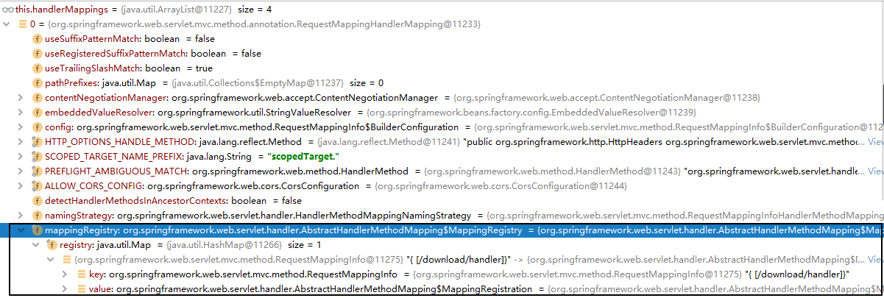
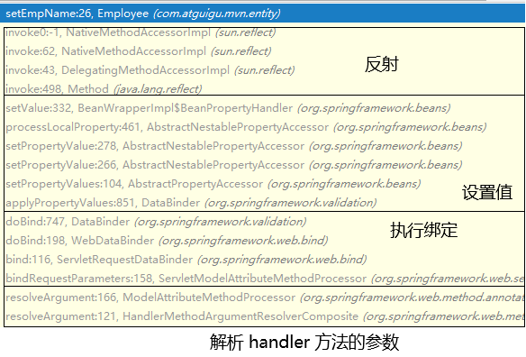

# springmvc-day04                                  

## 第一章 SpringMVC运行原理                            

### 第一节 启动过程                                                                                                                                                                                                                                                                                                     

#### 1. Servlet 生命周期回顾

| 生命周期环节 | 调用的方法                                                   | 时机                                     | 次数 |
| ------------ | ------------------------------------------------------------ | ---------------------------------------- | ---- |
| 创建对象     | 无参构造器                                                   | **默认：第一次请求 修改：Web应用启动时** | 一次 |
| 初始化       | init(ServletConfig servletConfig)                            | 创建对象后                               | 一次 |
| 处理请求     | service(ServletRequest servletRequest,  ServletResponse servletResponse) | 接收到请求后                             | 多次 |
| 清理操作     | destroy()                                                    | Web应用卸载之前                          | 一次 |

####  2. 初始化操作调用路线图


#### 3. IOC容器创建

所在类：org.springframework.web.servlet.FrameworkServlet 

```java
protected WebApplicationContext createWebApplicationContext(@Nullable ApplicationContext parent) {
    Class<?> contextClass = getContextClass();
    if (!ConfigurableWebApplicationContext.class.isAssignableFrom(contextClass)) {
        throw new ApplicationContextException(
                "Fatal initialization error in servlet with name '" + getServletName() +
                "': custom WebApplicationContext class [" + contextClass.getName() +
                "] is not of type ConfigurableWebApplicationContext");
    }
    
    // 通过反射创建 IOC 容器对象
    ConfigurableWebApplicationContext wac =
            (ConfigurableWebApplicationContext) BeanUtils.instantiateClass(contextClass);
    wac.setEnvironment(getEnvironment());
    
    // 设置父容器
    wac.setParent(parent);
    String configLocation = getContextConfigLocation();
    if (configLocation != null) {
        wac.setConfigLocation(configLocation);
    }
    configureAndRefreshWebApplicationContext(wac);
    return wac;
}
```

#### 4. 将 IOC 容器对象存入应用域

所在类：org.springframework.web.servlet.FrameworkServlet 

```java
protected WebApplicationContext initWebApplicationContext() {
    WebApplicationContext rootContext =
            WebApplicationContextUtils.getWebApplicationContext(getServletContext());
    WebApplicationContext wac = null;
    if (this.webApplicationContext != null) {
        wac = this.webApplicationContext;
        if (wac instanceof ConfigurableWebApplicationContext) {
            ConfigurableWebApplicationContext cwac = (ConfigurableWebApplicationContext) wac;
            if (!cwac.isActive()) {
                if (cwac.getParent() == null) {
                    cwac.setParent(rootContext);
                }
                configureAndRefreshWebApplicationContext(cwac);
            }
        }
    }
    if (wac == null) {
        wac = findWebApplicationContext();
    }
    if (wac == null) {
        // 创建 IOC 容器
        wac = createWebApplicationContext(rootContext);
    }
    if (!this.refreshEventReceived) {
        synchronized (this.onRefreshMonitor) {
            onRefresh(wac);
        }
    }
    if (this.publishContext) {
        // 获取存入应用域时专用的属性名
        String attrName = getServletContextAttributeName();
        
        // 存入
        getServletContext().setAttribute(attrName, wac);
    }
    return wac;
}
```

看到这一点的意义：SpringMVC 有一个工具方法，可以从应用域获取 IOC 容器对象的引用。

工具类：org.springframework.web.context.support.WebApplicationContextUtils

工具方法：getWebApplicationContext()

```java
@Nullable
public static WebApplicationContext getWebApplicationContext(ServletContext sc) {
    return getWebApplicationContext(sc, WebApplicationContext.ROOT_WEB_APPLICATION_CONTEXT_ATTRIBUTE);
}
```

#### 5. 请求映射初始化

FrameworkServlet.createWebApplicationContext()→configureAndRefreshWebApplicationContext()→wac.refresh()→触发刷新事件→org.springframework.web.servlet.DispatcherServlet.initStrategies()→org.springframework.web.servlet.DispatcherServlet.initHandlerMappings() 



#### 6. 小结

整个启动过程我们关心如下要点：

- DispatcherServlet 本质上是一个 Servlet，所以天然的遵循 Servlet 的生命周期。所以宏观上是 Servlet 生命周期来进行调度。
- DispatcherServlet 的父类是 FrameworkServlet。
  - FrameworkServlet 负责框架本身相关的创建和初始化。
  - DispatcherServlet 负责请求处理相关的初始化。
- FrameworkServlet 创建 IOC 容器对象之后会存入应用域。
- FrameworkServlet 完成初始化会调用 IOC 容器的刷新方法。
- 刷新方法完成触发刷新事件，在刷新事件的响应函数中，调用 DispatcherServlet 的初始化方法。
- 在 DispatcherServlet 的初始化方法中初始化了请求映射等。

## 第二章 请求处理过程

### 第一节 总体阶段

#### 1. 流程描述

- 目标 handler 方法执行**前**
  - 建立调用链，确定整个执行流程
  - 拦截器的 preHandle() 方法
  - 注入请求参数
  - 准备目标 handler 方法所需所有参数
- **调用**目标 handler 方法
- 目标 handler 方法执行**后**
  - 拦截器的 postHandle() 方法
  - 渲染视图
  - 拦截器的 afterCompletion() 方法

#### 2. 核心代码

整个请求处理过程都是 doDispatch() 方法在宏观上协调和调度，把握了这个方法就理解了 SpringMVC 总体上是如何处理请求的。

所在类：org.springframework.web.servlet.**DispatcherServlet**

所在方法：doDispatch()

核心方法中的核心代码：

```java
// Actually invoke the handler.
mv = ha.handle(processedRequest, response, mappedHandler.getHandler());
```

### 第二节 调用前阶段

#### 1. 建立调用链

##### 1.1 相关组件

全类名：org.springframework.web.servlet.HandlerExecutionChain 


拦截器索引默认是 -1，说明开始的时候，它指向第一个拦截器前面的位置。每执行一个拦截器，就把索引向前移动一个位置。所以这个索引每次都是指向当前拦截器。所以它相当于拦截器的**指针**。 

##### 1.2 对应操作

所在类：org.springframework.web.servlet.handler.AbstractHandlerMapping 


结论：调用链是由拦截器和目标 handler 对象组成的。 

#### 2. 调用拦截器 preHandle()

所在类：org.springframework.web.servlet.DispatcherServlet

所在方法：doDispatch()


具体调用细节：正序调用

所在类：org.springframework.web.servlet.HandlerExecutionChain

所在方法：applyPreHandle


从这部分代码我们也能看到，为什么拦截器中的 preHandle() 方法通过返回布尔值能够控制是否放行。

- 每一个拦截器的 preHandle() 方法都返回 true：applyPreHandle() 方法返回 true，被取反就不执行 if 分支，继续执行后续操作，这就是放行。
- 任何一个拦截器的 preHandle() 方法返回 false：applyPreHandle() 方法返回 false，被取反执行 if 分支，return，导致 doDispatch() 方法结束，不执行后续操作，就是不放行。

#### 3. 调用handler方法

##### 3.1 相关组件

接口：org.springframework.web.servlet.HandlerAdapter

作用：字面含义是适配器的意思，具体功能有三个

- 将请求参数绑定到实体类对象中
- 给目标 handler 方法准备所需的其他参数，例如：
  - Model、ModelMap、Map……
  - 原生 Servlet API：request、response、session……
  - BindingResult
  - @RequestParam 注解标记的零散请求参数
  - @PathVariable 注解标记的路径变量
- 调用目标 handler 方法

##### 3.2 创建并获取这个组件

所在类：org.springframework.web.servlet.DispatcherServlet

所在方法：doDispatch()


##### 3.3 具体操作：调用目标 handler 方法

所在类：org.springframework.web.servlet.DispatcherServlet

所在方法：doDispatch()


##### 3.4 具体操作：注入请求参数

                         

通过反射给对应属性注入请求参数应该是下面的过程：

- 获取请求参数名称
- 将请求参数名称首字母设定为大写
- 在首字母大写后的名称前附加 set，得到目标方法名
- 通过反射调用 setXxx() 方法

#### 4. 准备其他参数

以 Model 为例来进行说明。

##### 4.1 背景

在 handler 方法中，如果需要 Model、ModelMap、Map 等对象用来存放模型数据，那么直接在 handler 方法中声明这些类型的形参即可。

而不管我们声明 Model、ModelMap、Map 三者中的任何一个，其实实际传入的对象都是 BindingAwareModelMap 类型的。

##### 4.2 相关组件

组件类：org.springframework.web.method.support.ModelAndViewContainer

相关属性：defaultModel

```java
private final ModelMap defaultModel = new BindingAwareModelMap();
```

从这个属性的声明能够看出：defaultModel 直接就是用 BindingAwareModelMap 对象来初始化的。

##### 4.3 相关操作

相关接口：org.springframework.web.servlet.HandlerAdapter

所在类：org.springframework.web.servlet.mvc.method.annotation.RequestMappingHandlerAdapter

所在方法：invokeHandlerMethod()

操作1：创建 ModelAndViewContainer 对象


操作2：把 ModelAndViewContainer 对象传给 invokeAndHandle() 方法 


### 第三节 调用后阶段

#### 1. 调用拦截器的 postHandle() 方法

所在类：org.springframework.web.servlet.DispatcherServlet

所在方法：doDispatch()


调用细节：从拦截器集合长度 - 1 开始循环，循环到 0 为止。所以是**倒序**执行 


#### 2. 渲染视图

##### 2.1 所有后续操作的入口

所在类：org.springframework.web.servlet.DispatcherServlet

所在方法：doDispatch()


##### 2.2 后续细节1：处理异常

所在类：org.springframework.web.servlet.DispatcherServlet

所在方法：processDispatchResult()


##### 2.3 后续细节2：渲染视图

所在类：org.springframework.web.servlet.DispatcherServlet

所在方法：processDispatchResult()


补充细节：模型数据存入请求域的具体位置

所在类：org.thymeleaf.context.WebEngineContext.RequestAttributesVariablesMap

所在方法：setVariable()


#### 3. 调用拦截器的 afterCompletion() 方法

所在类：org.springframework.web.servlet.DispatcherServlet

所在方法：processDispatchResult()


调用细节：从拦截器索引开始循环，直到循环变量 i 被减到 0 为止。这样的效果是前面执行拦截器到哪里，就从哪里倒回去执行；前面没有执行的拦截器，现在也不执行。 


## 第三章 ContextLoaderListener

### 第一节 概述

目前情况：DispatcherServlet 加载 spring-mvc.xml，此时整个 Web 应用中只创建一个 IOC 容器。将来整合Mybatis、配置声明式事务，全部在 spring-mvc.xml 配置文件中配置也是可以的。可是这样会导致配置文件太长，不容易维护。

所以想到把配置文件分开：

- 处理浏览器请求相关：spring-mvc.xml 配置文件
- 声明式事务和整合Mybatis相关：spring-persist.xml 配置文件

配置文件分开之后，可以让 DispatcherServlet 加载多个配置文件。例如：

```xml
<servlet>
    <servlet-name>dispatcherServlet</servlet-name>
    <servlet-class>org.springframework.web.servlet.DispatcherServlet</servlet-class>
    <init-param>
        <param-name>contextConfigLocation</param-name>
        <param-value>classpath:spring-*.xml</param-value>
    </init-param>
    <load-on-startup>1</load-on-startup>
</servlet>
```

如果希望这两个配置文件使用不同的机制来加载：

- DispatcherServlet 加载 spring-mvc.xml 配置文件：它们和处理浏览器请求相关
- ContextLoaderListener 加载 spring-persist.xml 配置文件：不需要处理浏览器请求，需要配置持久化层相关功能

此时会带来一个新的问题：在 Web 一个应用中就会出现两个 IOC 容器

- DispatcherServlet 创建一个 IOC 容器
- ContextLoaderListener 创建一个 IOC 容器

注意：本节我们探讨的这个技术方案并不是**『必须』**这样做，而仅仅是**『可以』**这样做。

### 第二节 配置 ContextLoaderListener

#### 1. 创建 spring-persist.xml


#### 2. 配置 ContextLoaderListener

```xml
<!-- 通过全局初始化参数指定 Spring 配置文件的位置 -->
<context-param>
    <param-name>contextConfigLocation</param-name>
    <param-value>classpath:spring-persist.xml</param-value>
</context-param>
 
<listener>
    <!-- 指定全类名，配置监听器 -->
    <listener-class>org.springframework.web.context.ContextLoaderListener</listener-class>
</listener>
```

| 方法名               | 执行时机           | 作用                  |
| -------------------- | ------------------ | --------------------- |
| contextInitialized() | Web 应用启动时执行 | 创建并初始化 IOC 容器 |
| contextDestroyed()   | Web 应用卸载时执行 | 关闭 IOC 容器         |

#### 3. ContextLoader

##### 3.1 指定配置文件位置的参数名

```java
/**
 * Name of servlet context parameter (i.e., {@value}) that can specify the
 * config location for the root context, falling back to the implementation's
 * default otherwise.
 * @see org.springframework.web.context.support.XmlWebApplicationContext#DEFAULT_CONFIG_LOCATION
 */
public static final String CONFIG_LOCATION_PARAM = "contextConfigLocation";
```

##### 3.2 初始化 IOC 容器

方法名：initWebApplicationContext() 

##### 3.3 创建 IOC 容器

方法名：createWebApplicationContext() 

### 第三节 探讨两个IOC容器之间的关系

打印两个 IOC 容器对象的 toString() 方法：  

```java
Object springIOC = servletContext.getAttribute("org.springframework.web.context.WebApplicationContext.ROOT"
logger.debug(springIOC.toString());
Object springMVCIOC = servletContext.getAttribute("org.springframework.web.servlet.FrameworkServlet.CONTEXT.dispatcherServlet");
logger.debug(springMVCIOC.toString());
```

打印效果是：

> **Root** WebApplicationContext, started on Thu Jun 17 14:49:17 CST 2021
>
> WebApplicationContext for namespace 'dispatcherServlet-servlet', started on Thu Jun 17 14:49:18 CST 2021, **parent**: Root WebApplicationContext

 

结论：两个组件分别创建的 IOC 容器是**父子**关系。

- 父容器：ContextLoaderListener 创建的 IOC 容器
- 子容器：DispatcherServlet 创建的 IOC 容器

父子关系是如何决定的？

- ContextLoaderListener 初始化时如果检查到有已经存在的根级别 IOC 容器，那么会抛出异常。
- DispatcherServlet 创建的 IOC 容器会在初始化时先检查当前环境下是否存在已经创建好的 IOC 容器。
  - 如果有：则将已存在的这个 IOC 容器设置为自己的父容器
  - 如果没有：则将自己设置为 root 级别的 IOC 容器
- 同时 Tomcat 在读取 web.xml 之后，加载组件的顺序就是监听器、过滤器、Servlet。

 

DispatcherServlet 创建的 IOC 容器设置父容器的源码截图：

所在类：org.springframework.web.servlet.FrameworkServlet

所在方法：createWebApplicationContext()


### 第四节 探讨两个 IOC 容器之间 bean 的互相访问


spring-mvc.xml配置方式：

```xml
<context:component-scan base-package="com.atguigu.spring.component.controller"/>
```

spring-persist.xml配置方式：

```xml
<context:component-scan base-package="com.atguigu.spring.component.service,com.atguigu.spring.component.dao"/>
```

所以bean所属IOC容器的关系：

- 父容器
  - EmpService
  - EmpDao
- 子容器
  - EmpController

结论：子容器中的 EmpController 装配父容器中的 EmpService 能够正常工作。说明子容器可以访问父容器中的bean。

分析：“子可用父，父不能用子”的根本原因是子容器中有一个属性 **getParent()** 可以获取到父容器这个对象的引用。

源码依据：

- 在 AbstractApplicationContext 类中，有 parent 属性
- 在 AbstractApplicationContext 类中，有获取 parent 属性的 getParent() 方法
- 子容器可以通过 getParent() 方法获取到父容器对象的引用
- 进而调用父容器中类似 “getBean()” 这样的方法获取到需要的 bean 完成装配
- 而父容器中并没有类似 “getChildren()“ 这样的方法，所以没法拿到子容器对象的引用


### 第五节 有可能重复创建对象


#### 1. 查看日志确认是否重复创建了对象

> Root WebApplicationContext: initialization started
>
> ……
>
> Creating shared instance of singleton bean 'helloDao' Creating shared instance of singleton bean 'helloHandler' Creating shared instance of singleton bean 'helloService'
>
> ……
>
> Root WebApplicationContext initialized in 1150 ms
>
> ……
>
> Refreshing WebApplicationContext for namespace 'dispatcherServlet-servlet'
>
> ……
>
> Creating shared instance of singleton bean 'helloDao'
>
> Creating shared instance of singleton bean 'helloHandler'
>
> Creating shared instance of singleton bean 'helloService'
>
> ……

 

#### 2. 重复创建对象的问题

- 浪费内存空间

- 两个 IOC 容器能力是不同的

  - spring-mvc.xml：仅配置和处理请求相关的功能。所以不能给 service 类附加声明式事务功能。

    结论：基于 spring-mvc.xml 配置文件创建的 EmpService 的 bean 不带有声明式事务的功能

    影响：DispatcherServlet 处理浏览器请求时会调用自己创建的 EmpController，然后再调用自己创建的EmpService，而这个 EmpService 是没有事务的，所以处理请求时**没有事务功能的支持**。

  - spring-persist.xml：配置声明式事务。所以可以给 service 类附加声明式事务功能。

    结论：基于 spring-persist.xml 配置文件创建的 EmpService 有声明式事务的功能

    影响：由于 DispatcherServlet 的 IOC 容器会优先使用自己创建的 EmpController，进而装配自己创建的EmpService，所以基于 spring-persist.xml 配置文件创建的有声明式事务的 EmpService 用不上。

 

#### 3. 解决重复创建对象的问题

##### 3.1 解决方案一

让两个配置文件配置自动扫描的包时，各自扫描各自的组件。

- SpringMVC 就扫描 XxxHandler
- Spring 扫描 XxxService 和 XxxDao

 

##### 3.2 解决方案二

如果由于某种原因，必须扫描同一个包，确实存在重复创建对象的问题，可以采取下面的办法处理。

- spring-mvc.xml 配置文件在整体扫描的基础上进一步配置：仅包含被 @Controller 注解标记的类。
- spring-persist.xml 配置在整体扫描的基础上进一步配置：排除被 @Controller 注解标记的类。

具体spring-mvc.xml配置文件中的配置方式如下：

```xml
<!-- 两个Spring的配置文件扫描相同的包 -->
<!-- 为了解决重复创建对象的问题，需要进一步制定扫描组件时的规则 -->
<!-- 目标：『仅』包含@Controller注解标记的类 -->
<!-- use-default-filters="false"表示关闭默认规则，表示什么都不扫描，此时不会把任何组件加入IOC容器；
        再配合context:include-filter实现“『仅』包含”效果 -->
<context:component-scan base-package="com.atguigu.spring.component" use-default-filters="false">
    <!-- context:include-filter标签配置一个“扫描组件时要包含的类”的规则，追加到默认规则中 -->
    <!-- type属性：指定规则的类型，根据什么找到要包含的类，现在使用annotation表示基于注解来查找 -->
    <!-- expression属性：规则的表达式。如果type属性选择了annotation，那么expression属性配置注解的全类名 -->
    <context:include-filter type="annotation" expression="org.springframework.stereotype.Controller"/>
</context:component-scan>
```

具体spring-persist.xml配置文件中的配置方式如下： 

```xml
<!-- 两个Spring的配置文件扫描相同的包 -->
<!-- 在默认规则的基础上排除标记了@Controller注解的类 -->
<context:component-scan base-package="com.atguigu.spring.component">
    <!-- 配置具体排除规则：把标记了@Controller注解的类排除在扫描范围之外 -->
    <context:exclude-filter type="annotation" expression="org.springframework.stereotype.Controller"/>
</context:component-scan>
```

### 第六节 小结

- DispatcherServlet 和 ContextLoaderListener 并存
  - DispatcherServlet 负责加载 SpringMVC 的配置文件，例如：spring-mvc.xml
  - ContextLoaderListener 负责加载 Spring 的配置文件，例如：spring-persist.xml
- 两个 IOC 容器的关系：
  - ContextLoaderListener 创建的容器是父容器
  - DispatcherServlet 创建的容器是子容器
- bean 的装配
  - 子容器可以访问父容器中的 bean
  - 父容器不能访问子容器中的 bean
- 两个容器扫描同一个包会导致重复创建对象
  - 解决办法一：各自扫描各自的包
  - 解决办法二：
    - DispatcherServlet 创建的容器仅扫描 handler
    - ContextLoaderListener 创建的容器不扫描 handler

## 第四章 SSM整合(重点)

### 第一节 Spring 和 Mybatis 整合

#### 1. 思路


#### 2. Mybatis-Spring技术

[官方介绍](http://mybatis.org/spring/zh/index.html)

相关技术之间版本匹配说明：


Mybatis-Spring 的依赖：

```xml
<!-- https://mvnrepository.com/artifact/org.mybatis/mybatis-spring -->
<dependency>
    <groupId>org.mybatis</groupId>
    <artifactId>mybatis-spring</artifactId>
    <version>2.0.6</version>
</dependency>
```

#### 3. 总体 SSM 整合所需依赖

```xml
<!-- SpringMVC -->
<dependency>
    <groupId>org.springframework</groupId>
    <artifactId>spring-webmvc</artifactId>
    <version>5.3.1</version>
</dependency>

<!-- Spring 持久化层所需依赖 -->
<dependency>
    <groupId>org.springframework</groupId>
    <artifactId>spring-orm</artifactId>
    <version>5.3.1</version>
</dependency>

<!-- 日志 -->
<dependency>
    <groupId>ch.qos.logback</groupId>
    <artifactId>logback-classic</artifactId>
    <version>1.2.3</version>
</dependency>

<!-- ServletAPI -->
<dependency>
    <groupId>javax.servlet</groupId>
    <artifactId>javax.servlet-api</artifactId>
    <version>3.1.0</version>
    <scope>provided</scope>
</dependency>

<!-- Spring5和Thymeleaf整合包 -->
<dependency>
    <groupId>org.thymeleaf</groupId>
    <artifactId>thymeleaf-spring5</artifactId>
    <version>3.0.12.RELEASE</version>
</dependency>

<!-- Mybatis核心 -->
<dependency>
    <groupId>org.mybatis</groupId>
    <artifactId>mybatis</artifactId>
    <version>3.5.7</version>
</dependency>

<!-- MySQL驱动 -->
<dependency>
    <groupId>mysql</groupId>
    <artifactId>mysql-connector-java</artifactId>
    <version>5.1.3</version>
</dependency>

<!-- 数据源 -->
<dependency>
    <groupId>com.alibaba</groupId>
    <artifactId>druid</artifactId>
    <version>1.0.31</version>
</dependency>

<!-- junit5 -->
<dependency>
    <groupId>org.junit.jupiter</groupId>
    <artifactId>junit-jupiter-api</artifactId>
    <version>5.7.0</version>
    <scope>test</scope>
</dependency>

<!-- Spring 的测试功能 -->
<dependency>
    <groupId>org.springframework</groupId>
    <artifactId>spring-test</artifactId>
    <version>5.3.1</version>
</dependency>

<!-- Mybatis 和 Spring 的整合包 -->
<dependency>
    <groupId>org.mybatis</groupId>
    <artifactId>mybatis-spring</artifactId>
    <version>2.0.6</version>
</dependency>

<!--引入LomBok的依赖-->
<dependency>
    <groupId>org.projectlombok</groupId>
    <artifactId>lombok</artifactId>
    <version>1.18.8</version>
    <scope>provided</scope>
</dependency>
```

#### 4. 配置数据源

##### 4.1 创建 jdbc.properties

```properties
jdbc.user=root
jdbc.password=123456
jdbc.url=jdbc:mysql://localhost:3306/mybatis-example
jdbc.driver=com.mysql.jdbc.Driver
```

##### 4.2 加入日志配置文件


##### 4.3 创建spring配置文件


```xml
<!-- 加载外部属性文件 -->
<context:property-placeholder location="classpath:jdbc.properties"/>
 
<!-- 配置数据源 -->
<bean id="druidDataSource" class="com.alibaba.druid.pool.DruidDataSource">
    <property name="username" value="${jdbc.user}"/>
    <property name="password" value="${jdbc.password}"/>
    <property name="driverClassName" value="${jdbc.driver}"/>
    <property name="url" value="${jdbc.url}"/>
</bean>
```

##### 4.4 创建 junit 测试类

```java
@SpringJUnitConfig(locations = {"classpath:spring-persist.xml"})
public class SSMTest {
 
    @Autowired
    private DataSource dataSource;
 
    Logger logger = LoggerFactory.getLogger(getClass());
 
    @Test
    public void testConn() throws SQLException {
        Connection connection = dataSource.getConnection();
        logger.debug(connection.toString());
    }
 
}
```

#### 5. 配置 SqlSessionFactoryBean

##### 5.1 创建 Mybatis 全局配置文件


```xml
<?xml version="1.0" encoding="UTF-8" ?>
<!DOCTYPE configuration
        PUBLIC "-//mybatis.org//DTD Config 3.0//EN"
        "http://mybatis.org/dtd/mybatis-3-config.dtd">
<configuration>
 
    <!-- Mybatis全局配置 -->
    <settings>
        <!-- 将数据库表字段映射到驼峰式命名的Java实体类属性中 -->
        <!-- 数据库表字段格式：单词_单词 -->
        <!-- Java实体类属性：首字母小写的驼峰式命名 -->
        <setting name="mapUnderscoreToCamelCase" value="true"/>
    </settings>
 
</configuration>
```

##### 5.2 创建模型

```java
package com.atguigu.pojo;

import lombok.AllArgsConstructor;
import lombok.Data;
import lombok.NoArgsConstructor;

/**
 * 包名:com.atguigu.pojo
 *
 * @author Leevi
 * 日期2021-09-10  09:04
 */
@Data
@AllArgsConstructor
@NoArgsConstructor
public class Employee {
    private Integer empId;
    private String empName;
    private Double empSalary;
}

```

##### 5.3 创建Mapper接口

```java
package com.atguigu.mapper;

import com.atguigu.pojo.Employee;

import java.util.List;

/**
 * 包名:com.atguigu.mapper
 *
 * @author Leevi
 * 日期2021-09-10  09:05
 */
public interface EmployeeMapper {
    /**
     * 查询所有员工
     * @return
     */
    List<Employee> findAll();
}
```

##### 5.4 创建Mapper配置文件(存放路径在resources中要与对应的接口的路径一致)


```xml
<?xml version="1.0" encoding="UTF-8" ?>
<!DOCTYPE mapper
            PUBLIC "-//mybatis.org//DTD Mapper 3.0//EN"
            "http://mybatis.org/dtd/mybatis-3-mapper.dtd">
<mapper namespace="com.atguigu.mapper.EmployeeMapper">
    <select id="findAll" resultType="Employee">
        select * from t_emp
    </select>
</mapper>
```

##### 5.5 配置 SqlSessionFactoryBean

###### 5.5.1 风格一：保留 Mybatis 全局配置文件

```xml
<bean id="sqlSessionFactoryBean" class="org.mybatis.spring.SqlSessionFactoryBean">
        <!--注入数据源-->
        <property name="dataSource" ref="druidDataSource"/>
        <!--注入mybatis的全局配置文件的路径-->
        <property name="configLocation" value="classpath:mybatis-config.xml"/>
    </bean>
```

###### 5.5.2 风格二：彻底舍弃 Mybatis 全局配置文件

```xml
<bean id="sqlSessionFactoryBean" class="org.mybatis.spring.SqlSessionFactoryBean">
    <!--注入数据源-->
    <property name="dataSource" ref="druidDataSource"/>
    <!--想配置驼峰,但是又没有Mybatis的核心配置文件-->
    <property name="configuration">
        <bean class="org.apache.ibatis.session.Configuration">
            <!--驼峰配置-->
            <property name="mapUnderscoreToCamelCase" value="true"/>
            <!--懒加载配置-->
            <property name="lazyLoadingEnabled" value="true"/>
        </bean>
    </property>

    <!--配置别名包扫描-->
    <property name="typeAliasesPackage" value="com.atguigu.pojo"/>

    <!--单独扫描映射配置文件:注意不是目录路径-->
    <property name="mapperLocations" value="classpath:mappers/*Mapper.xml"/>
</bean>
```

注意：上面两种方式如果并存，会抛出异常：

> java.lang.IllegalStateException: Property 'configuration' and 'configLocation' can not specified with together

#### 6. 配置 Mapper 接口扫描器

##### 6.1 方式一：使用扫描器

```xml
<!-- 配置 Mapper 接口类型的bean的扫描器 -->
<bean id="mapperScannerConfigurer" class="org.mybatis.spring.mapper.MapperScannerConfigurer">
    <property name="basePackage" value="com.atguigu.mapper"/>
</bean>
```

##### 6.2 方式二：使用 mybatis-spring 名称空间

```xml
<!--
        3. Mapper接口的包扫描
        目的:创建Mapper接口的代理对象
    -->
<mybatis-spring:scan base-package="com.atguigu.mapper"/>
```

#### 7. 测试

```java
@Autowired
private EmpMapper empMapper;
 
@Test
public void testMybatis() {
    List<Emp> empList = empMapper.selectAll();
 
    for (Emp emp : empList) {
        logger.debug(emp.toString());
    }
}
```

### 第二节 加入声明式事务

#### 1. 配置事务管理器

```xml
<!-- 配置事务管理器 -->
<bean id="transactionManager" class="org.springframework.jdbc.datasource.DataSourceTransactionManager">
    <!-- 装配数据源 -->
    <property name="dataSource" ref="druidDataSource"/>
</bean>
 
<!-- 开启基于注解的声明式事务 -->
<tx:annotation-driven transaction-manager="transactionManager"/>
```

#### 2. 测试

##### 2.1 创建 Service 组件


```java
@Service
public class EmpServiceImpl implements EmpService {
 
    @Autowired
    private EmpMapper empMapper;
 
    @Override
    @Transactional(readOnly = true)
    public List<Emp> getAll() {
        return empMapper.selectAll();
    }
}
```

##### 2.2 配置自动扫描的包


```xml
<!--包扫描:配置业务层的组件-->
<context:component-scan base-package="com.atguigu.service"/>
```

##### 2.3 junit

```java
@Autowired
private EmpService empService;
 
@Test
public void testTx() {
    List<Emp> empList = empService.getAll();
    for (Emp emp : empList) {
        System.out.println("emp = " + emp);
    }
}
```

### 第三节 Spring 和 SpringMVC 整合

#### 1. 整合的本质

- ContextLoaderListener：读取 spring-persist.xml
- DispatcherServlet：读取 spring-mvc.xml

#### 2. web.xml配置

```xml
<?xml version="1.0" encoding="UTF-8"?>
<web-app xmlns:xsi="http://www.w3.org/2001/XMLSchema-instance"
         xmlns="http://java.sun.com/xml/ns/javaee"
         xsi:schemaLocation="http://java.sun.com/xml/ns/javaee http://java.sun.com/xml/ns/javaee/web-app_2_5.xsd"
         version="2.5">
    <!--
        在服务器启动的时候加载配置文件，创建ioc容器有两种方式:
        1. DispatcherServlet
        2. ContextLoaderListener
    -->
    <!--1. 使用DispatcherServlet加载spring-mvc.xml-->
    <servlet>
        <servlet-name>dispatcherServlet</servlet-name>
        <servlet-class>org.springframework.web.servlet.DispatcherServlet</servlet-class>
        <init-param>
            <param-name>contextConfigLocation</param-name>
            <param-value>classpath:spring-mvc.xml</param-value>
        </init-param>
        <load-on-startup>1</load-on-startup>
    </servlet>
    <servlet-mapping>
        <servlet-name>dispatcherServlet</servlet-name>
        <url-pattern>/</url-pattern>
    </servlet-mapping>


    <!--使用ContextLoaderListener加载spring-persist.xml-->
    <context-param>
        <param-name>contextConfigLocation</param-name>
        <param-value>classpath:spring-persist.xml</param-value>
    </context-param>
    <listener>
        <listener-class>org.springframework.web.context.ContextLoaderListener</listener-class>
    </listener>

    <!-- 配置过滤器解决 POST 请求的字符乱码问题 -->
    <filter>
        <filter-name>CharacterEncodingFilter</filter-name>
        <filter-class>org.springframework.web.filter.CharacterEncodingFilter</filter-class>
        <!-- encoding参数指定要使用的字符集名称 -->
        <init-param>
            <param-name>encoding</param-name>
            <param-value>UTF-8</param-value>
        </init-param>
        <!-- 请求强制编码 -->
        <init-param>
            <param-name>forceRequestEncoding</param-name>
            <param-value>true</param-value>
        </init-param>
        <!-- 响应强制编码 -->
        <init-param>
            <param-name>forceResponseEncoding</param-name>
            <param-value>true</param-value>
        </init-param>
    </filter>
    <filter-mapping>
        <filter-name>CharacterEncodingFilter</filter-name>
        <url-pattern>/*</url-pattern>
    </filter-mapping>
</web-app>
```

#### 3. SpringMVC 配置

```xml
<?xml version="1.0" encoding="UTF-8"?>
<beans xmlns="http://www.springframework.org/schema/beans"
       xmlns:xsi="http://www.w3.org/2001/XMLSchema-instance"
       xmlns:context="http://www.springframework.org/schema/context"
       xmlns:mvc="http://www.springframework.org/schema/mvc"
       xsi:schemaLocation="http://www.springframework.org/schema/beans
                           http://www.springframework.org/schema/beans/spring-beans.xsd
                           http://www.springframework.org/schema/context
                           https://www.springframework.org/schema/context/spring-context.xsd
                           http://www.springframework.org/schema/mvc
                           https://www.springframework.org/schema/mvc/spring-mvc.xsd">
    <!--1. 包扫描-->
    <context:component-scan base-package="com.atguigu.handler"/>
    <!--2. 加载mvc注解驱动-->
    <mvc:annotation-driven/>
    <!--3. 静态资源处理-->
    <mvc:default-servlet-handler/>
    <!--4. 配置Thymeleaf的模板解析器-->
    <!-- Thymeleaf视图解析器 -->
    <bean id="viewResolver" class="org.thymeleaf.spring5.view.ThymeleafViewResolver">
        <property name="order" value="1"/>
        <property name="characterEncoding" value="UTF-8"/>
        <property name="templateEngine">
            <bean class="org.thymeleaf.spring5.SpringTemplateEngine">
                <property name="templateResolver">
                    <bean class="org.thymeleaf.spring5.templateresolver.SpringResourceTemplateResolver">

                        <!-- 视图前缀 -->
                        <property name="prefix" value="/WEB-INF/templates/"/>

                        <!-- 视图后缀 -->
                        <property name="suffix" value=".html"/>

                        <!--模板类型-->
                        <property name="templateMode" value="HTML5"/>
                        <!--模板的字符编码-->
                        <property name="characterEncoding" value="UTF-8"/>
                    </bean>
                </property>
            </bean>
        </property>
    </bean>

    <!--配置view-controller-->
    <mvc:view-controller path="/" view-name="portal"/>
    <mvc:view-controller path="/index.html" view-name="portal"/>
</beans>
```

#### 4. 创建组件


```java
package com.atguigu.handler;

import com.atguigu.pojo.Employee;
import com.atguigu.service.EmployeeService;
import org.springframework.beans.factory.annotation.Autowired;
import org.springframework.stereotype.Controller;
import org.springframework.ui.Model;
import org.springframework.web.bind.annotation.RequestMapping;

import java.util.List;

/**
 * 包名:com.atguigu.handler
 *
 * @author Leevi
 * 日期2021-09-10  10:01
 */
@Controller
@RequestMapping("/employee")
public class EmployeeHandler {
    @Autowired
    private EmployeeService employeeService;
    @RequestMapping("/findAll")
    public String findAll(Model model){
        //1. 调用业务层的方法查询所有员工信息
        List<Employee> employeeList = employeeService.findAll();
        //2. 将employeeList存储到请求域
        model.addAttribute("list",employeeList);
        //3. 返回逻辑视图
        return "emp-list";
    }
}
```

#### 5. 页面操作

##### 5.1 首页超链接


```html
<a th:href="@{/employee/findAll}">显示员工列表</a>
```

##### 5.2 显示数据的页面


```html
<!DOCTYPE html>
<html lang="en" xmlns:th="http://www.thymeleaf.org">
    <head>
        <meta charset="UTF-8">
        <title>员工信息展示页面</title>
        <style type="text/css">
            table {
                border-collapse: collapse;
                margin: 0px auto 0px auto;
            }

            table th, td {
                border: 1px solid black;
                text-align: center;
            }
        </style>
    </head>
    <body>
        <table>
            <tr>
                <th>ID</th>
                <th>NAME</th>
                <th>SALARY</th>
            </tr>
            <tbody th:if="${#lists.isEmpty(list)}">
                <tr>
                    <td colspan="3">抱歉！没有查询到数据！</td>
                </tr>
            </tbody>
            <tbody th:if="${not #lists.isEmpty(list)}">
                <tr th:each="emp : ${list}">
                    <td th:text="${emp.empId}">这里显示员工ID</td>
                    <td th:text="${emp.empName}">这里显示员工NAME</td>
                    <td th:text="${emp.empSalary}">这里显示员工SALARY</td>
                </tr>
            </tbody>
        </table>
    </body>
</html>
```

## 第五章 分页

### 第一节 分页的概述

#### 1. 为什么要分页

如果应用程序显示数据不分页，会有三个问题：

- 用户查看数据非常不方便。
- 所有数据不分冷热全部显示出来，冷数据白白占用存储空间，浪费内存。
- 在服务器端查询全部数据占用内存很大，给整个系统增加了很大压力。

####  2. 分页本身的概念

把系统中要显示的数据分成较小的单元，每个单元作为『一页』显示给用户。每次访问服务器只查询一页数据。

分页的好处：

- 用户体验较好。
- 服务器端每次只查询一部分数据，内存压力减小。
- 对冷数据减少查询的次数，据此对系统性能进行优化。

#### 3. 分页的细节


#### 4. 实现分页的基本逻辑

##### 4.1 物理分页

具体数据库不同，分页语法有区别。下面我们以 MySQL 为例来说明。MySQL 的分页需要借助 LIMIT 子句来完成。 

```mysql
select emp_id,emp_name,emp_salary from t_emp limit 0,5; # 查询第一页数据
select emp_id,emp_name,emp_salary from t_emp limit 5,5; # 查询第二页数据
select emp_id,emp_name,emp_salary from t_emp limit 10,5;# 查询第三页数据
```

LIMIT 子句的公式：

> limit (pageNo-1)*pageSize,pageSize

注意：在 SQL 的语法中，LIMIT 子句必须出现在 SQL 语句最后。

##### 4.2 逻辑分页

###### 4.2.1 需求

为了能够在页面上全面显示分页相关的细节数据，总页数需要计算得到。 

###### 4.2.2 总页数计算方式


###### 4.2.3 页码的合理化

页码的有效范围：1~总页数。修正方式：

- 用户输入的页码 < 1：将页码设定为第一页
- 用户输入的页码 > 总页数：将页码设定为最后一页

###### 4.2.4 分页执行流程

- 查询总记录数(用count()函数)
- 查询当前页数据(使用limit查询)
- 根据总记录数和每页条数计算总页数
- 在1~总页数之间修正页码
- 封装上述所有数据，发送到页面显示

### 第二节 实现分页

#### 1. Mybatis的分页插件

具体使用细节可以参考：[官方文档](https://github.com/pagehelper/Mybatis-PageHelper/blob/master/wikis/zh/HowToUse.md) 

##### 1.1 引入依赖

```xml
<!-- https://mvnrepository.com/artifact/com.github.pagehelper/pagehelper -->
<dependency>
    <groupId>com.github.pagehelper</groupId>
    <artifactId>pagehelper</artifactId>
    <version>5.2.0</version>
</dependency>
```

##### 1.2 配置

```xml
<!-- 配置 SqlSessionFactoryBean -->
<bean id="sqlSessionFactory" class="org.mybatis.spring.SqlSessionFactoryBean">
 
    ……
 
    <!-- 在 plugins 属性中配置 Mybatis 插件 -->
    <property name="plugins">
        <array>
            <bean class="com.github.pagehelper.PageInterceptor">
                <property name="properties">
                    <props>
                        <!-- 设置 reasonable 为 true 表示将页码进行合理化修正。页码的有效范围：1~总页数 -->
                        <prop key="reasonable">true</prop>
                        
                        <!-- 数据库方言：同样都是 SQL 语句，拿到不同数据库中，在语法上会有差异 -->
                        <!-- 默认情况下，按照 MySQL 作为数据库方言来运行 -->
                        <prop key="helperDialect">mysql</prop>
                    </props>
                </property>
            </bean>
        </array>
    </property>
 
</bean>
```

#### 2. 具体代码

##### 2.1 首页超链接

```html
<a th:href="@{/get/page/1}">显示分页数据</a>
```

##### 2.2 handler 方法

```java
@RequestMapping("/get/page/{pageNo}")
public String getPage(
        @PathVariable("pageNo") Integer pageNo, 
        Model model) {
 
    // PageInfo 对象封装了和分页相关的所有信息
    PageInfo<Emp> pageInfo = empService.getPageInfo(pageNo);
    
    // 将 PageInfo 对象存入模型
    model.addAttribute("pageInfo", pageInfo);
    
    return "emp-page";
}
```

##### 2.3 service 方法

```java
@Override
public PageInfo<Emp> getPageInfo(Integer pageNo) {
 
    // 1、确定每页显示数据的条数
    int pageSize = 5;
 
    // 2、设定分页数据：开启分页功能。开启后，后面执行的 SELECT 语句会自动被附加 LIMIT 子句，
    // 而且会自动查询总记录数
    PageHelper.startPage(pageNo, pageSize);
 
    // 3、正常执行查询
    List<Emp> empList = empMapper.selectAll();
 
    // 4、封装为 PageInfo 对象返回
    return new PageInfo<>(empList);
}
```

##### 2.4 页面展示分页数据

###### 2.4.1 显示列表

```html
……
    <tr th:each="emp : ${pageInfo.list}">
……
```

###### 2.4.2 显示翻页导航栏

```html
<span th:if="${pageInfo.hasPreviousPage}">
    <a th:href="@{/get/page/1}">首页</a>
    <a th:href="@{/get/page/}+${pageInfo.prePage}">上一页</a>
</span>
 
<span th:each="navigator : ${pageInfo.navigatepageNums}">
 
    <!-- th:if 判断当前标签是否是当前页 -->
    <!-- 如果不是当前页则显示超链接 -->
    <a th:if="${navigator != pageInfo.pageNum}"
       th:href="@{/get/page/}+${navigator}"
       th:text="'['+${navigator}+']'"></a>
 
    <!-- 如果是当前页则显示页码本身 -->
    <span th:if="${navigator == pageInfo.pageNum}" th:text="'['+${navigator}+']'"></span>
</span>
 
<span th:if="${pageInfo.hasNextPage}">
    <a th:href="@{/get/page/}+${pageInfo.nextPage}">下一页</a>
    <a th:href="@{/get/page/}+${pageInfo.pages}">最后一页</a>
</span>
 
<span th:text="${pageInfo.pageNum}+'/'+${pageInfo.pages}"></span>
```

##### 2.5 打印的 SQL 语句


### 第三节 为什么是 PageInfo 而不是 Page

#### 1. List接口的具体实现

当我们开启了分页功能后，查询一个 List 集合，实际返回的是：com.github.pagehelper.Page 类型。这个 Page 类继承了 ArrayList，所以也兼容 List 接口类型。

#### 2. 提出问题

如果我们将 Page 类型的对象存入模型，转发到视图模板上显示数据，会存在一个问题：视图模板技术只承认这个对象是一个 List 集合，不识别 List 集合之外的其它属性。

这一点在其他场合也需要注意：我们开发时尽量不要继承 ArrayList、HashMap 等类似的集合实现类。如果继承了，那么页面视图模板技术或其他表达式往往只能识别我们的对象是一个集合，而无法访问额外封装的其他属性。

所以 Page 对象需要封装为 PageInfo，让 list、pageNum 等等数据作为 PageInfo 对象的属性；PageInfo 本身并不是一个 List 类型的集合。

#### 3. PageHelper 非侵入式的体现

```
PageHelper.startPage(pageNo, pageSize);
```

开启分页功能，就在 SQL 语句后面附加 LIMIT 子句并查询总记录数；不开启就还是按照原样查询。分页功能对原有的 Mapper 接口、SQL 语句没有任何影响。这个效果可以称之为是非侵入式，也可以说是可插拔的。

